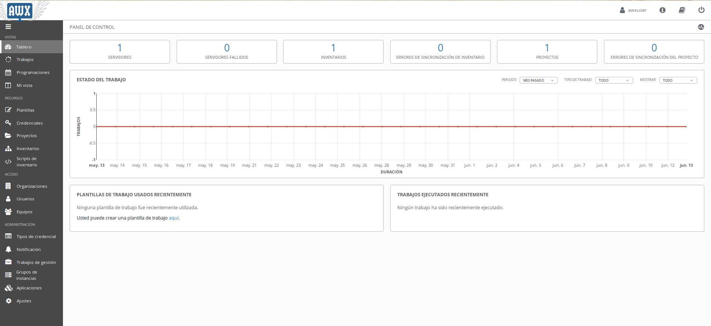

## Introducción[¶](https://jpcarmona.github.io/web/blog/proyecto/#introduccion)

Hoy en día el número de servidores, virtuales o físicos, sigue creciendo. Este hecho nos obliga a buscar nuevos métodos para desplegar, configurar y actualizar máquinas de forma que estas tareas repetitivas nos hagan perder el menor tiempo posible.

Ansible es una herramienta open-source desarrollada en python. Se define como un motor de orquestación muy simple que automatiza las tareas necesarias en el campo de los servidores. Ansible posee unas características que junto a su buena documentación hacen esta herramienta realmente atractiva para aquellos que aún no automatizan sus tareas de administración ya que su curva de aprendizaje crece muy rápido.

### Objetivos de este proyecto[¶](https://jpcarmona.github.io/web/blog/proyecto/#objetivos-de-este-proyecto)

Los objetivos de este proyecto son en gran parte aprender a utilizar Ansible definiendo roles, playbooks y tareas y su herramienta Web AWX que nos permite gestionar nuestros proyectos.

El objetivo final será el despliegue automático de una infraestructura en Openstack que nos sirva de hosting de aplicaciones "contenedorizadas" con Docker.

------

## Requisitos[¶](https://jpcarmona.github.io/web/blog/proyecto/#requisitos)

Para llevar a cabo el funcionamiento de este proyecto se hará uso de distintas tecnologías de sofware libre, se recomendaría tener conocimientos de algunas de estas tecnologías listadas a continuación. Además necesitaremos una infraestructura con OpenStack, en mi caso utilizo la de mi instituto.

### Tecnologías utilizadas[¶](https://jpcarmona.github.io/web/blog/proyecto/#tecnologias-utilizadas)

- [Docker](https://docs.docker.com/get-started/) - La versión Community Edition "CE:

  ```bash
  $ docker --version Docker version 18.09.6, build 481bc77 
  ```

  

- [Python3-pip](https://packaging.python.org/guides/installing-using-pip-and-virtual-environments/) :

  ```bash
  $ python3 -m pip --version pip 19.1.1 from /home/user/.local/lib/python3.6/site-packages/pip (python 3.6) 
  ```

  

- [Ansible](https://docs.ansible.com/ansible/latest/index.html) :

  ```bash
  $ ansible --version
  ansible 2.8.0
    config file = None
    configured module search path = ['/home/user/.ansible/plugins/modules', '/usr/share/ansible/plugins/modules']
    ansible python module location = /home/user/env/lib/python3.6/site-packages/ansible
    executable location = /home/user/env/bin/ansible
    python version = 3.6.5 (default, Apr  1 2018, 05:46:30) [GCC 7.3.0]
  ```

- [AWX](https://github.com/ansible/awx)

### Infraestructura[¶](https://jpcarmona.github.io/web/blog/proyecto/#infraestructura)

- En nuestro equipo local de desarrollo donde trabajaremos en este proyecto instalaremos la herramienta AWX
- Servidor con Openstack: Esta herramienta de cloud-computing me la proporcionará mi instituto y en él desplegaremos el resto de infraestructura virtual.

#### Infraestructura virtual:[¶](https://jpcarmona.github.io/web/blog/proyecto/#infraestructura-virtual)

- Servidor DNS.
- Servidor Apache.
- Servidor MySQL.
- Servidor Docker.

------

## Forma de trabajo[¶](https://jpcarmona.github.io/web/blog/proyecto/#forma-de-trabajo)

En esta ocasión se trabajará con la herramienta `git` con un repositorio remoto alojado en [github](https://github.com/jpcarmona/proyectoawx).

Trabajaremos en local con un directorio definido de la siguiente manera:

```bash
PROJECT_NAME="proyecto"
PROJECT_DIR="${HOME}/${PROJECT_NAME}"
mkdir -p $PROJECT_DIR
```

Descargamos repositorio para trabajar con él:

```bash
PROJECT_REPO_NAME="proyectoawx"
PROJECT_REPO_URL="https://github.com/jpcarmona/proyectoawx.git"
git clone $PROJECT_REPO_URL ${PROJECT_DIR}/${PROJECT_REPO_NAME}
```

attention

Importante tener en cuenta estas variables en futuros usos en la línea de comandos.

------

## Ansible[¶](https://jpcarmona.github.io/web/blog/proyecto/#ansible)

A continuación se explicará los métodos y las buenas prácticas utilizadas con Ansible.

### Extensiones de ficheros[¶](https://jpcarmona.github.io/web/blog/proyecto/#extensiones-de-ficheros)

Ansible utiliza en la mayoría de sus definiciones de ficheros YAML aunque también se podría utilizar JSON o INI en algunas ocasiones. También se utiliza JINJA2 para el uso en variables o condicionales, además del uso en ficheros plantilla.

### Estructura de ficheros y directorios para ansible[¶](https://jpcarmona.github.io/web/blog/proyecto/#estructura-de-ficheros-y-directorios-para-ansible)

Las buenas prácticas definen la siguiente estructura:

```
.
├── host_vars
│   └── local
│       ├── main.yml
├── inventories
│   ├── inventory.yml
│   └── local.yml
├── playbooks
│   ├── playbook.yml
│   ├── host_vars -> ../host_vars
│   ├── roles -> ../roles
├── roles
    ├── role1
    ├── role2
        ├── defaults
        │   └── main.yml
        ├── handlers
        │   └── main.yml
        ├── meta
        │   └── main.yml
        ├── tasks
        │   ├── main.yml
        └── templates
            └── main.conf.j2
```

Dichos directorios y ficheros se explicarán a continuación.

### Inventarios[¶](https://jpcarmona.github.io/web/blog/proyecto/#inventarios)

Los inventarios son los ficheros donde se definen los equipos a los cuales se le van a realizar las tareas indicadas en los playbooks.

Ejemplo fichero inventario:

```yml
# inventories/inventory.yml
---
all:
  vars:
    # Ansible commons all
    ansible_ssh_common_args: '-o StrictHostKeyChecking=no'
    ansible_python_interpreter: "/usr/bin/python3"
    ansible_ssh_private_key_file: ~/.ssh/id_rsa
    ansible_ssh_transfer_method: scp
    ansible_user: ubuntu
    hosts:
      server1:
        ansible_host: 172.22.0.1
      server2:
        ansible_host: 172.22.0.2
      server3:
        ansible_host: 172.22.0.3
      server4:
        ansible_host: 172.22.0.4
```

En la definición de este ejemplo utilizo algunas variables comúnes de ansible:

- ansible_host: Es la ip de la máquina donde se ejecutarán las tareas
- ansible_user: Usuario con que se conectará por ssh
- ansible_ssh_private_key_file: Fichero de clave privada para conectarse por ssh.
- ansible_ssh_transfer_method: Modo de transferencia de los ficheros hacia el equipo remoto.
- ansible_ssh_common_args: Opcion de ssh para que no compruebe estrictamente la vericidad de la máquina a la que nos conectaremos. Útil para cuando nos pregunta en medio del lanzamiento de un playbook de ansible si aceptamos la veracidad del servidor. Poco seguro pero más cómodo. Podríamos antes realizar las conexiones para así añadir los servidor al fichero `known_hosts`.
- ansible_python_interpreter: Intérprete de python a utilizar en la ejecución del playbook.

### Variables de host[¶](https://jpcarmona.github.io/web/blog/proyecto/#variables-de-host)

Son variables definidas para los hosts del inventario. Estas variables deben encontrarse en directorios o ficheros llamados igual que al host del que se definen dentro del directorio `host_vars`. Se podrán llamar dichas variables de hosts desde un host distinto utilizando `include_vars` en las tareas o creando ficheros de variables de grupos `group_vars` para que un grupo de host pueda utilizar las mismas variables.

### Playbooks[¶](https://jpcarmona.github.io/web/blog/proyecto/#playbooks)

Son los fichero principales que ejecuta ansible donde se especifican las tareas a ajecutar y en que hosts debe ejecutarse, ya sean especificadas en el propio playbook o llamando por ejemplo a roles.

- Ejemplo de Playbook:

```yml
# inventories/inventory.yml
---
## Create rule for new http port in groups security of Openstack
- hosts: localhost
  gather_facts: False
  tasks:
    - name: Give a msg
      debug:
        msg: "Hello world"

# Create hosting
- hosts: all
  gather_facts: True
  become: True
  tasks:
    - name: Include role
      include_role:
        name: role
  vars:
    var1: "value1"
```

En este playbook se lanzara la tarea de mostrar un mensaje en local y luego para todos los hosts del inventario se ejecutara un rol que esta incluido en la tarea.

### Roles[¶](https://jpcarmona.github.io/web/blog/proyecto/#roles)

#### Creación de rol a partir de role-skeleton[¶](https://jpcarmona.github.io/web/blog/proyecto/#creacion-de-rol-a-partir-de-role-skeleton)

Para la creación de nuevos roles una buena práctica es utilizar un `role-skeleton`. Es una estructura de directorios y ficheros predefinidos en modo plantillas `Jinja2`. Un ejemplo en el [repositorio del proyecto](https://github.com/jpcarmona/proyectoawx/tree/master/roles/role-skeleton).

- Creación de rol a partir de un `role-skeleton`:

```bash
cd ${PROJECT_DIR}/${PROJECT_REPO_NAME}/roles
ansible-galaxy init --role-skeleton=role-skeleton rol-nuevo
```

Se nos creará una nueva estructura de directorios y ficheros con el nuevo nombre de rol `rol-nuevo` en el directorio roles.

- Estructura de directorios y ficheros:

```bash
roles/role-skeleton/
├── defaults
│   └── main.yml.j2
├── docs
│   └── README.md.j2
├── files
├── handlers
│   └── main.yml.j2
├── meta
│   └── main.yml.j2
├── README.md.j2
├── tasks
│   └── main.yml.j2
├── templates
└── vars
    └── main.yml.j2
```

#### Utilización de rol de Ansible Galaxy[¶](https://jpcarmona.github.io/web/blog/proyecto/#utilizacion-de-rol-de-ansible-galaxy)

En la comunidad de Ansible existen usuarios que aportan continuamente la creación de nuevos roles que facilitan el desempeño de algunas necesidades, como por ejemplo la instalación de Docker.

- Descarga de rol de Ansible Galaxy en nuestro directorio de roles:

```bash
ansible-galaxy install -p ${PROJECT_DIR}/${PROJECT_REPO_NAME}/roles/ geerlingguy.docker
```

------

## AWX[¶](https://jpcarmona.github.io/web/blog/proyecto/#awx)

### ¿ Qué es AWX ?[¶](https://jpcarmona.github.io/web/blog/proyecto/#que-es-awx)

AWX es una herramienta para la coordinación de entornos empresariales. AWX administra la tecnología Ansible para automatizar tareas de TI, como la gestión de las configuraciones, el aprovisionamiento, la coordinación de los flujos de trabajo, la implementación de las aplicaciones y la gestión del ciclo de vida.

AWX es una herramienta compuesta por 5 servicios, en nuestro son 5 contenedores:

- awx_web: Servidor Web Nginx con aplicación en Python(Django)
- awx_task: Servidor que ejecuta las tareas con Ansible
- awx_rabbitmq: Servidor de cola de mensajes.
- awx_memcached: Servidor caché de la base de datos.
- awx_postgres: Servidor de base de datos.

### Preparación previa a la instalación[¶](https://jpcarmona.github.io/web/blog/proyecto/#preparacion-previa-a-la-instalacion)

En este apartado se explicará los pasos previos llevados a cabo para la posterior instalación de AWX.

Comentar que la instalación de esta herramienta puede ser realizada de 3 formas:

- Mediante Openshift
- Usando Kubernetes
- En local con Docker

En mi caso he optado por utilizar la instalación en local con Docker ya que es la forma mas sencilla.

- Descarga de repositorio de AWX:

```bash
AWX_REPO_NAME="awx"
AWX_REPO_URL="https://github.com/ansible/awx.git"
git clone $REPO_URL ${PROJECT_DIR}/${REPO_NAME}
```

En este repositorio podemos encontrar el propio instalador oficial de AWX que se basa en el propio uso de ansible con `inventory`, `playbooks` y `roles`.

Lo primero que haremos será definir las variables del inventory:

- Creamos inventory base sin comentarios ni líneas en blanco:

```bash
cd ${PROJECT_DIR}/${AWX_REPO_NAME}/installer
cp inventory inventory.backup
cat inventory.backup | grep -Ev "^#|^$" > inventory
```

- Definimos variables añadiendo algunas que estaban comentadas necesarias quedando el fichero de una forma similar a esta:

```yml
cat <<EOF> ${PROJECT_DIR}/${AWX_REPO_NAME}/installer/inventory
---
all:
  vars:
    dockerhub_base: ansible
    # IMPORTANTE deben tener estos nombres si no dará error en la ejecución de jobs
    awx_task_hostname: awx
    awx_web_hostname: awxweb
    # Para que no nos cree las imagenes de Docker
    use_container_for_build: false
    # Volumenes a montar en contenedores
    postgres_data_dir: /var/lib/awx/pgdocker
    project_data_dir: /var/lib/awx/projects
    # Renvío de puertos locales
    host_port: 80
    host_port_ssl: 443
    # Directorio que nos interesa para su posterior uso
    docker_compose_dir: ${PROJECT_DIR}/${PROJECT_REPO_NAME}/awxcompose
    # Configuraciones de los distintos servicios de AWX
    pg_port: 5432
    pg_database: pgname 
    pg_username: pguser
    pg_password: pgpass
    rabbitmq_password: rabbitmqpass
    rabbitmq_erlang_cookie: rabbitmqcookie
    admin_user: awxuser
    admin_password: awxpass
    secret_key: awxsecret
  hosts:
    localhost:
      ansible_connection: local
      # Establecemos ansible_python_interpreter con el del entorno virtual utilizado. Podemos utilizar la variable "{{ ansible_playbook_python }}" que es el entorno actual utilizado.
      ansible_python_interpreter: "{{ ansible_playbook_python }}"

EOF
```

- En mi caso he convertido el fichero inventory de tipo INI a YAML.
- Las contraseñas deben ser distintas si se van a utilizar en un entorno de producción[(Ver Anexo 3)](https://jpcarmona.github.io/web/blog/proyecto/#anexo-3).

Con esto ya podríamos ejecutar el playbook pero antes realizaremos una modificación en una tarea de un rol. Esta modificación consistirá en comentar la tarea que nos crea los contenedores en local al lanzar el playbook, ya que esta tarea no tiene la acción parametrizada y queremos realizar algunas acciones antes del depspliegue de AWX.

La tarea es `Start the containers` situada en `${PROJECT_DIR}/${AWX_REPO_NAME}/installer/roles/local_docker/tasks/compose.yml`. Además también comentaremos las dos últimas tareas de este fichero que para nuestro caso no nos sirve para nada y se nos mostrará un error debido a que no se van a crear los contenedores.

- Antes que nada debemos tener permisos en el directorio de los volumenes:

```bash
sudo mkdir -p /var/lib/awx/
sudo chown -R $USER. /var/lib/awx/
```

- Ejecutamos playbook teniendo previamente creado un entorno virtual de python3[(Ver Anexo 1)](https://jpcarmona.github.io/web/blog/proyecto/#anexo-1) con ansible instalado:

```bash
ansible-playbook -i inventory install.yml
```

Este playbook nos generará varios ficheros en el directorio en la variable `docker_compose_dir` que constará de ficheros de configuración y de un fichero para levantar los contenedores con `docker-compose`.

Los fichero generados en el directorio `docker_compose_dir` (`${PROJECT_DIR}/${PROJECT_REPO_NAME}/awxcompose`) podemos cifrarlos con Ansible Vault[(Ver Anexo 2)](https://jpcarmona.github.io/web/blog/proyecto/#anexo-2) ya que contienen contraseñas y así poderlos subirlos a nuestro repositorio de github.

### Instalación[¶](https://jpcarmona.github.io/web/blog/proyecto/#instalacion)

- Nos situamos en el directorio `docker_compose_dir` y levantamos contenedores con `docker-compose`:

```bash
cd ${PROJECT_DIR}/${PROJECT_REPO_NAME}/awxcompose
docker-compose up -d
```




### Creando un proyecto en AWX[¶](https://jpcarmona.github.io/web/blog/proyecto/#creando-un-proyecto-en-awx)

#### Creación de proyecto mediante líneas de comandos[¶](https://jpcarmona.github.io/web/blog/proyecto/#creacion-de-proyecto-mediante-lineas-de-comandos)

- Antes que nada estableceremos algunas variables necesarias para la ejecución de dichos comandos:

```bash
## For all connections:
AWXUSER="awxuser"
AWXPASS="awxpass"
AWXHOST="http://localhost"
## For naming resources:
PROJECT_NAME="proyecto"
PROJECT_ORG="Default"
## For projects:
PROJECT_URL="git@github.com:jpcarmona/proyectoawx.git"
PROJECT_BRANCH="master"
##For credentials:
SSH_KEY_FILE="${HOME}/.ssh/id_rsa"
```

- Las siguientes variables cambiaran dependiendo de la plantillad e trabajo que queramos añadir:

```bash
## Playbook:
PLAYBOOK_FILE="playbooks/create_servers.yml"
## Inventory:
INVENTORY_FILE="inventories/local.yml"
```

- Lo primero es configurar `tower-cli`:

```bash
tower-cli config host $AWXHOST
tower-cli config username $AWXUSER
tower-cli config password $AWXPASS
tower-cli config verify_ssl false
```

Ahora lo primero que necesitamos para crear un proyecto en AWX son las credenciales del repositorio(SCM) de donde descargaremos el código(playbooks de ansible). Por ende crearemos en AWX una credencial que tenga acceso a dicho repositorio.

- Creación de credencial para git mediante línea de comandos

```bash
CRED_INPUTS="ssh_key_data: |"$'\n'"$(awk '{printf " %s\n", $0}' < ${SSH_KEY_FILE})"

tower-cli credential create \
  --organization="$PROJECT_ORG" \
  --description="Credential-git for project ${PROJECT_ORG}-${PROJECT_NAME}" \
  --name="credential-git_${PROJECT_ORG}-${PROJECT_NAME}" \
  --credential-type="Source Control" \
  --inputs="$CRED_INPUTS" \
  --force-on-exists
```

- Creamos el proyecto:

```bash
tower-cli project create \
  --organization="$PROJECT_ORG" \
  --description="Project-git for ${PROJECT_ORG}-${PROJECT_NAME}" \
  --name="project-git_${PROJECT_ORG}-${PROJECT_NAME}" \
  --scm-type="git" \
  --scm-url="$PROJECT_URL" \
  --scm-branch="$PROJECT_BRANCH" \
  --scm-credential="credential-git_${PROJECT_ORG}-${PROJECT_NAME}" \
  --force-on-exists
```

Antes de usar el proyecto deberemos de esperar ya que estará descargandolo del repositorio.

- Una vez creado el proyecto crearemos el inventario:

```bash
tower-cli inventory create \
  --organization="$PROJECT_ORG" \
  --description="Inventory for ${PROJECT_ORG}-${PROJECT_NAME}" \
  --name="inventory_${PROJECT_ORG}-${PROJECT_NAME}" \
  --force-on-exists
```

- Añadimos un fichero de inventario al inventario ya creado:

```bash
tower-cli inventory_source create \
  --description="Source for inventory_${PROJECT_ORG}-${PROJECT_NAME}" \
  --name="inventory-source_${PROJECT_ORG}-${PROJECT_NAME}" \
  --inventory="inventory_${PROJECT_ORG}-${PROJECT_NAME}" \
  --source="scm" \
  --source-project="project-git_${PROJECT_ORG}-${PROJECT_NAME}" \
  --source-path="${INVENTORY_FILE}" \
  --force-on-exists
```

- Creamos plantilla de trabajo:

```bash
tower-cli job_template create \
  --job-type="run" \
  --description="Job template for project ${PROJECT_ORG}-${PROJECT_NAME}" \
  --name="job-template_${PROJECT_ORG}-${PROJECT_NAME}" \
  --inventory="inventory_${PROJECT_ORG}-${PROJECT_NAME}" \
  --project="project-git_${PROJECT_ORG}-${PROJECT_NAME}" \
  --playbook="${PLAYBOOK_FILE}" \
  --credential="credential-ssh_${PROJECT_ORG}-${PROJECT_NAME}" \
  --ask-variables-on-launch=true \
  --force-on-exists
```

- Por último lanzamos plantilla de trabajo:

```bash
    tower-cli job launch \
      --job-template=job-template_${PROJECT_ORG}-${PROJECT_NAME} \
      --extra-vars="${VARS_TO_LAUNCH:-}" \
      --verbosity=2 \
      --monitor
```

La variable `VARS_TO_LAUNCH` se especificaría en el caso que fuera necesario: `VARS_TO_LAUNCH="{'var1':'value1','var2':'value2'}"`

Para la creación del proyecto mediante comandos necesitaremos el módulo de python `ansible-tower-cli`.

#### Creación de proyecto mediante interfaz web de AWX[¶](https://jpcarmona.github.io/web/blog/proyecto/#creacion-de-proyecto-mediante-interfaz-web-de-awx)

No me da tiempo!! Lo muestro en la presentación

------

## Proceso de automatización[¶](https://jpcarmona.github.io/web/blog/proyecto/#proceso-de-automatizacion)

El proceso de automatización de la infraestructura del hosting de aplicaciones Web mediante Ansible, la hemos dividido en 3 partes:

- Creación de máquinas en openstack.
- Instalación y configuración de los servicios para el hosting.
- Creación de aplicación web en hosting.

### Creación de máquinas en openstack[¶](https://jpcarmona.github.io/web/blog/proyecto/#creacion-de-maquinas-en-openstack)

Para la creación de máquinas en Opestack hemos utilizado los módulos de Ansible:

- os_server: Para crear las instancias
- os_floating_ip: Para asignar ips flotantes

También he necisitado utilizar el cliente de openstack para actualizar el nombre del servidor DNS que reparte el servidor DHCP de la subred de mi proyecto.

- Creación de infraestructura de servidores mediante Ansible:

```bash
cd ${PROJECT_DIR}/${PROJECT_REPO_NAME}
ansible-playbook --vault-password-file vault-password-file -i inventories/local.yml playbooks/create_servers.yml
```

Al finalizar la ejecución de dicho playbook tendremos creada la infraestructura de máquinas virtual:

- Servidor DNS: Para la resolución de los distintos servicios y las aplicaciones Web creadas en un futuro.
- Servidor Apache: Nos hará de proxy hacia las aplicaciones "contenedorizadas"
- Servidor MySQL: Para albergar las bases de datos de las aplicaciones.
- Servidor Docker: Servidor donde se alojarán los contenedores de las aplicaciones.

Además se nos creará el inventario de dichos servidores creados.

### Instalación y configuracion de los servidores[¶](https://jpcarmona.github.io/web/blog/proyecto/#instalacion-y-configuracion-de-los-servidores)

- Se instalarán los servicios mediante el módulo de Ansible `apt`.

- El servicio de Docker se instalará mediante un rol de [Ansible-galaxy](https://github.com/geerlingguy/ansible-role-docker).

- Se utilizarán los módulos comunes de Ansible para los ficheros de configuración principal de los servicios:

  > - template
  > - copy
  > - systemd
  > - replace

- Instalación y configuracion de los servidores mediante Ansible:

```bash
cd ${PROJECT_DIR}/${PROJECT_REPO_NAME}
ansible-playbook --vault-password-file vault-password-file -i inventories/infra.yml playbooks/config_servers.yml
```

Con esto ya tedriamos la infraestructura creada y configurada del hosting, ya solo nos quedaría desplegar una aplicación.

### Despliegue de aplicación Web(CMS) en el hosting[¶](https://jpcarmona.github.io/web/blog/proyecto/#despliegue-de-aplicacion-webcms-en-el-hosting)

En el despliegue de la aplicación se realizan las siguientes tareas:

- Se crea una regla de entrada de un puerto en Openstack.

  > Utilizo el módulo de cloud de Ansible `os_security_group_rule`.

- Se crea un registro CNAME en el DNS para resolver el nuevo nombre de dominio de la aplicación.

  > Utilizo el módulo de Ansible `blockinfile` con una marca para que no se repitan los registros.

- Se crea un virtualhost en Apache que funciona como proxy hacia el contenedor.

- Se crea un usuario y una base de datos para la aplicación.

  > Utilizo la línea de comandos directamente para dicha creación aunque existe un módulo de Ansible para esta tarea.

- Se crea el contenedor de la aplicación con una redirección del puerto, creada regla de entrada en Openstack, del servidor de Docker al puerto 80 del contenedor.

- Despliegue de aplicación mediante Ansible:

```bash
cd ${PROJECT_DIR}/${PROJECT_REPO_NAME}
ansible-playbook --extra-vars '{"awx_user":"usuario","awx_cms":"drupal"}' --vault-password-file vault-password-file -i inventories/infra.yml playbooks/hosting.yml
```


------

## Cosas para hacer en un futuro[¶](https://jpcarmona.github.io/web/blog/proyecto/#cosas-para-hacer-en-un-futuro)

- Añadir certificados para utilizar https tanto en AWX como en las aplicaciones del hosting
- Añadir más aplicaciones para el hosting
- Parametrizar la autenticación y los recursos de Openstack(red,sshkey,etc...)

------

## Anexos[¶](https://jpcarmona.github.io/web/blog/proyecto/#anexos)

### Anexo 1[¶](https://jpcarmona.github.io/web/blog/proyecto/#anexo-1)

Creación entorno virtual de python3

- Instalamos el paquete de python3 que nos permite crear entornos virtuales:

```bash
sudo apt install python3-venv
```

- Creamos y activamos entorno virtual:

```bash
python3 -m venv ${PROJECT_DIR}/entorno
source ${PROJECT_DIR}/entorno/bin/activate
```

- Instalamos ansible con pip(gestor de paquetes de python)

```bash
pip install ansible
```

### Anexo 2[¶](https://jpcarmona.github.io/web/blog/proyecto/#anexo-2)

Cifrado con Ansible Vault

- Es necesario tener un entorno virtual de python3[(Ver Anexo 1)](https://jpcarmona.github.io/web/blog/proyecto/#anexo-1) con Ansible instalado.

### Creación de ficheros cifrados[¶](https://jpcarmona.github.io/web/blog/proyecto/#creacion-de-ficheros-cifrados)

- Creamos fichero con contraseña que usaremos para cifrar los ficheros:

```bash
openssl rand -base64 30 > vault-password-file.txt
```

- Ciframos ficheros con Ansible Vault:

```bash
ansible-vault encrypt --vault-password-file  vault-password-file.txt foo.yml bar.yml baz.yml
```

- Para descifrar los ficheros:

```bash
ansible-vault decrypt --vault-password-file  vault-password-file.txt foo.yml bar.yml baz.yml
```

### Creación de contraseñas cifradas[¶](https://jpcarmona.github.io/web/blog/proyecto/#creacion-de-contrasenas-cifradas)

- Creamos fichero con contraseña que usaremos para cifrar los ficheros

- Ciframos contraseña:

```bash
ansible-vault encrypt_string --vault-password-file vault-password-file.txt --name="password" 'XpassX'
```

- Ejecutar playbook de Ansible con las contraseñas descifradas:

```bash
ansible-playbook -i inventories/inventory.yml playbooks/playbooks.yml --vault-password-file vault-password-file.txt
```

### Anexo 3[¶](https://jpcarmona.github.io/web/blog/proyecto/#anexo-3)

Creación de contraseña aleatorias

- Podemos crear contraseñas aleatorias con `openssl`:

```bash
openssl rand -base64 30
```

- `30`: Número de caracteres a generar aleatoriamente.
- `-base64`: Codificación de los caracteres.

### Anexo 4[¶](https://jpcarmona.github.io/web/blog/proyecto/#anexo-4)

Arreglando problemas con AWX

En AWX tengo el problema de que no es capaz de ejecutar algunos módulos que en mi propio entorno de python3 si puedo, por lo tanto procedo a relizar los siguientes cambios en el contenedor de AWX que ejecuta las tareas de ansible.

- Nos conectamos al contenedor:

```bash
docker exec -it awx_task bash
```

- Eliminamos el entorno virtual que utiliza AWX:

```bash
rm -rf /var/lib/awx/venv/ansible/
```

- Creamos nuevo entorno y lo activamos:

```bash
python3 -m venv /var/lib/awx/venv/ansible
source /var/lib/awx/venv/ansible/bin/activate
```

- Actualizamos pip en el entorno:

```bash
pip install --upgrade pip
```

- Instalamos nuevos modulos a partir del fichero [requirements](https://raw.githubusercontent.com/jpcarmona/proyectoawx/master/requeriments.txt) de mi repositorio del proyecto:

```bash
curl -o requeriments.txt https://raw.githubusercontent.com/jpcarmona/proyectoawx/master/requeriments.txt
pip install -r requeriments.txt
```

- Instalamos `gcc` y `python36-devel` necesario para instalar el módulo de python `psutil`:

```bash
yum install -y gcc python36-devel
pip install psutil
```

- Además necesita resolver el nombre de `jupiter`(servidor de Openstack):

```bash
cat << EOF >> /etc/hosts
172.22.222.1        jupiter.gonzalonazareno.org
EOF
```

CC https://jpcarmona.github.io/web/blog/proyecto/

