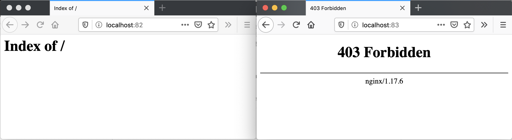

## 10. Almacenamiento en volúmenes

El almacenamiento en contenedores es efímero. Una vez que el contenedor es eliminado también son eliminados sus archivos. Pero además, cuando un contenedor falla, `kubelet` lo reiniciará con un estado limpio habiéndose perdido todo lo que había en sus archivos.

Kubernetes cuenta con una gran cantidad de [tipos de volúmenes](https://kubernetes.io/docs/concepts/storage/volumes/#types-of-volumes). Los hay de almacenamiento local, almacenamiento en el sistema de archivos de los nodos de Kubernetes, Ceph, Gluster, NFS y almacenamiento cloud, como en Azure, Azure, Google y OpenStack Cinder, por citar algunos. También permite volúmenes `configmap` y `secret`, útiles para el compartir entre pods datos de configuración o información sensible, como contraseñas. En cualquier caso, los volúmenes son montados por los pods y accederían a sus datos.

### 10.1. Volúmenes `emptyDir`

Se trata de volúmenes que se crean al asignar un pod a un nodo. Su contenido se mantiene en el nodo hasta que el contenedor sea eliminado. Su contenido se mantiene aunque el contenedor sea destruido o eliminado.

De forma predeterminada, los volúmenes `emptyDir` son almacenados en el medio de almacenamiento prederminado del nodo (HD, SSD, NAS, …). No obstante, se puede definir este tipo de volúmenes como volátiles configurando la propiedad `emptyDir.medium` como `Memory` y Kubernetes lo montará como un sistema de archivos RAM, lo que puede ser muy útiles para cachés.

Este tipo de contenedores se suele usar para situaciones en las que queremos compartir datos entre varios contenedores en un pod o cachés.

El manifiesto siguiente crea un pod con [Redis](https://redis.io/) usando un volumen `emptyDir`. El volumen se monta en el directorio `/data` del contenedor, que es el directorio predeterminado de almacenamiento de la [imagen de Redis](https://hub.docker.com/_/redis).

```yaml
apiVersion: v1
kind: Pod
metadata:
  name: redis
spec:
  containers:
  - name: redis
    image: redis
    volumeMounts: 
    - name: redis-storage 
      mountPath: /data 
  volumes: 
  - name: redis-storage 
    emptyDir: {} 
```

|      | Montaje de un volumen en el contenedor              |
| ---- | --------------------------------------------------- |
|      | Nombre del volumen a montar                         |
|      | Ruta del contenedor donde se va a montar el volumen |
|      | Definición del volumen                              |
|      | Nombre asignado al volumen                          |
|      | Tipo de volumen                                     |

A continuación ya podremos desplegar este pod con un volumen `emptyDir` usando `kubectl`

```bash
$ kubectl apply -f redis.yaml
```

### 10.2. Volúmenes `hostPath`

Un volumen `hostPath` monta en el contenedor un archivo o un directorio del sistema de archivos del nodo en el que está ejecutándose el pod.

|      | Este tipo de volúmenes no es una solución buena para clusters Kubernetes con varios nodos, ya que no se guardarían los mismos datos en cada nodo.No obstante se podrá valorar si [rsync](https://rsync.samba.org/) o [Syncthing](https://syncthing.net/) ofrecen soporte suficiente para usar volúmenes `hostPath` en clusters con más de un nodo. |
| ---- | ------------------------------------------------------------ |
|      |                                                              |

El ejemplo siguiente muestra un manifiesto para la creación de un pod con un contenedor Apache que monta un volumen `hostPath`. El contenedor monta ese volumen en la carpeta de publicación del contenedor Apache (`/usr/local/apache2/htdocs/`).

```yaml
apiVersion: v1
kind: Pod
metadata:
  name: hostPathContainer
spec:
  containers:
  - image: nginx
    name: nginx-hostPath
    volumeMounts:
    - mountPath: /vol-hostPath
      name: myvolume
  volumes:
  - name: myvolume
    hostPath:
      path: /data/pv
```

|      | Crear volúmenes `hostPath` es una operación atrevida, ya que estamos accediendo e incluso escribiendo en el sistema de archivos del nodo en el que esté el pod.Es posible controlar la creación del volumen para montar un archivo o directorio del nodo sólo en aquellos casos en los que previamente exista dicho archivo o directorio. Para ello, tenemos que crear el volumen con `type: Directory`. Esto hará que sólo se cree el pod si existen el directorio previamente en el nodo.`  volumes:  - name: myvolume    hostPath:      type: Directory       path: /data/pv`Sólo se creará el volumen si existe en el nodo el directorio especificado en `path`Para más información sobre cómo limitar y configurar el uso de `hostPath`, consultar la [documentación oficial de volúmenes `hostPath`](https://kubernetes.io/docs/concepts/storage/volumes/#hostpath) |
| ---- | ------------------------------------------------------------ |
|      |                                                              |

### 10.3. Volúmenes con Openstack Cinder

Podemos montar volúmenes OpenStack Cinder en pods Kubernetes. Previamente tendremos que haber configurado el cluster Kubernetes con OpenStack como proveedor cloud. Los volúmenes Cinder son volúmenes externos al cluster Kubernetes y son persistentes, de forma que su contenido se mantiene después de la eliminación de los pods que lo tengan montado.

Para este ejemplo partimos de un cluster Kubernetes gestionado con Rancher. En la configuración del archivo YAML del cluster añadiremos lo siguiente:

```yaml
cloud_provider:
  name: "openstack"
  openstackCloudProvider:
    block_storage:
      ignore-volume-az: true
      trust-device-path: false
    global:
      auth-url: "http://www.xxx.yyy.zzz:5000/v3/" 
      domain-name: "xxx" 
      tenant-id: "xxx" 
      username: "xxx" 
    load_balancer:
      create-monitor: false
      manage-security-groups: false
      monitor-max-retries: 0
      subnet-id: "xxx" 
      use-octavia: false
    metadata:
      request-timeout: 0
```

|      | IP o nombre DNS del servicio Keystone de identificación      |
| ---- | ------------------------------------------------------------ |
|      | Nombre de dominio (p.e. `default`)                           |
|      | id del proyecto que proporciona los recursos OpenStack a Kubernetes |
|      | Nombre de usuario                                            |
|      | id de la subred a la que se conectarán el balanceador que proporciona acceso a los servicios de tipo `loadbalancer` |

```yaml
apiVersion: storage.k8s.io/v1
kind: StorageClass
metadata:
  name: cinder-sc
provisioner: kubernetes.io/cinder
parameters:
  availability: nova
$ kubectl apply -f cinder-storageclass.yaml
$ kubectl get storageclasses.storage.k8s.io

NAME            PROVISIONER            AGE
cinder-sc   kubernetes.io/cinder   15s
kind: PersistentVolumeClaim
apiVersion: v1
metadata:
  name: cinder-pvc
spec:
  accessModes:
    - ReadWriteOnce
  resources:
    requests:
      storage: 9Gi # pass here the size of the volume
  storageClassName: cinder-sc
$ kubectl apply -f cinder-persistentvolumeclaim.yaml
$ kubectl get persistentvolumeclaims

NAME             STATUS   VOLUME                                     CAPACITY   ACCESS MODES   STORAGECLASS    AGE
cinder-pvc   Bound    pvc-3688b17d-0de1-11ea-945c-fa163e416ffb   9Gi        RWO            cinder-sc   15s
apiVersion: apps/v1
kind: Deployment
metadata:
  name: apache-cinder
spec:
  selector:
    matchLabels:
     app: apache
  template:
    metadata:
      labels:
        app: apache
    spec:
      containers:
      - name: apache
        image: httpd
        volumeMounts:
          - mountPath: /usr/local/apache2/htdocs
            name: cinder-vol
        ports:
        - containerPort: 80
      volumes:
        - name: cinder-vol
          persistentVolumeClaim:
            claimName: cinder-pvc
$ kubectl apply -f cinder-apache-pvc.yaml
$ kubectl get pods

NAME                                  READY   STATUS    RESTARTS   AGE
apache-cinder-54d6c66cf8-djv76        1/1     Running   0          15s
$ sudo kubectl port-forward apache-cinder-54d6c66cf8-djv76 81:80

Forwarding from 127.0.0.1:81 -> 80
Forwarding from [::1]:81 -> 80
```


```bash
$ kubectl exec -it apache-cinder-54d6c66cf8-djv76 /bin/bash
root@apache-cinder-54d6c66cf8-djv76:/usr/local/apache2# echo "<h1>Volumen Cinder</h1>" > htdocs/index.html
```


```bash
$ kubectl delete -f cinder-apache-pvc.yaml
$ kubectl apply -f cinder-apache-pvc.yaml
$ kubectl get pods
NAME                                  READY   STATUS    RESTARTS   AGE
apache-cinder-54d6c66cf8-zx92w        1/1     Running   0          102s
sudo kubectl port-forward apache-cinder-54d6c66cf8-zx92w 81:80
```


### 10.4. Volúmenes NFS. Openstack Manila

Kubernetes permite montar *shares* NFS existentes en un pod. Los volúmenes NFS son volúmenes externos al cluster Kubernetes y son persistentes, de forma que su contenido se mantiene después de la eliminación de los pods que lo tengan montado.

Para este ejemplo usaremos Openstack Manila como servidor NFS. Para los ejemplos ya tenemos creado un *share*,. disponible en en la ruta `/var/lib/manila/mnt/share-2e653a46-bc6a-4fc3-83d3-d144554113e1` del servidor `192.168.64.17`

```yaml
apiVersion: v1
kind: PersistentVolume
metadata:
  name: nfs-pv
spec:
  capacity:
    storage: 10Gi
  accessModes:
    - ReadWriteMany
  persistentVolumeReclaimPolicy: Recycle
  nfs:
    path: /var/lib/manila/mnt/share-2e653a46-bc6a-4fc3-83d3-d144554113e1
    server: 192.168.64.17
$ kubectl apply -f nfs-persistentvolume.yaml
apiVersion: v1
kind: PersistentVolumeClaim
metadata:
  name: nfs-pvc
spec:
  accessModes:
    - ReadWriteMany
  resources:
    requests:
      storage: 10Gi
  storageClassName: ""
  volumeName: nfs-pv
$ kubectl apply -f nfs-persistentvolumeclaim.yaml
kubectl get pv,pvc
NAME                         CAPACITY   ACCESS MODES   RECLAIM POLICY   STATUS     CLAIM                     STORAGECLASS   REASON   AGE
persistentvolume/nfs-pv      10Gi       RWX            Recycle          Bound      default/nfs-pvc                                   3m36s

NAME                            STATUS   VOLUME   CAPACITY   ACCESS MODES   STORAGECLASS   AGE
persistentvolumeclaim/nfs-pvc   Bound    nfs-pv   10Gi       RWX                           3m35
apiVersion: apps/v1
kind: Deployment
metadata:
  name: apache-nfs
spec:
  selector:
    matchLabels:
     app: apache
  template:
    metadata:
      labels:
        app: apache
    spec:
      containers:
      - name: apache
        image: httpd
        volumeMounts:
          - mountPath: /usr/local/apache2/htdocs
            name: nfs-vol
        ports:
        - containerPort: 80
      volumes:
        - name: nfs-vol
          persistentVolumeClaim:
            claimName: nfs-pvc
apiVersion: apps/v1
kind: Deployment
metadata:
  name: www-vol
spec:
  selector:
    matchLabels:
     app: nginx
  template:
    metadata:
      labels:
        app: nginx
    spec:
      containers:
      - name: nginx
        image: nginx
        volumeMounts:
          - mountPath: /usr/share/nginx/html
            name: nfs-vol
        ports:
        - containerPort: 80
      volumes:
        - name: nfs-vol
          persistentVolumeClaim:
            claimName: nfs-pvc
$ kubectl apply -f nfs-apache-pvc.yaml
$ kubectl apply -f nfs-nginx-pvc.yaml
$ kubectl get pods
NAME                                  READY   STATUS    RESTARTS   AGE
apache-nfs-5cb7d87b6f-jp774           1/1     Running   0          4m55s
nginix-nfs-58d6698d65-vfqkv           1/1     Running   0          4m54s
$ sudo kubectl port-forward apache-nfs-5cb7d87b6f-jp774 82:80

Forwarding from 127.0.0.1:82 -> 80
Forwarding from [::1]:82 -> 80

$ sudo kubectl port-forward nginix-nfs-58d6698d65-vfqkv 83:80

Forwarding from 127.0.0.1:83 -> 80
Forwarding from [::1]:83 -> 80
```



```bash
kubectl exec -it apache-nfs-5cb7d87b6f-jp774 /bin/bash
root@apache-nfs-5cb7d87b6f-jp774:/usr/local/apache2# echo "<h1>Volumen NFS</h1>" > htdocs/index.html
```


```bash
$ kubectl delete -f nfs-apache-pvc.yaml
kubectl apply -f nfs-apache-pvc.yaml
deployment.apps/apache-nfs created
$ kubectl get pods
NAME                                  READY   STATUS    RESTARTS   AGE
apache-nfs-5cb7d87b6f-2dzhr           1/1     Running   0          46s
nginix-nfs-58d6698d65-vfqkv           1/1     Running   0          16m
sudo kubectl port-forward apache-nfs-5cb7d87b6f-2dzhr 82:80

Forwarding from 127.0.0.1:82 -> 80
Forwarding from [::1]:82 -> 80
```

