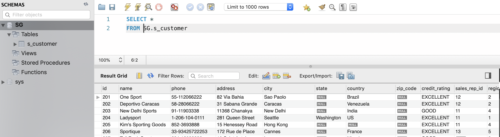

## 11. Init Containers

Existen un tipo especial de contenedores denominados *Init Containers* que se ejecutan antes que el resto de contenedores de aplicación del pod. Este tipo de contenedores suelen dedicarse a realizar operaciones de incialización que no están presentes en la imagen de los otros contenedores del pod.

Para ilustrar el uso de Init Container supongamos que queremos tener disponibles distintos tipos de bases de datos MySQL para pruebas en desarrollo.. En función del proyecto en el que estemos trabajando queremos tener disponible una base de datos u otra (p.e. recursos humanos, espacios, expedientes, préstamos, …). Para ello, contaremos con varios scripts diferentes de inicialización de los distintos tipos de bases de datos que queremos configurar.

Para llevar a cabo ese caso práctico contaremos con:

- URL donde se encuentra el script de inicialización de la base de datos.

- ConfigMap que configura la URL del script con el que se va a inicializar la base de datos.

- Secret el que se almacena la contraseña del usuario `root`.

- Init Container que inicializa una imagen `busybox` con un volumen donde descarga el script SQL que inicializa la BD. La URL de descarga del script la toma del ConfigMap. El script SQL se descarga con el nombre `init.sql` para que sirva como script de inicialización del contenedor MySQL.

  |      | La imagen `busybox` contiene gran cantidad de utilidades Linunx incorporadas y nos va a ser muy útil para realizar la tarea de inicialización de la base de datos en su contenedor compañero de MySQL |
  | ---- | ------------------------------------------------------------ |
  |      |                                                              |

- Contenedor que monta el volumen que ha inicializado el Init Container con el script SQL. Dicho volumen es montando en el directorio `/docker-entrypoint-initdb.d` de la imagen MySQL. Como el script se llama `init.sql`, al arrancar por primera vez el contenedor MySQL, se inicializará el contenedor con la base de datos elegida.

Esta configuración con Init Container permite la configuración a medida y sobre la marcha de una imagen MySQL sin necesidad de tener disponibles diferentes imágenes MySQL, cada una con su propia base de datos. En su puesto, lo que hacemos es cambiar en el ConfigMap la URL del script que inicializará una nueva base de datos. Con esto podremos tener todas las bases de datos diferentes que queramos con una única imagen MySQL.

A continuación se muestra el manifiesto YAML que crea el ConfigMap que contiene el script SQL de inicialización de la base de datos.

ConfigMap

```yaml
apiVersion: v1
kind: ConfigMap
metadata:
  name: initsqlsource
data:
  source: https://gist.githubusercontent.com/ualmtorres/eb328b653fcc5964f976b22c320dc10f/raw/448b00c44d7102d66077a393dad555585862f923/init.sql
```

Desplegaremos el ConfigMap con:

```bash
$ kubectl apply -f initsqlsource-configmap.yaml
```

También contaremos con un objeto Secret para almacenar la contraseña del usuario root. Este sería su manifiesto YAML

```yaml
apiVersion: v1
kind: Secret
metadata:
  name: mysqlpassword
type: Opaque
data:
  password: cGFzc3dvcmQ=
```

Desplegaremos el Secret con:

```bash
$ kubectl apply -f credentials-secret.yaml
```

Por último, crearemos el pod que incluye el contenedor MySQL y el Init Container que lo inicializa. El pod contiene un volumen que comparten ambos contenedores. El Init Container descarga el script SQL de inicialización en el volumen. Posteriormente, el contenedor MySQL monta ese volumen en el directorio de scripts de inicialización de forma que al arrancar por primera vez inicialice la base de datos con el script descargado por el Init Container.

Este sería el manifiesto YAML del pod que incluye el Init Container, el contenedor MySQL y el volumen compartido por los dos contenedores.

```yaml
apiVersion: apps/v1
kind: Deployment
metadata:
  name: initdb
spec:
  selector:
    matchLabels:
     app: mysql
  template:
    metadata:
      labels:
        app: mysql
    spec:
      containers:
      - name: mysql 
        image: mysql
        env:
        - name: MYSQL_ROOT_PASSWORD 
          valueFrom:
            secretKeyRef:
              name: mysqlpassword
              key: password
        ports:
        - containerPort: 3306
        volumeMounts: 
        - name: workdir
          mountPath: /docker-entrypoint-initdb.d
      initContainers:
      - name: install 
        image: busybox
        env:
        - name: SQLSOURCE 
          valueFrom:
            configMapKeyRef:
              name: initsqlsource
              key: source
        command: 
        - wget
        - "-O"
        - "/work-dir/init.sql"
        args: ["$(SQLSOURCE)"]
        volumeMounts: 
        - name: workdir
          mountPath: "/work-dir"
      dnsPolicy: Default
      volumes: 
      - name: workdir
        emptyDir: {}
```

|      | Contenedor MySQL                                             |
| ---- | ------------------------------------------------------------ |
|      | Inicialización de la variable de entorno con el Secret que contiene la contraseña del usuario root |
|      | Montar el volumen `workdir`, definido al final del script, en el directorio `/docker-entrypoint-initdb.d` del contenedor |
|      | Contenedor de inicialización                                 |
|      | Inicialización de la variable de entorno con el ConfigMap que contiene la URL con el script SQL que inicializará la base de datos |
|      | Comando de inicialización para ejecutar al crear el Init Container |
|      | Montar el volumen `workdir` en el directorio `/work-dir` del InitContainer |
|      | Volumen que almacenará el script de inicialización de la base de datos |

|      | El volumen `workdir` se crea del tipo `emptyDir` porque su único propósito es almacenar el script de inicialización de la base de datos del contenedor MySQL en su primer arranque. Una vez hecha esta función, ya no es necesario, y no está destinado a guardar datos que se quieran persistir tras la finalización del contenedor MySQL. |
| ---- | ------------------------------------------------------------ |
|      |                                                              |

Lanzamos el despliegue del Deployment:

```bash
$ kubectl apply -f initdb-deployment.yaml
```

Tras su creación, haremos un *port forward* al contenedor creado:

```bash
$ kubectl port-forward initdb-87b65d485-89m4c 3306:3306
```

Por último, abrimos una sesión con un cliente MySQL (usuario: `root`, password: `password`). Dado que tenemos los puertos redirigidos, las peticiones al puerto 3306 de nuestro equipo irán al puerto 3306 del contenedor. Podremos comprobar que el contenedor tiene inicializada una base de datos, la base de datos que inicializa el script almacenado en la URL especificada en el ConfigMap.



