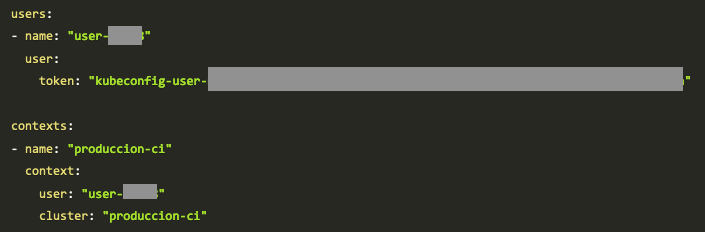

## 12. Apéndice. Cheat Sheet

### 12.1. Comandos Minikube

- `minikube version`
- `minikube start`
- `minikube dashboard`
- `minikube service `
- `minikube delete`

### 12.2. Comandos `kubectl`

- `kubectl version`
- `kubectl cluster-info`
- `kubectl get nodes|deployments|services|pods [--show-labels]`
- `kubectl run  --image= --port=`
- `kubectl expose deployment > --type=NodePort`
- `kubectl describe pods|deployments|services `
- `kubectl scale deployments  --replicas=`
- `kubectl delete pods|deployments|services `
- `kubectl set image deployments  =`
- `kubectl rollout undo deployments `
- `kubectl apply -f `
- `kubectl logs `
- `kubectl exec  `

### 12.3. Herramientas interesantes

- [`kubectl` y `kubens`](https://github.com/ahmetb/kubectx): Cambio de namespace contexto

cloud_provider: name: "openstack" openstackCloudProvider: block_storage: ignore-volume-az: true trust-device-path: false global: auth-url: "http://192.168.64.12:5000/v3/" domain-name: "default" tenant-name: "mtorres" username: "mtorres" password: "xxx" load_balancer: create-monitor: false manage-security-groups: false monitor-max-retries: 0 use-octavia: false metadata: request-timeout: 0

### 12.4. Contextos

El archivo de contextos

Disponible en `~/.kube/config`

```bash
apiVersion: v1
clusters:
- cluster:
    certificate-authority: /Users/manolo/.minikube/ca.crt
    server: https://192.168.99.100:8443
  name: minikube
contexts:
- context:
    cluster: minikube
    user: minikube
  name: minikube
current-context: ""
kind: Config
preferences: {}
users:
- name: minikube
  user:
    client-certificate: /Users/manolo/.minikube/client.crt
    client-key: /Users/manolo/.minikube/client.key
```

Obtener los contextos

```bash
$ kubectl config get-contexts
CURRENT   NAME            CLUSTER         AUTHINFO     NAMESPACE
          minikube        minikube        minikube
```

Añadir un contexto nuevo

Obtener los datos de conexión a Rancher desde


Ahí aparecen los datos de conexión al cluster. Ahí se encuentran los datos que tenemos que copiar en el archivo `~/.kube/config`




Editamos el archivo el archivo `~/.kube/config` y debería quedar algo así

```bash
apiVersion: v1
clusters:
- cluster:
    certificate-authority: /Users/manolo/.minikube/ca.crt
    server: https://192.168.99.100:8443
  name: minikube
- cluster: 
    certificate-authority-data: XXXXXXXXXXXXXXXXXXX
  name: produccion-ci
contexts:
- context:
    cluster: minikube
    user: minikube
  name: minikube
- context: 
    cluster: produccion-ci
    namespace: mtorres
    user: user-XXXXXX
  name: produccion-ci
current-context: ""
kind: Config
preferences: {}
users:
- name: minikube
  user:
    client-certificate: /Users/manolo/.minikube/client.crt
    client-key: /Users/manolo/.minikube/client.key
- name: user-XXXXX 
  user:
    token: XXXXXXXXXXXXXXXXXXXXX
```

|      | Datos del cluster de Rancher |
| ---- | ---------------------------- |
|      | Datos del nuevo contexto     |
|      | Datos del usuario            |

Usar un contexto

```bash
$ kubectl config use-context produccion-ci

Switched to context "produccion-ci".
```

Si ahora consultamos los contextos, veremos que el contexto activo es `produccion-ci`. Por tanto, todas las operaciones que hagamos con `kubectl` a partir de ahora se dirigirán contra ese contexto (cluster-usuario-namespace).

```bash
$ kubectl config get-contexts
CURRENT   NAME            CLUSTER         AUTHINFO     NAMESPACE
          minikube        minikube        minikube
*         produccion-ci   produccion-ci   user-mzmh8   mtorres
```