# Istio

Istio viene a incorporarse al vocabulario marinero y ballenero del ecosistema de Docker y Kubernetes. Istio es una palabra griega que significa *navegar*.

|      | Istio está disponible en Rancher desde la versión 2.3.0-alpha5. Basta activarlo en el menú `Tools`. Pedirá si se quiere realizar la inyección automática de sidecars en un *namespace*. Esto hará que se cree un sidecar en cada pod del *namespace* para el `Istio-proxy`. **Este proxy intercepta todo el tráfico al microservicio del pod y asumirá la gestión del enrutado, la selección de versiones, el registro de actividad y tráfico, y el control de acceso**. Por tanto, en cada *namespace* en el que quede activado Istio se tendrá configurada la etiqueta `istio-injection=enabled`. No obstante, también es posible activarlo de forma manual, lo que exigiría un reinicio de los servicios, despliegues y otros objetos Kubernetes para que se active el funcionamiento de Istio. |
| ---- | ------------------------------------------------------------ |
|      |                                                              |

La figura siguiente ilustra una aplicación sin Istio. En ella, cada microservicio es el responsable de implementar la funcionalidad de *discovery*, balanceo, resilencia, métricas y trazado.

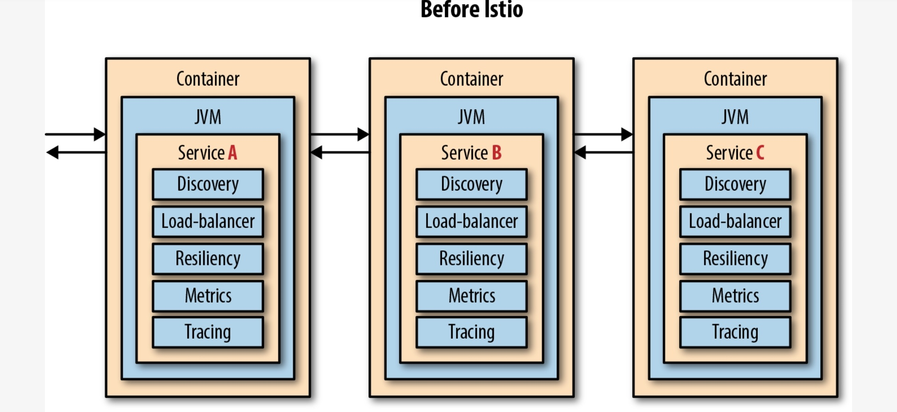

La figura siguiente ilustra cómo en las aplicaciones basadas en Istio los pods están formados por dos contenedores: el contenedor propio del microservicio y el del sidecar. Al sidecar se le delegan las tareas de *discovery*, balanceo, resilencia, métricas y trazado, lo que facilita el desarrollo de los microservicios.

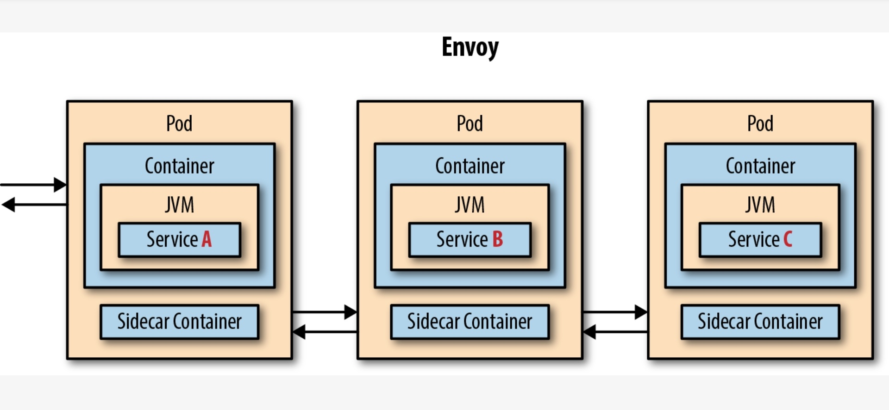

Istio ofrece una forma declarativa, mediante la creación de manifiestos YAML, de gestión del tráfico, enrutado selectivo de peticiones (en lugar del round robin que ofrece Kubernetes), diferentes tipos de despliegue (*canary, A/B, blue/green*), resilencia a nivel de red (con opciones de *retry*, *timeout*), control de acceso, observación de microservicios distribuidos comprendiendo los flujos y trazas y pudiendo ver las métricas importantes de forma inmediata, inyección de caos para poner a prueba la resilencia de aplicaciones y servicios, por citar algunas de sus funcionalidades destacadas.

Para activar el uso de Istio en un namespace (p.e. `default`) se haría con

```bash
kubectl label namespace default istio-injection=enabled
```

### 13.2. Arquitectura de Istio

Istio consta de un plano de control y un plano de datos. El plano de datos está formado por proxies que se integran en los pods de la aplicación. Usando el patrón del sidecar, cada instancia de la aplicación tendrá su proxy dedicado a través del cual pasa todo el tráfico antes de llegar a la aplicación. Estos proxies individuales son gestionados individualmente por Istio para enrutar, filtrar y aumentar el tráfico según sea necesario.

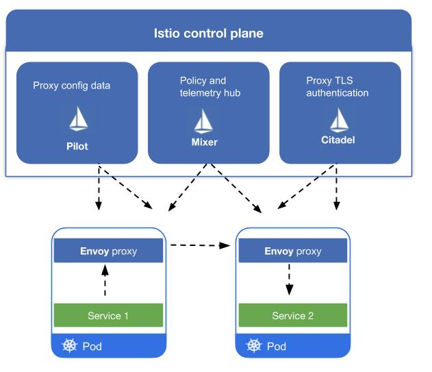

Además, Istio permite realizar deciciones de enrutado en función de las cabeceras HTTP (p.e. tipo de navegador, usuario, …)

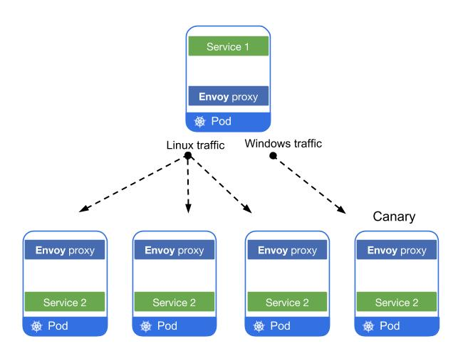

|      | Algo a tener en cuenta es que los componentes del plano de control son aplicaciones sin estado, lo que favorece que puedan escalar horizontalmente. Todos los datos están almacenados en *etcd* como descricpciones personalizadas de recursos Kubernetes. |
| ---- | ------------------------------------------------------------ |
|      |                                                              |

Sin embargo, toda esta funcionalidad tiene un coste sobre la infraestructura. Cuando mayor sea el cluster, mayor será la carga añadida al sistema. Cada sidecar consume bastante RAM (unos 350Mb). Además, añade una latencia de unos 10 ms a cada petición.

### 13.3. Control de tráfico y técnicas de despliegue

- Despliegue *canary*: Se despliega en producción una nueva versión del código, pero sólo se dirige a ella una parte del tráfico. A la nueva versión quizá sólo tengan acceso clientes de prueba, empleados, usuarios de iOS, etcétera. Una vez desplegado el canario, éste se monitoriza para comprobar la posible existencia de excepciones, comportamiento no satisfactorio, bajada del rendimiento, y demás. Si el canario no muestra indicios de que presente problemas, se puede ir aumentando paulatinamente el tráfico hacia él. En cambio, si presenta un comportamiento inaceptable, se puede retirar fácilmente de producción.

- Control del tráfico: Se pueden especificar reglas de enrutado que controlen el tráfico a un conjunto de pods. En concreto, Istio usa los recursos `DestinationRule` y `VirtualService` en forma de manifiestos YAML para describir estas reglas.

  - `DestinationRule`: Define grupos (*subsets*) de pods. Normalmente definiremos un *subset* para cada servicio y el *subset* estará formado por cada una de las versiones que se pueden utilizar del servicio. A continuación se muestra un fragmento YAML con la definición de una `DestinationRule` que define dos versiones posibles a las que enrutar tráfico con Istio.

    ```bash
    apiVersion: networking.istio.io/v1alpha3
    kind: DestinationRule
    metadata:
      name: jsonproducer
    spec:
      host: jsonproducer
      subsets:
      - name: v0
        labels:
          version: v0
      - name: v1
        labels:
          version: v1
    ```

  - `VirtualService` dirige el tráfico a un *subset*, y lo puede hacer basándose en porcentajes, cabeceras, direcciones IP, por citar algunas. La selección de pods afectados es similar al modelo de selectores utilizado por Kubernetes para selección basada en etiquetas (*labels*). A continuación se muestra un fragmento YAML con la definición de un `VirtualService` para aplicar un enrutado del 80% de las peticiones a la versión `v0` de un microservicio y el 20% a la versión `v1`.

    ```bash
    apiVersion: networking.istio.io/v1alpha3
    kind: VirtualService
    metadata:
      name: jsonproducer
    spec:
      hosts:
      - jsonproducer
      http:
      - route:
        - destination:
            host: jsonproducer
            subset: v0
          weight: 80
        - destination:
            host: jsonproducer
            subset: v1
          weight: 20
    ```

  Este comportamiento del enrutado no es sólo para el tráfico de entrada externo. Es para toda la comunicación inter-servicio en el *service mesh*. Así, si hubiese servicios desplegados en Kubernetes, pero que no sean parte del *mesh*, dichos servicios no estarían afectados por estas reglas y se regirían por las reglas de balanceo de Kubernetes (round-robin).

- *Dark launch*: Se trata de un despliegue a producción que no es visible a los clientes. En este caso Istio permite duplicar (*mirror*) el tráfico a una versión de la aplicación y ver cómo se comporta respecto a la versión del pod en producción. De esta forma se están realizando peticiones en las condiciones de producción al nuevo servicio sin afectar al tráfico de la versión en producción. No obstante, hay que tener una consideración especial con los servicios que traten con datos o estén vinculados a otros servicios, para no introducir duplicados, provocar inconsistencias y otros problemas derivados de la duplicación de peticiones.

### 13.4. Técnicas de resilencia

- *Circuit breaker*: Determina el número máximo de peticiones que puede soportar un pod. Pasado ese valor no admite más hasta que se recupere.
- *Pool ejection*: Saca de un nodo a un pod que esté dando fallos creando un nuevo pod que los sustituya en otro nodo.
- *Retries*: Reenvía la petición a otro pod al encontrar un caso de *circuit breaker* o *pool rejection*.

### 13.5. Caso práctico

Para no perdernos en los detalles usaremos un ejemplo muy sencillo con dos servicios: uno que produce datos y otro que los presenta. Podríamos ver este ejemplo como un ejemplo muy reducido de backend y frontend.

El servicio que genera datos se denomina `jsonproducer` y genera un documento JSON con un único elemento `nombre` y un valor asociado (p.e. `{"nombre": "manolo"}`). De este servicio se cuenta con dos versiones, cada una con su imagen Docker correspondiente. La primera versión (`v0`) devuelve el elemento JSON `{"nombre": "manolo"}`. La segunda versión (`v1`) devuelve el elemento JSON `{"nombre": "Manuel Torres"}`

El servicio que consume datos se denomina `jsonreader` y usará los datos leídos de `jsonproducer` para presentarlos al usuario en forma de saludo, mostrando `Hola` seguido del nombre leído del JSON devuelto por la versión de `jsonproducer` usada (`Hola manolo` cuando use `v0` y `Hola Manuel Torres` cuando use `v1`).

#### 13.5.1. Creación de todos los servicios

En primer lugar vamos a desplegar en el cluster de Kubernetes todos los recursos (`Service` y `Deployment`) con todas sus versiones correspondientes. Posteriormente, con Istio controlaremos el tráfico que se dirige a cada versión desplegada. En nuestro ejemplo se definirán dos objetos `Deployment`, uno para cada una de las versiones del `jsonproducer` (`v0` y `v1`) que quedarán desplegadas en el cluster.

Cada despliegue incorpora en los metadatos el nombre que le queremos dar, así como unas etiquetas con su versión, que le permitirán ser seleccionado posteriormente cuando se definan los *servicios virtuales*. Además, en la `spec` del despliegue se usarán etiquetas en `matchLabels` que permitirán más adelante a Istio distinguir los pods correspondientes a cada despliegue.

En este ejemplo usaremos dos versiones (dos recursos `Deployment`) del `jsonproducer`. La primera está basada en la imagen `ualmtorres/jsonproducer:v0` que devuelve `{"nombre": "manolo"}`. La segunda está basada en la imagen `ualmtorres/jsonproducer:v1` que devuelve `{"nombre": "Manuel Torres"}`. Con este ejemplo tan sencillo nos bastará para ver a Istio en acción controlando el tráfico.

El manifiesto siguiente ([`greeter.yaml`](https://gist.githubusercontent.com/ualmtorres/b651f3c73aa87376752c606e3747b151/raw/9f289b6500b75d93f22b4b36c63c6e3f409f1ccf/greeter.yaml)) configura varios recursos Kubernetes:

- Dos servicios (`jsonproducer` y `jsonreader`).
- Dos `Deployment` de `jsonproducer`, correspondientes a las dos versiones (`jsonproducer-v0` y `jsonproducer-v1`).
- `Deployment` de `jsonreader` (`jsonreader-v0`).

```bash
#########################################################
# jsonproducer service
#########################################################
apiVersion: v1
kind: Service
metadata:
  name: jsonproducer
  labels:
    app: jsonproducer
    service: jsonproducer
spec:
  ports:
  - port: 80
    name: http
  selector:
    app: jsonproducer
---
apiVersion: apps/v1
kind: Deployment
metadata:
  name: jsonproducer-v0 
  labels:
    app: jsonproducer
    version: v0
spec:
  replicas: 1
  selector:
    matchLabels:
      app: jsonproducer
      version: v0 
  template:
    metadata:
      labels:
        app: jsonproducer
        version: v0
    spec:
      containers:
      - name: jsonproducer
        image: ualmtorres/jsonproducer:v0 
        imagePullPolicy: IfNotPresent
        ports:
        - containerPort: 80
---
apiVersion: apps/v1
kind: Deployment
metadata:
  name: jsonproducer-v1 
  labels:
    app: jsonproducer
    version: v1
spec:
  replicas: 1
  selector:
    matchLabels:
      app: jsonproducer
      version: v1 
  template:
    metadata:
      labels:
        app: jsonproducer
        version: v1
    spec:
      containers:
      - name: jsonproducer
        image: ualmtorres/jsonproducer:v1 
        imagePullPolicy: IfNotPresent
        ports:
        - containerPort: 80
---
###########################################################
# jsonreader services
###########################################################
apiVersion: v1
kind: Service
metadata:
  name: jsonreader
  labels:
    app: jsonreader
    service: jsonreader
spec:
  ports:
  - port: 80
    name: http
  selector:
    app: jsonreader
---
apiVersion: apps/v1
kind: Deployment
metadata:
  name: jsonreader-v0
  labels:
    app: jsonreader
    version: v0
spec:
  replicas: 1
  selector:
    matchLabels:
      app: jsonreader
      version: v0
  template:
    metadata:
      labels:
        app: jsonreader
        version: v0
    spec:
      containers:
      - name: jsonreader
        image: ualmtorres/jsonreader:v0
        imagePullPolicy: IfNotPresent
        ports:
        - containerPort: 80
---
```

|      | Versión `v0` del servicio                                    |
| ---- | ------------------------------------------------------------ |
|      | Selector para determinar los pods asociados a la versión `v0` del servicio |
|      | Imagen `v0` del servicio                                     |
|      | Versión `v1` del servicio                                    |
|      | Selector para determinar los pods asociados a la versión `v1` del servicio |
|      | Imagen `v1` del servicio                                     |

Lo aplicaremos en nuestro cluster con

```bash
$ kubectl apply -f https://gist.githubusercontent.com/ualmtorres/b651f3c73aa87376752c606e3747b151/raw/9f289b6500b75d93f22b4b36c63c6e3f409f1ccf/greeter.yaml
```

Después, podemos consultar los servicios y *deployments* configurados

```bash
$ kubectl get services
NAME                                       TYPE        CLUSTER-IP      EXTERNAL-IP   PORT(S)          AGE
jsonproducer                               ClusterIP   10.43.88.162    <none>        80/TCP           40s
jsonreader                                 ClusterIP   10.43.106.61    <none>        80/TCP           40s

$ kubectl get deployments
NAME              READY   UP-TO-DATE   AVAILABLE   AGE
jsonproducer-v0   1/1     1            1           40s
jsonproducer-v1   1/1     1            1           40s
jsonreader-v0     1/1     1            1           40s
```

|      | De cara a poder probar los distintos escenarios que vamos a desarrollar, sería conveniente crear el Ingress en Rancher para los servicios `jsonproducer` y `jsonreader` y que nos genere automáticamente un hostname `.xip.io` para cada uno de ellos. |
| ---- | ------------------------------------------------------------ |
|      |                                                              |

#### 13.5.2. Creación de los *subsets* mediante `DestinationRule`

A continación vamos a definir todas las versiones de un servicio que vamos a tener elegibles en el cluster de Kubernetes y que posteriormente serán seleccionadas o usadas cuando pasemos a controlar el tráfico a cada versión. Las `DestinationRule` se usan para definir las distintas instancias o versiones disponibles que se pueden usar de cada servicio. Cada servicio tendrá su `DestinationRule` con lo siguiente:

- `metatada.name`: Nombre.
- `spec.host`: Host contra el que se lanzará este servicio. Puede ser un nombre DNS (admite *wildcards*) o un nombre de servicio válido en nuestra aplicación.
- `spec.subsets`: Lista de versiones de servicios a configurar. Cada versión tendrá su nombre (`name`) y usará una etiqueta (p.e. `labels.version: v0`) para emparejarse con los pods de su versión de acuerdo a lo definido en el selector `matchLabels` del objeto `Deployment` del manifiesto del apartado anterior.

El manifiesto siguiente ([`destination-rule-all.yaml`](https://gist.githubusercontent.com/ualmtorres/b651f3c73aa87376752c606e3747b151/raw/9f289b6500b75d93f22b4b36c63c6e3f409f1ccf/greeter.yaml)) corresponde a los dos recursos `DestinationRule` que vamos a crear, uno para cada servicio, `jsonproducer` y `jsonreader`, respectivamente. Cada `DestinationRule` incluye los _subsets o versiones de recursos `Deployment` de cada servicio. En este caso, indicamos que `jsonreader` consta sólo de un *subset* al que llegaremos a través de la versión `v0` del servicio (*host*) `jsonreader`. En cambio, `jsonproducer` consta de dos *subset* , a los que llegaremos a través de las versiones `v0` o `v1` del servicio (*host*) `jsonproducer`.

```bash
apiVersion: networking.istio.io/v1alpha3
kind: DestinationRule
metadata:
  name: jsonreader
spec:
  host: jsonreader
  subsets:
  - name: v0
    labels:
      version: v0
---
apiVersion: networking.istio.io/v1alpha3
kind: DestinationRule
metadata:
  name: jsonproducer
spec:
  host: jsonproducer 
  subsets:
  - name: v0
    labels:
      version: v0
  - name: v1 
    labels:
      version: v1 
---
```

|      | Nombre que le damos a nuestro host y que luego será usado por los *servicios virtuales* para dirigir el tráfico a una versión concreta de las definidas en los `subsets`. **Este nombre debe coincidir con los nombres de servicio usados en el código de la aplicación** |
| ---- | ------------------------------------------------------------ |
|      | Nombre dado a esta versión del servicio                      |
|      | Etiqueta usada para seleccionar los pods a los que corresponde esta versión. Se emparejarán los pods que tengan `version: v1` en su `MatchingLabels` |

Lo aplicaremos en nuestro cluster con

```bash
$ kubectl apply -f https://gist.githubusercontent.com/ualmtorres/440e04403d2ec662bda2a9cc29721a75/raw/37542b7886916efe9f306c6d9c48bafef91b335d/destination-rule-all.yaml
```

Después, podemos consultar las `DestinationRule` configuradas

```bash
$ kubectl get destinationrules
NAME           HOST           AGE
jsonproducer   jsonproducer   40s
jsonreader     jsonreader     40s
```

#### 13.5.3. Creación de los servicios virtuales para el control del tráfico a versiones específicas

Por último, crearemos los `VirtualService` para indicarle a Istio la versión concreta de cada microservicio desplegado a la que queremos desviar el tráfico. Este recurso es el que Istio usará para configurar los proxies que controlarán el tráfico en el *mesh*.

Con los servicios virtuales conseguimos poner en marcha la capa complementaria a la aplicación que controlará su tráfico. Esto nos permite usar y cambiar a versiones concretas, derivar un porcentaje del tráfico a versiones determinadas (p.e. para despliegues `canary`), tener versiones diferentes para usuarios diferentes, control de tráfico basado en CIDR, y demás.

|      | Con Istio podremos cambiar el enrutado a unos servicios u otros de forma dinánica. Basta con aplicar otro manifiesto con los nuevos valores de enrutado de los `VirtualService` que seleccionen las versiones correspondientes, el porcentaje de derivación de tráfico entre versiones que coexistan, y demás. El *mesh* cambiará de acuerdo a las nuevas especificaciones. |
| ---- | ------------------------------------------------------------ |
|      |                                                              |

El manifiesto siguiente ([`all-v0.yaml`](https://gist.githubusercontent.com/ualmtorres/e900fc85856fec3d918575e6e3d91d29/raw/35d799ca518f8e5ad76112ecf575a6b8e62f3ff3/all-v0.yaml)) define un servicio virtual para cada servicio de nuestra aplicación. En este ejemplo cada servicio virtual usa la versión `v0` de los `Deployment` desplegados en el cluster.

```bash
apiVersion: networking.istio.io/v1alpha3
kind: VirtualService
metadata:
  name: jsonreader
spec:
  hosts:
  - jsonreader
  http:
  - route:
    - destination:
        host: jsonreader
        subset: v0
---
apiVersion: networking.istio.io/v1alpha3
kind: VirtualService
metadata:
  name: jsonproducer
spec:
  hosts:
  - jsonproducer 
  http:
  - route:
    - destination:
        host: jsonproducer 
        subset: v0 
---
```

|      | Nombre DNS (admite prefijos *wildcard*) o nombres de servicios del *mesh* |
| ---- | ------------------------------------------------------------ |
|      | Servicio al que se quiere dirigir el tráfico                 |
|      | Versión a la que se quiere dirigir el tráfico                |

Lo aplicaremos en nuestro cluster con

```bash
$ kubectl apply -f https://gist.githubusercontent.com/ualmtorres/e900fc85856fec3d918575e6e3d91d29/raw/35d799ca518f8e5ad76112ecf575a6b8e62f3ff3/all-v0.yaml
```

Después, podemos consultar los servicios virtuales configurados

```bash
$ kubectl get virtualservices
NAME           GATEWAYS             HOSTS            AGE
jsonproducer                        [jsonproducer]   40s
jsonreader                          [jsonreader]     40s
```

Si lanzamos ahora peticiones contra `jsonreader` o contra `jsonproducer` siempre se selecciona la versión `v0` de cada una de ellos (`jsonproducer` siempre devuelve `{"nombre":"manolo"}`

#### 13.5.4. Desvío de una fracción del tráfico a una nueva versión

Como comentamos en el apartado [Control de tráfico y técnicas de despliegue](https://ualmtorres.github.io/SeminarioKubernetes/#truecontrol-de-tr-fico-y-t-cnicas-de-despliegue), en los despliegues *canary* se despliega una nueva versión del código, pero sólo se dirige a ella una parte del tráfico con la intención de comenzar a probar el funcionamiento de una nueva versión. Con Istio, este tipo de despliegue lo realizaremos aplicando un nuevo servicio virtual que desviará el 80% del tráfico a la versión `v0` de `jsonproducer` y el 20% del tráfico a la versión `v1` de `jsonproducer`.

El manifiesto siguiente ([`virtual-service-jsonproducer-20-v1.yaml`](https://gist.githubusercontent.com/ualmtorres/7c04cf736f2283fa3c2ffb6bc81a8c30/raw/ae7eb38d0c1d66d08f6792021da15b5ac5462507/virtual-service-jsonproducer-20-v1.yaml)) define un servicio virtual para cada servicio de nuestra aplicación y modifica el original de `jsonproducer` para desviar el 80% del tráfico a `v0` y el 20% a `v1`.

```bash
apiVersion: networking.istio.io/v1alpha3
kind: VirtualService
metadata:
  name: jsonreader
spec:
  hosts:
  - jsonreader
  http:
  - route:
    - destination:
        host: jsonreader
        subset: v0
---
apiVersion: networking.istio.io/v1alpha3
kind: VirtualService
metadata:
  name: jsonproducer
spec:
  hosts:
  - jsonproducer
  http:
  - route:
    - destination: 
        host: jsonproducer
        subset: v0
      weight: 80 
    - destination: 
        host: jsonproducer
        subset: v1
      weight: 20 
---
```

|      | Configuración de la versión `v0` de `jsonproducer` como destino de tráfico del servicio virtual |
| ---- | ------------------------------------------------------------ |
|      | Porcentaje de tráfico que se dirigirá a la versión `v0` (80%) |
|      | Configuración de la versión `v1` de `jsonproducer` como destino de tráfico del servicio virtual |
|      | Porcentaje de tráfico que se dirigirá a la versión `v1` (20%) |

Lo aplicaremos en nuestro cluster con

```bash
$ kubectl apply -f https://gist.githubusercontent.com/ualmtorres/7c04cf736f2283fa3c2ffb6bc81a8c30/raw/ae7eb38d0c1d66d08f6792021da15b5ac5462507/virtual-service-jsonproducer-20-v1.yaml
```

Si lanzamos ahora un gran número de peticiones contra `jsonreader` veremos como estadísticamente se tiene a que el 80% de las peticiones muestren los datos de la `v0` de `jsonproducer` y el 20% muestre los datos de la `v1` de `jsonproducer`.

Experimento:

```bash
$ ab -n 100 http://greeter-jsonreader.default.192.168.65.94.xip.io/
This is ApacheBench, Version 2.3 <$Revision: 1663405 $>
Copyright 1996 Adam Twiss, Zeus Technology Ltd, http://www.zeustech.net/
Licensed to The Apache Software Foundation, http://www.apache.org/

Benchmarking greeter-jsonreader.default.192.168.65.94.xip.io (be patient).....done


Server Software:        nginx/1.15.6
Server Hostname:        greeter-jsonreader.default.192.168.65.94.xip.io
Server Port:            80

Document Path:          /
Document Length:        11 bytes

Concurrency Level:      1
Time taken for tests:   13.647 seconds
Complete requests:      100
Failed requests:        0
Total transferred:      29965 bytes
HTML transferred:       1100 bytes
Requests per second:    7.33 [#/sec] (mean)
Time per request:       136.466 [ms] (mean)
Time per request:       136.466 [ms] (mean, across all concurrent requests)
Transfer rate:          2.14 [Kbytes/sec] received

Connection Times (ms)
              min  mean[+/-sd] median   max
Connect:       46   49   4.6     47      73
Processing:    55   88  37.7     77     268
Waiting:       55   85  37.0     72     268
Total:        101  136  37.5    126     315

Percentage of the requests served within a certain time (ms)
  50%    126
  66%    137
  75%    145
  80%    151
  90%    196
  95%    208
  98%    258
  99%    315
 100%    315 (longest request)
```

Grafo de tráfico en Rancher

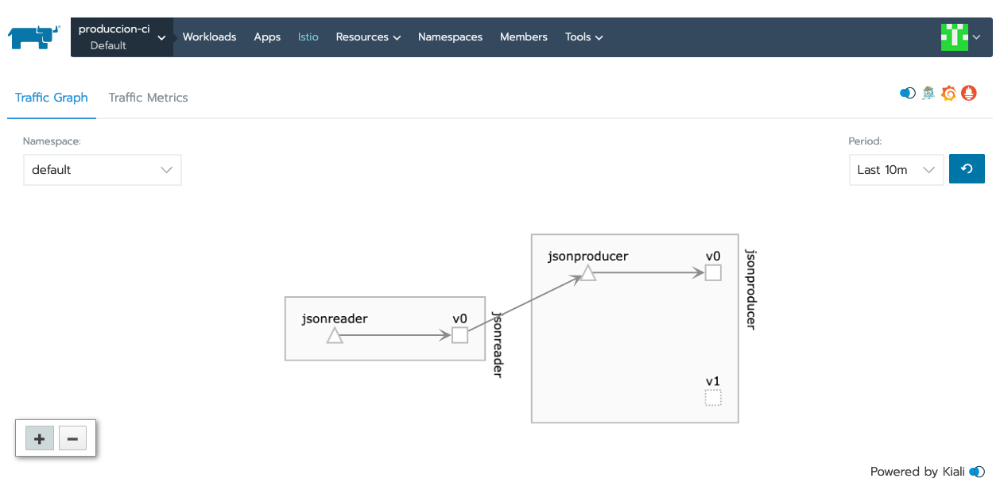

Métricas de acceso en Rancher

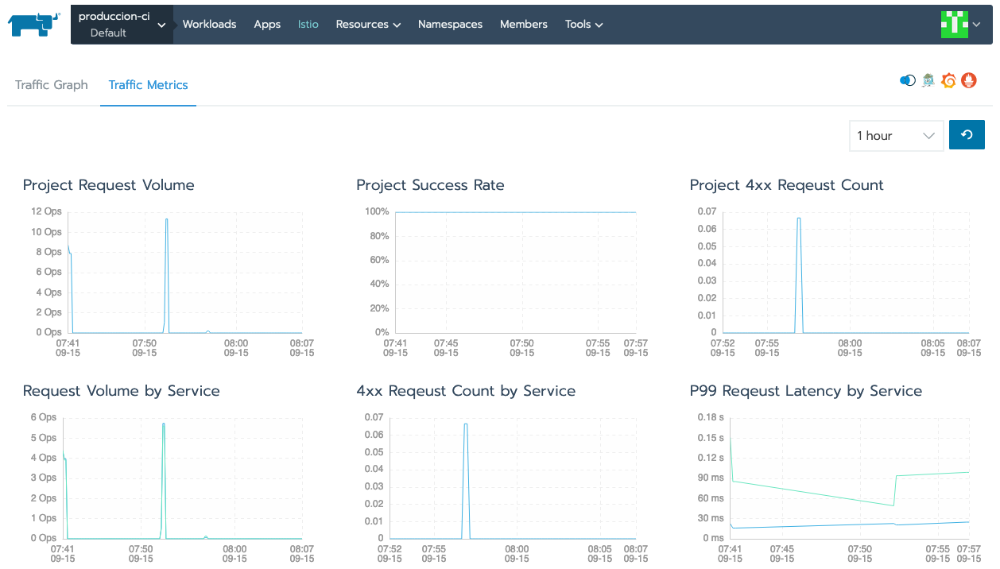

Actividad de los servicios en Kiali

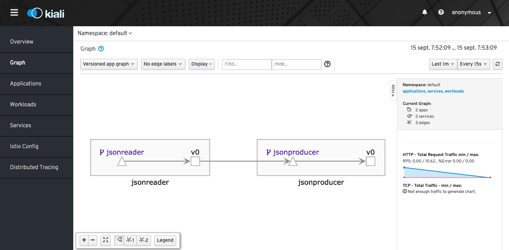

Visión general de las trazas con Jaeger

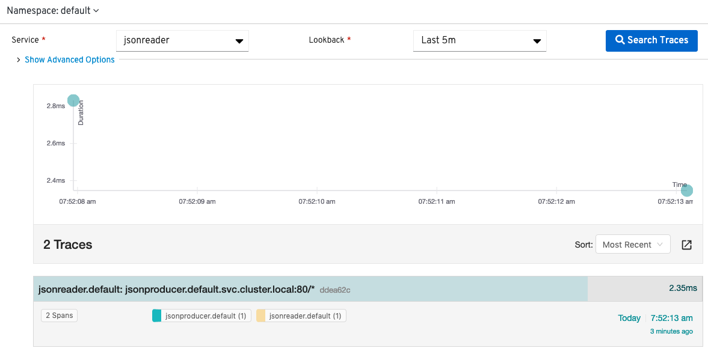

Detalles de una traza con Jaeger

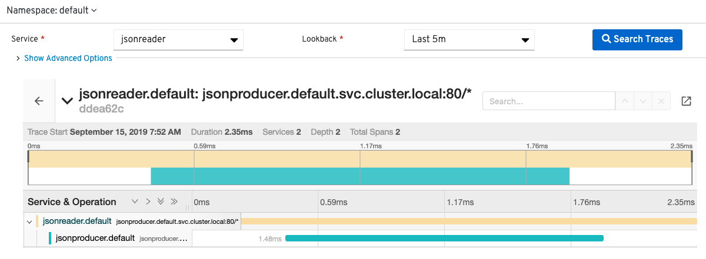

Actividad del servicio con Grafana

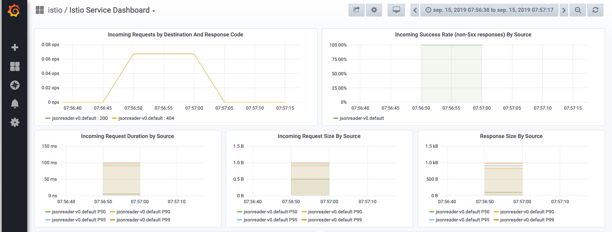

Consultas de métricas en Prometheus

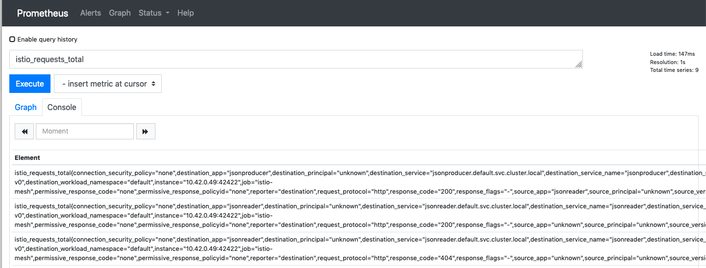