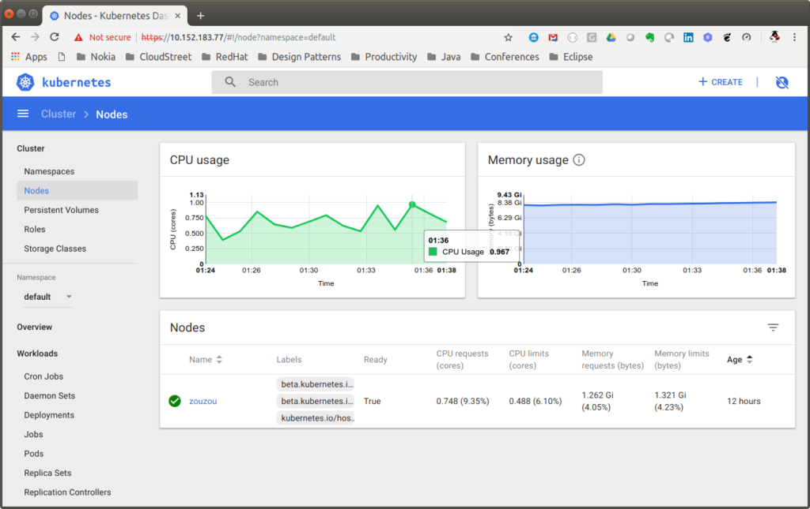

## 3. Microk8s

[Instalación web kuberntes](https://kubernetes.io/blog/2019/11/26/running-kubernetes-locally-on-linux-with-microk8s/)

[Instalación en ubuntu](https://ubuntu.com/tutorials/install-a-local-kubernetes-with-microk8s#5-host-your-first-service-in-kubernetes)

[Microk8s](https://microk8s.io/)

Microk8s es una nueva solución para ejecutar un clúster local Kubernetes ligero. Fue desarrollado por el equipo de Kubernetes en Canonical. Está diseñado para ser una instalación Kubernetes aguas arriba rápida y liviana aislada de su entorno local. Este aislamiento se logra empaquetando todos los binarios para Kubernetes, Docker.io, iptables y CNI en un solo paquete instantáneo [snap package](https://snapcraft.io/) (disponible solo en Ubuntu y distribuciones compatibles).

Al instalar Microk8s usando snap, puede crear una implementación "limpia" de los últimos Kubernetes en su máquina local sin ningún otro gasto adicional. La herramienta Snap se encarga de todas las operaciones necesarias y puede actualizar todos los archivos binarios asociados a sus últimas versiones. Por defecto, Microk8s instala y ejecuta los siguientes servicios:

- Api-server
- Controller-manager
- scheduler
- kubelet
- cni

Los servicios adicionales, como el panel de control de Kubernetes, se pueden habilitar / deshabilitar fácilmente con los comandos microk8s.enable y microk8s.disable. La lista de servicios disponibles son:

1. Dns
2. Dashboard, including grafana and influxdb
3. Storage
4. Ingress, Istio
5. Registry
6. Metrics Server

### Installation

Microk8s se puede instalar como un solo comando de ajuste, directamente desde la tienda Snap.

```
sudo snap install microk8s --classic
```


Esto instalará el comando `microk8s` y un servidor api, controlador-administrador, planificador, etcd, kubelet, cni, kube-proxy y Docker. Para evitar conflictos con la instalación existente de Kubernetes, Microk8s agrega un comando `microk8s.kubectl`, configurado para acceder exclusivamente a la nueva instalación de Microk8s. Cuando siga las instrucciones genéricas de Kubernetes en línea, asegúrese de prefijar `kubectl` con Microk8s. Para verificar que la instalación se realizó correctamente, puede usar los siguientes comandos para recuperar los nodos disponibles y los servicios disponibles respectivamente:

```
microk8s.kubectl get nodesmicrok8s.kubectl get services
```

Para asegurarse de que MicroK8s se esté ejecutando, puede usar este comando de estado:

```
sudo microk8s.status 
```

Y la salida :

```
microk8s is running
addons:
cilium: disabled
dashboard: disabled
dns: disabled
fluentd: disabled
gpu: disabled
helm: disabled
ingress: disabled
istio: disabled
jaeger: disabled
knative: disabled
linkerd: disabled
metrics-server: disabled
prometheus: disabled
rbac: disabled
registry: disabled
storage: disabled
```

Como puede ver, MicroK8s se está ejecutando como se esperaba y podemos ver una larga lista de componentes adicionales que están deshabilitados, que discutiremos en el siguiente paso.

Para hacer que MicroK8s sea lo más liviano posible, la instalación predeterminada incluye una implementación básica de Kubernetes, que incluye el servidor api, el controlador-administrador, el planificador, kubelet, cni y kube-proxy.

Sin embargo, nuestra implementación de nodo único se puede ampliar fácilmente al habilitar los complementos proporcionados que vimos en el paso anterior. Por ejemplo, puede habilitar los servicios de Istio o implementar un registro privado de Docker. Los complementos se pueden habilitar y deshabilitar fácilmente cuando lo desee y están preconfigurados para funcionar de forma inmediata.

En aras de la demostración en este tutorial, agregaremos el complemento del panel que proporciona la interfaz de usuario conocida para monitorear y operar clústeres de Kubernetes. También habilitaremos otros dos complementos que admitirán el panel: dns e ingress.

Para hacer esto, usaremos este comando:

```bsah
sudo microk8s.enable dns dashboard ingress 
```

A continuación, configuraremos un proxy para pasar y permitir solicitudes externas al panel de control:

```bash
sudo microk8s.kubectl proxy --accept-hosts=.* --address=0.0.0.0 & 
```

Para permitir el acceso al tablero sin requerir un token, voy a editar el archivo de implementación para el servicio del tablero:

```bash
sudo microk8s.kubectl -n kube-system edit deploy kubernetes-dashboard -o yaml 
```

Aquí, voy a agregar el indicador  –enable-skip-login flag to the deployment’s specs:

```yaml
spec:
  progressDeadlineSeconds: 600
  replicas: 1
  revisionHistoryLimit: 10
  selector:
    matchLabels:
      k8s-app: kubernetes-dashboard
  strategy:
    rollingUpdate:
      maxSurge: 25%
      maxUnavailable: 25%
    type: RollingUpdate
  template:
    metadata:
      creationTimestamp: null
      labels:
        k8s-app: kubernetes-dashboard
    spec:
      containers:
      - args:
        - --auto-generate-certificates
        - --namespace=kube-system
        - --enable-skip-login
```


Una vez que guardemos el archivo, podremos acceder al tablero ingresando la siguiente URL:

 [http://{IP_address}:8001/api/v1/namespaces/kube-system/services/https:kubernetes-dashboard:/proxy/](about:blank)


### Management

Como se mencionó anteriormente, Microk8s instala un Kubernetes upstream de barebones. Esto significa que solo el servidor api, el controlador-administrador, el planificador, kubelet, cni y kube-proxy están instalados y ejecutados. Los servicios adicionales como kube-dns y el panel de control se pueden ejecutar con el comando microk8s.enable.


```bash
microk8s.enable dns dashboard
```


Puede verificar que todos los servicios estén en funcionamiento con el siguiente comando:


```
pliakas@zouzou:~$ microk8s.kubectl get all --all-namespaces
NAMESPACE     NAME                                                  READY     STATUS    RESTARTS   AGE
kube-system   pod/heapster-v1.5.2-84f5c8795f-n8dmd                  4/4       Running   8          11h
kube-system   pod/kube-dns-864b8bdc77-8d8lk                         2/3       Running   191        11h
kube-system   pod/kubernetes-dashboard-6948bdb78-z4knb              1/1       Running   97         11h
kube-system   pod/monitoring-influxdb-grafana-v4-7ffdc569b8-g6nrv   2/2       Running   4          11h

NAMESPACE     NAME                           TYPE        CLUSTER-IP       EXTERNAL-IP   PORT(S)             AGE
default       service/kubernetes             ClusterIP   10.152.183.1     <none>        443/TCP             12h
kube-system   service/heapster               ClusterIP   10.152.183.58    <none>        80/TCP              11h
kube-system   service/kube-dns               ClusterIP   10.152.183.10    <none>        53/UDP,53/TCP       11h
kube-system   service/kubernetes-dashboard   ClusterIP   10.152.183.77    <none>        443/TCP             11h
kube-system   service/monitoring-grafana     ClusterIP   10.152.183.253   <none>        80/TCP              11h
kube-system   service/monitoring-influxdb    ClusterIP   10.152.183.15    <none>        8083/TCP,8086/TCP   11h

NAMESPACE     NAME                                             DESIRED   CURRENT   UP-TO-DATE   AVAILABLE   AGE
kube-system   deployment.apps/heapster-v1.5.2                  1         1         1            1           11h
kube-system   deployment.apps/kube-dns                         1         1         1            0           11h
kube-system   deployment.apps/kubernetes-dashboard             1         1         1            1           11h
kube-system   deployment.apps/monitoring-influxdb-grafana-v4   1         1         1            1           11h

NAMESPACE     NAME                                                        DESIRED   CURRENT   READY     AGE
kube-system   replicaset.apps/heapster-v1.5.2-84f5c8795f                  1         1         1         11h
kube-system   replicaset.apps/kube-dns-864b8bdc77                         1         1         0         11h
kube-system   replicaset.apps/kubernetes-dashboard-6948bdb78              1         1         1         11h
kube-system   replicaset.apps/monitoring-influxdb-grafana-v4-7ffdc569b8   1         1         1         11h

```

Puede acceder a cualquier servicio señalando el `CLUSTER_IP` correcto a su navegador. Por ejemplo, puede acceder al tablero utilizando la siguiente dirección web, https://10.152.183.77. Vea la imagen a continuación para el tablero:

[](https://codefresh.io/wp-content/uploads/2018/11/image1.png)Kubernetes dashboard


En cualquier momento, puede pausar y reiniciar todos los servicios de Kubernetes y los contenedores instalados sin perder ninguna de sus configuraciones emitiendo el siguiente comando. (Tenga en cuenta que esto también deshabilitará todos los comandos con el prefijo Microk8s).


```bash
snap disable microk8s
```


Eliminar Microk8s es muy fácil. Puede hacerlo deshabilitando primero todos los servicios de Kubernetes y luego usando el comando snap para eliminar los archivos completos de instalación y configuración


```bash
microk8s.disable dashboard dnssudo snap remove microk8s
```


### Deployment

Desplegar un servicio nginx es lo que esperaría, con la adición del prefijo Microk8s:


```bash
microk8s.kubectl run nginx --image nginx --replicas 3microk8s.kubectl expose deployment nginx --port 80 --target-port 80 --type ClusterIP\ --selector=run=nginx --name nginx
```

Puede monitorear sus servicios desplegados usando el comando:


```tex
pliakas@zouzou:~$ microk8s.kubectl get all
NAME                         READY     STATUS    RESTARTS   AGE
pod/nginx-64f497f8fd-86xlj   1/1       Running   0          2m
pod/nginx-64f497f8fd-976c4   1/1       Running   0          2m
pod/nginx-64f497f8fd-r2tsv   1/1       Running   0          2m

NAME                 TYPE        CLUSTER-IP       EXTERNAL-IP   PORT(S)   AGE
service/kubernetes   ClusterIP   10.152.183.1     <none>        443/TCP   13h
service/nginx        ClusterIP   10.152.183.125   <none>        80/TCP    1m

NAME                    DESIRED   CURRENT   UP-TO-DATE   AVAILABLE   AGE
deployment.apps/nginx   3         3         3            3           2m

NAME                               DESIRED   CURRENT   READY     AGE
replicaset.apps/nginx-64f497f8fd   3         3         3         2m
```

Ahora está listo para acceder a su servicio web desplegado señalando la siguiente URL web en su navegador web preferido: http://10.152.183.125

