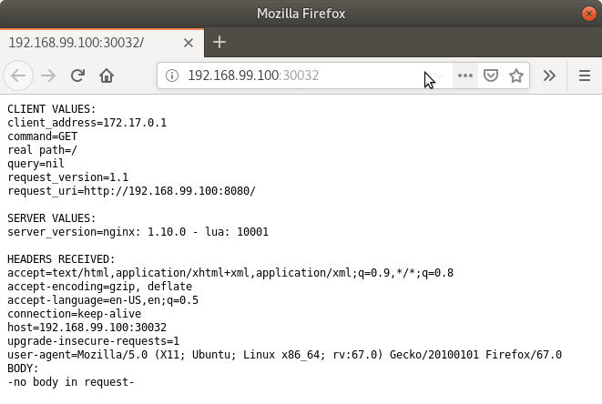
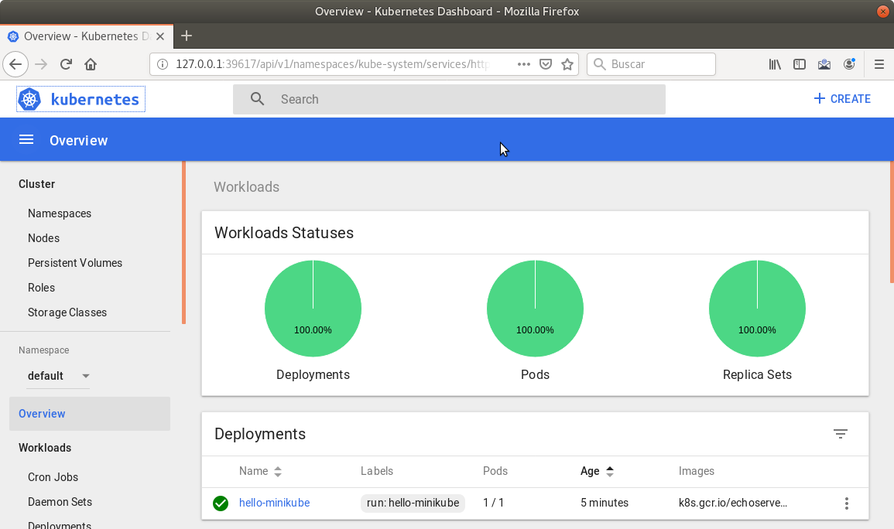

## 3. Minikube

- Minikube es una implementación ligera de Kubernetes que crea una máquina virtual localmente y despliega un cluster sencillo formado por un solo nodo.
- Minikube es una gran herramienta para el desarrollo de aplicaciones Kubernetes y permite características habituales como *LoadBalancer*, *NodePort*, volúmenes persistentes, *Ingress*, dashboard, reglas de acceso, y demás.

En la [página de GitHub de Minikube](https://github.com/kubernetes/minikube) se encuentra información sobre el proyecto, [instalación](https://kubernetes.io/docs/tasks/tools/install-minikube/) y otros temas de interés.

Una vez instalado, probaremos los comandos básicos:

- Iniciar un cluster: `minikube start`

La primera vez que ejecutemos este comando descargará la ISO de Minikube, que son unos 130 MB, y creará la máquina virtual correspondiente. Después, la preparará para Kubernetes y tras unos minutos estará disponible minikube en nuestro puesto de trabajo.

- Acceso al Dashboard de Kubernetes: `minikube dashboard`

- Una vez iniciado, se podrá interactuar con el cluster usando `kubectl` (que veremos en la sección [kubectl (el CLI de Kubernetes)](https://ualmtorres.github.io/SeminarioKubernetes/#truekubectl-el-cli-de-kubernetes)) como con cualquier cluster Kubernetes:

  - Iniciar un servidor de ejemplo en Minikube: `kubectl run hello-minikube --image=k8s.gcr.io/echoserver:1.4 --port=8080`

  - Exponer un servicio como un *NodePort*: `kubectl expose deployment hello-minikube --type=NodePort`

  - Abrir el endpoint del servicio en el navegador: `minikube service hello-minikube`

    El servidor de ejemplo iniciado muestra información sobre el cliente en el que se está ejecutando y sobre las cabeceras. Dicho servidor es expuesto en el cluster de Kubernetes como un *NodePort*. El resultado tras mostrarlo con `minikube service hello-minikube` será algo similar al de la figura siguiente.

Un *NodePort* es una forma de exponer un servicio mediante la IP del nodo en el que está el pod y un puerto estático (*NodePort*). De forma predeterminada el rango de puertos para *NodePort* es 30000-32767. 

​    

    Si ahora abrimos el dashboard con `minikube dashboard`, se mostraría algo similar a lo de la figura siguiente. En la figura se observa cómo ha sido creado el *Deployment* `hello-minikube`.

  Un *Deployment* es un objeto Kubernetes que de forma declarativa especifica, entre otros, la imagen usada para desplegar los pods, el número de réplicas deseadas, recursos (RAM, CPU, …) solicitados para los pods, y demás. 

  

Si ahora probamos a eliminar el pod creado, veremos que se vuelve a crear. Esto se debe a que el objeto Deployment `hello-minikube` creado anteriormente (con la orden `kubectl run hello-minikube --image=k8s.gcr.io/echoserver:1.4 --port=8080`) se encarga de mantener el número de réplicas especificado (1 de forma predeterminada). Realmente, si queremos eliminar el pod de forma permanente tendríamos que eliminar el objeto Deployment. Un poco más adelante veremos cómo hacerlo.

## Comandos básicos de minikube

- Iniciar un pod a partir de una imagen indicando el puerto de escucha del pod: `kubectl run hello-minikube --image=k8s.gcr.io/echoserver:1.4 --port=8080`
- Exponer un servicio como un *NodePort*: `kubectl expose deployment hello-minikube --type=NodePort`
- Abrir el endpoint del servicio en el navegador: `minikube service hello-minikube`
- Iniciar un segundo cluster local: `minikube start -p cluster2`
- Detener el cluster local: `minikube stop`
- Eliminar el cluster local: `minikube delete`