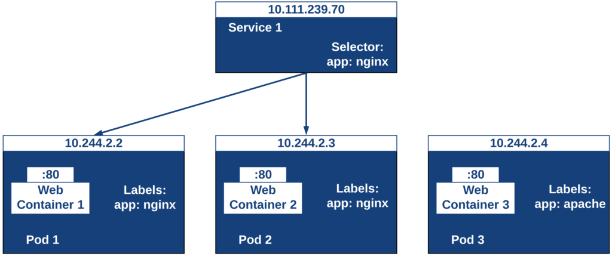
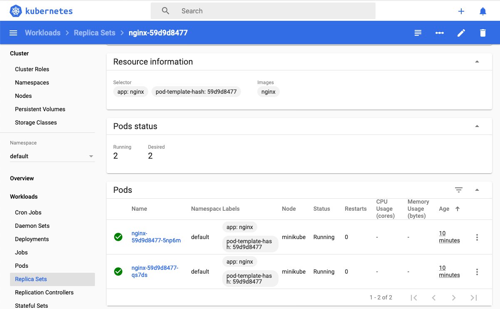
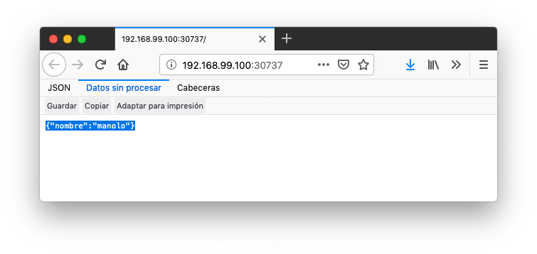

## 5. Componentes de Kubernetes en acción

### 5.1. Deployments

Una configuración de Deployment pide a Kubernetes que cree y actualice las instancias de una aplicación. Tras crear el Deployment, el Master organiza las instancias de aplicación en los nodos disponibles del cluster.


Una vez creadas las instancias de aplicación, el **Controlador de Deployment de Kubernetes** monitoriza continuamente las instancias. Si un nodo en el que está una instancia cae o es eliminado, el Controlador de Deployment de Kubernetes sustituye la instancia por otra instancia en otro nodo disponible del cluster.

Esta funcionalidad de *autocuración* de las aplicaciones supone un cambio radical en la gestión de las aplicaciones. Esta característica de recuperación de fallos mediante la creación de nuevas instancias que reemplazan a las defectuosas o desaparecidas no existía antes de los orquestadores.

Al crear un Deployment se especifica la imagen del contenedor que usará la aplicación y el número de réplicas que se quieren mantener en ejecución. El número de réplicas se puede modificar en cualquier momento actualizando el Deployment.

#### 5.1.1. Despliegue de una aplicación

Podemos ejecutar una aplicación con `kubectl run` indicando el nombre que se dará al Deployment y el nombre de la imagen (Docker) usada para la aplicación.

```bash
$ kubectl run jsonproducer --image=ualmtorres/jsonproducer:v0 --port 80 

deployment.apps/jsonproducer created
```

|      | El puerto hace referencia al puerto que usa la aplicación original, es decir su contenedor, para servir su contenido. |
| ---- | ------------------------------------------------------------ |
|      |                                                              |

Este comando ha hecho que el Master haya buscado un nodo para ejecutar la aplicación, haya programado la ejecución de la aplicación en ese nodo y haya configurado el cluster para programar la ejecución de otra instancia cuando sea necesario.

|      | Para imágenes que no estén en Docker Hub se pasa la URL completa del repositorio de imágenes. |
| ---- | ------------------------------------------------------------ |
|      |                                                              |

Para obtener los Deployments disponibles

```bash
$ kubectl get deployments

NAME           READY   UP-TO-DATE   AVAILABLE   AGE
jsonproducer   1/1     1            1           8s
```

Para poder acceder a la aplicación deberemos primero exponerla en el cluster de Kubernetes. Más adelante veremos los detalles. Por ahora, basta con ejecutar el comando siguiente, el cual creará un *servicio* asociado a nuestro Deployment para poder acceder a la aplicación.

```bash
$ kubectl expose deployment jsonproducer --type=NodePort

service/jsonproducer exposed
```

Para ver la ejecución de la aplicación, pediremos a Minikube que nos muestre el *servicio* con el comando

```bash
$ minikube service jsonproducer
```

Esto abrirá un navegador y el resultado del servicio es un JSON similar a este:

```json
{"nombre":"manolo"}
```

### 5.2. Pods

Al crear el Deployment anterior, Kubernetes creó un Pod para ejecutar una instancia de la aplicación. Un Pod es una abstracción de Kubernetes que representa un grupo de uno o más contenedores de una aplicación y algunos recursos compartidos de esos contenedores (p.e. volúmenes, redes)

|      | Un ejemplo de pod con más de un contenedor lo encontramos en lo que se denominan *sidecars*. Ejemplos de sidecar los encontramos en aplicaciones que registran su actividad en un contenedor (sidecar) dentro del mismo pod y publican la actividad en una aplicación que monitoriza el cluster. Otro ejemplo de sidecar es el de un contenedor sidecar que proporciona un certificado SSL para comunicación https al contenedor de la aplicación. Otro ejemplo más lo podemos encontrar en un sidecar que actúa como volumen. |
| ---- | ------------------------------------------------------------ |
|      |                                                              |

Los contenedores de un pod comparten una IP y un espacio de puertos, y siempre van juntos y se despliegan juntos en un nodo. La figura siguiente ilustra varias configuraciones de pods:

- Pod 1: Un pod con un contenedor
- Pod 2: Un pod con un contenedor y un volumen
- Pod 3: Un pod con dos contenedores que comparten un volumen
- Pod 4: Un pod con varios contenedores y varios volúmenes


Los pods son la unidad atómica de Kubernetes. Al crear un despliegue en Kubernetes, el Deployment crea Pods con contenedores en su interior. Cada pod queda ligado a un nodo y sigue allí hasta que se finalice o se elimine. En caso de fallo del nodo se planifica la creación de sus pods en otros nodos disponibles del cluster.

|      | Los pods son efímeros, por lo que su almacenamiento desaparece al eliminar el pod. Por este motivo es necesario saber utilizar almacenamiento externo para que los datos persistan. La sección [[Almacenamiento externo\]](https://ualmtorres.github.io/SeminarioKubernetes/#Almacenamiento externo) estudia esta funcionalidad. |
| ---- | ------------------------------------------------------------ |
|      |                                                              |

#### 5.2.1. Creación de un pod para MongoDB mediante un archivo de manifiesto

Los pods, al igual que otros recursos de Kubernetes (ReplicaSets, volúmenes, …) se pueden crear sobre la marcha con el CLI indicando la imagen a partir de la que se crean, o se pueden crear a partir de archivos de manifiesto. Estos archivos de manifiesto se escriben en sintaxis [YAML](https://yaml.org/) y representan una forma declarativa de definir los recursos del cluster Kubernetes. En la sección [Despliegue de aplicaciones mediante archivos YAML](https://ualmtorres.github.io/SeminarioKubernetes/#truedespliegue-de-aplicaciones-mediante-archivos-yaml) se trata este tema.

Para ilustrar cómo crear un pod mediante una manifiesto YAML, veremos cómo crear uno sencillo para MongoDB. Para ir familiarizándonos con Kubernetes, probaremos también con unos comandos básicos para mostrar información, mostrar los logs y redirección de puertos

1. Creación del manifiesto YAML

   Archivo `mongodb-basico.yaml`

   ```yaml
   apiVersion: v1
   kind: Pod
   metadata:
     name: mongodb
   spec:
     containers:
     - image: mongo
       name: mongodb
   ```

2. Despliegue del manifiesto para crear el pod

   ```bash
   $ kubectl apply -f mongodb-basico.yaml
   ```

3. Inicio de sesión SSH en el pod

   ```bash
   $ kubectl exec -it mongodb /bin/bash
   ```

4. Mostrar información del pod

   ```bash
   $ kubectl describe pod mongodb
   ```

5. Mostrar los logs del pod

   ```bash
   $ kubectl logs mongodb
   ```

6. Redirección del puerto del pod a un puerto local (establece un túnel SSH entre nuestro equipo y el pod con los puertos indicados)

   ```bash
   $ kubectl port-forward mongodb 27017:27017
   ```

   |      | Para poder probar el comando anterior de la redirección de puertos necesitaremos disponer de un cliente MongoDB instalado en nuestro equipo. |
   | ---- | ------------------------------------------------------------ |
   |      |                                                              |

7. Eliminación del pod

   ```bash
   $ kubectl delete -f mongodb-basico.yaml
   ```

Nodos

Los pods se ejecutan en un Nodo. Un nodo es una máquina *worker* (física o virtual) del cluster. Los nodos están gestionados por el Master. Un Nodo puede contener muchos pods.


Cada Nodo ejecuta al menos:

- `Kubelet`, un proceso que se encarga de la comunicación entre el nodo y el Master. Gestiona los pods y los contenedores que se están ejecutando en el nodo.
- Un motor de contenedores, como Docker, que se encarga de la descarga de imágenes de un registro y de ejecutar la aplicación.

### 5.3. Servicios

Se dice que en Kubernetes los pods son mortales o efímeros. Cuando un nodo desaparece (bien por un error o por una desconexión), los contenedores que están en el nodo también se pierden. En ese momento, un *ReplicaSet* se encarga de devolver el cluster al estado deseado y organiza la creación de nuevos pods en otros nodos disponibles para mantener funcionando la aplicación. Las réplicas de los pods han de ser intercambiables y **aunque cada pod en el cluster tenga su propia IP única, Kubernetes reconcialiará los cambios entre los pods para que las aplicaciones sigan funcionando**.

Los servicios en Kubernetes son una abstracción que definen un conjunto lógico de pods y una política de acceso a ellos estableciendo un nombre para acceder a ellos. Esto permite que haya un acoplamiento débil entre pods dependientes. El acceso puede ser interno o externo al cluster. De esta forma, las aplicaciones sólo usarán los nombres de los servicios y no las IP de los pods, ya que éstas nunca son fijas debido a que, por un lado, los pods se crean y se destruyen para mantener el número de réplicas deseado; y por otro lado, un pod puede ser sustituido por otro ante un problema y el nuevo pod tendrá una IP diferente.

Agrupación de pods en servicios

Los pods pueden ser etiquetados con metadatos. Estos metadatos posteriormente pueden ser usados por otros objetos Kubernetes (p.e. ReplicaSet, Deployment) para seleccionar los pods y crear una unidad lógica (p.e. todas las réplicas de un contenedor de frontend)

La figura siguiente ilustra como un servicio agrupa mediante el **selector** `app:ngnix` a aquellos pods que están etiquetados con `app:ngnix`.



```yaml
apiVersion: apps/v1
kind: Deployment
metadata:
  name: nginx
  labels:
    app: nginx
spec:
  replicas: 2
  selector:
    matchLabels: 
      app: nginx
  template:
    metadata:
      labels: 
        app: nginx
    spec:
      containers:
      - name: webcontainer
        image: nginx
        ports:
        - containerPort: 80
```

|      | Condición para buscar         |
| ---- | ----------------------------- |
|      | Condición para ser encontrado |

Al desplegar este deployment se crearán dos pods (`replicas: 2`), que quedarán agrupados por la coincidencia entre el selector que pide el deployment (`app: nginx`) y la etiqueta con los que son creados los pods (`app: nginx`).

```bash
$ kubectl apply -f ngnix.yaml
```

Si ahora vemos los detalles del deployment en el dashboard de Minikube veremos que los dos pods de Nginx creados están agrupados lógicamente en el deployment `ngnix`. Esta información está realmente en el objeto ReplicaSet creado por el Deployment.



Cada pod tiene una dirección IP única, pero esa IP no se expone fuera del cluster sin lo que se denomina un Servicio. **Los servicios pemiten que las aplicaciones reciban tráfico**.

#### 5.3.1. Tipos de servicio

En función del ámbito de la exposición del servicio tenemos:

- `ClusterIP`: El servicio recibe una IP interna a nivel de cluster y hace que el servicio sólo sea accesible a nivel de cluster.
- `NodePort`: Expone el servicio fuera del cluster concatenando la IP del nodo en el que está el pod y un número de puerto entre 30000 y 32767, que es el mismo en todos los nodos
- `LoadBalancer`: Crea en cloud, si es posible, un balanceador externo con una IP externa asignada.
- `ExternalName`: Expone el servicio usando un nombre arbitrario (especificado en `externalName`)


Los servicios enrutan el tráfico entre los pods proporcionando una abstracción que permite que los pod mueran y se repliquen sin impactar en la aplicación.

|      | El descubrimiento y enrutado entre pods dependientes (p.e. frontend y backend) son gestionados por los Servicios. Los servicios agrupan a sus pods usando etiquetas y selectores. Los servicios usan selectores y los pods son creados con etiquetas. Su emparejamiento por valores coincidentes es lo que agupa los pods en un servicio. |
| ---- | ------------------------------------------------------------ |
|      |                                                              |

Las etiquetas son pares clave-valor y tienen usos muy variados:

- Seleccionar los objetos de un despliegue
- Diferenciar entre objetos de desarrollo, prueba y producción
- Distinguir entre versiones


En la figura se observa cómo el selector de etiquetas usado en los Deployment sirve para agrupar los pods que conforman un servicio, ya que cada pod contiene la misma etiqueta usada en el selector del Deployment al que pertenece.

Las etiquetas se pueden configurar durante la creación o en cualquier momento posterior.

|      | Prueba a editar en el dashboard de kubernetes uno de los pods de Nginx cambiándole la etiqueta (p.e. `app:apache`). Esto hará que ese pod salga del ReplicaSet al que pertenecía y se cree automáticamente un nuevo pod etiquetado con `app:nginx`. De esto se encarga el Deployment, que de acuerdo a su especificación exige tener 2 réplicas en ejecución de pods con etiquetas `app:nginx`. |
| ---- | ------------------------------------------------------------ |
|      |                                                              |

#### 5.3.2. Ejemplo. Creación de un servicio

Anteriormente, en la sección [Despliegue de una aplicación](https://ualmtorres.github.io/SeminarioKubernetes/#truedespliegue-de-una-aplicaci-n) creamos una aplicación de ejemplo que generaba un JSON de prueba. A modo de recordatorio, hicimos lo siguiente:

1. Crear un Deployment a partir de la imagen `ualmtorres/jsonproducer:v0` de Docker Hub con el comando

   ```bash
   $ kubectl run jsonproducer --image=ualmtorres/jsonproducer:v0 --port 80
   ```

   Podemos consultar el Deployment existente con el comando siguiente. Si por cualquier motivo no se dispone del Deployment, basta con ejecutar el comando anterior para crearlo.

   ```json
   $ kubectl get deployments
   NAME           READY   UP-TO-DATE   AVAILABLE   AGE
   jsonproducer   1/1     1            1           17m
   ```

   Este Deployment habrá creado un pod que estará ejecutando la aplicación disponible de la imagen utilizada. Podemos ver los pods disponibles con el comando

   ```bash
   $ kubectl get pods
   NAME                            READY   STATUS    RESTARTS   AGE
   jsonproducer-7769d76894-2nzt2   1/1     Running   0          23m
   ```

2. Crear un servicio para poder exponer la aplicación al exterior. Concretamente usamos un servicio de tipo NodePort, lo que nos sirve la aplicación concatenando la IP del nodo donde está el pod y un puerto aleatorio. El servicio lo creamos con

   ```bash
   $ kubectl expose deployment jsonproducer --type=NodePort
   ```

   Podemos consultar el servicio existente con el comando siguiente. Si por cualquier motivo no se dispone del servicio, basta con ejecutar el comando anterior para crearlo.

   ```bash
   $ kubectl get services
   NAME           TYPE        CLUSTER-IP      EXTERNAL-IP   PORT(S)        AGE
   jsonproducer   NodePort    10.99.116.165   <none>        80:30737/TCP   25m 
   kubernetes     ClusterIP   10.96.0.1       <none>        443/TCP        34d 
   ```

   |      | Este es nuestro servicio. En el caso del tutorial, el puerto aleatorio asignado es el 30737 |
   | ---- | ------------------------------------------------------------ |
   |      | Servicio `kubernetes` creado de forma predetermianda al iniciarse Minikube |

   Podemos acceder el servicio creado con

   ```bash
   $ minikube service jsonproducer
   ```

   

   Si queremos consultar la información del servicio creado usaremos la opción `describe` de `kubectl`

   ```bash
   $ kubectl describe services jsonproducer 
   
   Name:                     jsonproducer
   Namespace:                default
   Labels:                   run=jsonproducer 
   Annotations:              <none>
   Selector:                 run=jsonproducer
   Type:                     NodePort
   IP:                       10.99.116.165
   Port:                     <unset>  80/TCP
   TargetPort:               80/TCP
   NodePort:                 <unset>  30737/TCP
   Endpoints:                172.17.0.5:80
   Session Affinity:         None
   External Traffic Policy:  Cluster
   Events:                   <none>
   ```

   |      | Pasamos el nombre de nuestro servicio como parámetro |
   | ---- | ---------------------------------------------------- |
   |      | Etiqueta añadida de forma predeterminada             |

   Si ahora consultamos la información del pod de la aplicación veremos que coincide la etiqueta. Recordemos que al introducir el concepto de Servicio se indicó que era una abstracción para agrupar pods y que utilizaba etiquetas para poder reunirlos. He aquí la correspondencia entre la etiqueta del servicio y la etiqueta de los pods del servicio.

```bash
$ kubectl get pods 

NAME                            READY   STATUS    RESTARTS   AGE
jsonproducer-7769d76894-2nzt2   1/1     Running   0          49m

$ kubectl describe pods jsonproducer-7769d76894-2nzt2 

Name:               jsonproducer-7769d76894-2nzt2
Namespace:          default
Priority:           0
PriorityClassName:  <none>
Node:               minikube/10.0.2.15
Start Time:         Mon, 15 Jul 2019 18:56:20 +0200
Labels:             pod-template-hash=7769d76894
                    run=jsonproducer 
Annotations:        <none>
Status:             Running
IP:                 172.17.0.5
Controlled By:      ReplicaSet/jsonproducer-7769d76894 
Containers:
  jsonproducer:
    Container ID:   docker://52e290262984a94da4dd89102b93d80f59c0c4310c303dac67b02884d73fb545
    Image:          ualmtorres/jsonproducer:v0 
...
```

|      | Obtener primero los pods disponibles para poder acceder al pod deseado |
| ---- | ------------------------------------------------------------ |
|      | Obtener información del pod                                  |
|      | Etiqueta coincidente con el selector (etiqueta) del Deployment |
|      | ReplicaSet encargado de mantener el número de pods deseados para el Deployment |
|      | Imagen base usada para crear el único contenedor de este pod |

### 5.4. Volúmenes

Básicamente, un volumen es un directorio para datos que es accesible a los contenedores de un Pod y que persiste a los reinicios de un Pod. El medio que se use para el almacenamiento y cómo se comporte ante una eliminación del Pod depende del tipo de volumen que se use.

Para usar un volumen, un Pod especifica el volumen que proporciona al Pod (el campo `.spec.volumes`) y donde montarlo en los contenedores (el campo `.spec.containers.volumeMounts`). Dejamos por ahora el tema de los volúmenes para volver a ellos más adelante cuando usemos archivos de despliegue.

### 5.5. ConfigMaps

Los objetos ConfigMap permiten almacenar datos en forma de pares clave-valor para que puedan usarse posteriormente en despliegues parametrizados y hacerlos más portables.

Usaremos los ConfigMap para almacenar datos no sensibles sobre la configuración. Deben ser datos no sensibles porque los datos se guardan tal cual.

- Creación de un ConfigMap con valores directamente:

  ```bash
  $ kubectl create configmap datosmtorres --from-literal=nombre=Manuel --from-literal=apellidos=Torres
  ```

- Creación de un ConfigMap desde archivos:

  ```bash
  $ kubectl create configmap datosstevemcqueen --from-file=nombre=nombre.txt --from-file=apellidos=apellidos.txt
  ```

|      | Los archivos que contienen los valores que alimentarán las claves no contendrán caracteres no deseados como espacios o saltos de línea al final. |
| ---- | ------------------------------------------------------------ |
|      |                                                              |

- Obtener los datos de un ConfigMap

  ```bash
  $ kubectl describe configmap datosmtorres
  $ kubectl describe configmap datosstevemcqueen
  ```

- Eliminar un ConfigMap

  ```bash
  $ kubectl delete configmap datosmtorres
  $ kubectl delete configmap datosstevemcqueen
  ```

### 5.6. Secrets

Los objetos Secret se usan para almacenar información sensible, como contraseñas, tokens OAuth y claves ssh. Colocar esta información en objetos Secret es más seguro que colocarla en texto plano y legible.

No obstante, los datos de los objetos Secret no están cifrados. Están codificados en base64 y pueden hacerse visibles fácilmente. Sistemas como [Vault](https://www.vaultproject.io/) son usados de forma complementaria para aumentar la seguridad de la información que contienen los Secret.

- Creación de un Secret con valores directamente:

  ```bash
  $ kubectl create secret generic my-secret --from-literal=key1=supersecret --from-literal=key2=topsecret
  ```

- Creación de un Secret desde archivos:

  ```bash
  $ kubectl create secret generic my-second-secret --from-file=key1=key1.txt --from-file=key2=key2.txt
  ```

- Obtener los datos de un Secret:

  ```bash
  $ kubectl get secret my-secret -o yaml
  ```

- Decodificación de un Secret:

  ```bash
  $  echo 'yourEncodedKey' | base64 --decode
  ```

- Eliminar un Secret:

  ```bash
  $ kubectl delete secret my-secret
  ```

### 5.7. Namespaces

Hasta ahora, todos los objetos que hemos creado (pods, deployments, replicasets, services, configmaps y secrets) están en el mismo lugar, en el mismo espacio. Concretamente en el espacio `default`. Es lo que se conoce como *namespace*. Los namespaces se usan para organizar objetos en un cluster, proporcionando una forma de mantener separados los recursos en el cluster. De cara a dar nombres a los recursos, los nombres sólo tienen que ser únicos a nivel de namespace, pero no a nivel de cluster.

|      | En clusters con varios usuarios los namespaces proporcionan una forma de agrupar los recursos de cada usuario. Además, los administradores pueden establecer cuotas a nivel de namespace limitando a los usuarios la cantidad de objetos que pueden crear y la cantidad de recursos del cluster que pueden consumir (p.e. CPU, memoria). |
| ---- | ------------------------------------------------------------ |
|      |                                                              |

- Crear un Namespace

  ```bash
  $ kubectl create namespace rrhh
  ```

- Crear un pod indicando el namespace

  ```bash
  $ kubectl run nginxrrhh --image=nginx --port 80 --namespace rrhh
  ```

- Mostrar los pods de un namespace

  ```bash
  $ kubectl get pods --namespace rrhh
  ```

- Cambiar de namespace

  ```bash
  kubectl config set-context --current --namespace=rrhh
  ```

- Volver al namespace default

  ```bash
  $ kubectl config set-context --current --namespace=default
  ```

- Eliminar un namespace

  ```bash
  $ kubectl delete namespace rrhh
  ```

|      | Eliminar un namespace elimina el namespace y todos los objetos que contenga, por lo que es una operación muy peligrosa. |
| ---- | ------------------------------------------------------------ |
|      |                                                              |

|      | Si se elimina un namespace estando situado sobre él no se cambia a ningún namespace por lo que habrá que cambiar a uno de los namespace existentes en nuestro sistema |
| ---- | ------------------------------------------------------------ |
|      |                                                              |

|      | [`kubectx` y `kubens`](https://github.com/ahmetb/kubectx) son dos herramientas que facilitan la gestión de cambios de namespace y de contexto |
| ---- | ------------------------------------------------------------ |
|      |                                                              |