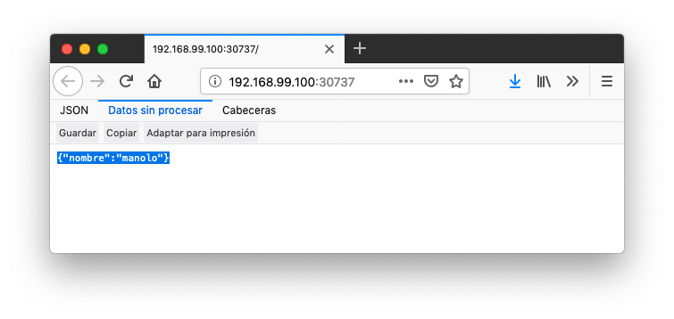

### 6.1. Ejemplo de escalado de una aplicación

En primer lugar veremos cuáles eran las condiciones del despliegue de ejemplo que estamos usando.

```bash
$ kubectl get deployments

NAME           READY   UP-TO-DATE   AVAILABLE   AGE
jsonproducer   1/1     1            1           68m
```

- `READY` indica el ratio entre los pods que están en ejecución y los pods deseados.
- `UP-TO-DATE` indica el número de réplicas que están actualizadas para alcanzar el estado deseado.
- `AVAILABLE` indica el número de réplicas disponibles actualmente para los usuarios.

|      | Si no contamos con este deployment porque vamos limpiando el entorno en cada sección, los comandos siguientes vuelven a crear el Deployment `jsonproducer` para continuar el tutorial.`$ kubectl run jsonproducer --image=ualmtorres/jsonproducer:v0 --port 80  $ kubectl expose deployment jsonproducer --type=NodePort  $ minikube service jsonproducer `Crea el Deployment, ReplicaSet y el PodCrea el servicio del tipo NodePort. El servicio está accesible mediante la IP del cluster (`kubectl cluster-info`) concatenada al puerto que se haya asignado (`NodePort`)Pedir a Minikube que abra un navegador para acceder al servicio `jsonproducer` |
| ---- | ------------------------------------------------------------ |
|      |                                                              |

El comando siguiente escala a 4 réplicas el despliegue de ejemplo (`jsonproducer`)

```bash
$ kubectl scale deployments jsonproducer --replicas=4

deployment.extensions/jsonproducer scaled
```

Unos instantes después podremos comprobar que el Deployment ya ha alcanzado el estado deseado.

```bash
$ kubectl get deployments

NAME           READY   UP-TO-DATE   AVAILABLE   AGE
jsonproducer   4/4     4            4           73m
```

La aplicación sigue disponible sin ningún cambio para el usuario final. Sin embargo, ahora hay 4 réplicas cuyo tráfico es gestionado por un balanceador de carga asociado al servicio.



La información de las réplicas la podemos obtener consultando el número de pods con el comando siguiente:

```bash
$ kubectl get pods

NAME                            READY   STATUS    RESTARTS   AGE
jsonproducer-7769d76894-2nzt2   1/1     Running   0          74m
jsonproducer-7769d76894-9xdqw   1/1     Running   0          38s
jsonproducer-7769d76894-nhtl4   1/1     Running   0          38s
jsonproducer-7769d76894-qbvzd   1/1     Running   0          38s
```

Si ahora por cualquier motivo dejase de estar disponible alguno de los nodos en los que se encuentra desplegados los pods de la apliación, o bien dejase de funcionar alguno de los pods, el Controlador de Deployment de Kubernetes se encargaría de organizar la creación de nuevos pods para volver a alcanzar el estado deseado, en nuestro caso 4 réplicas.

Probemos esta funcionalidad eliminando el último pod y comprobando como Kubernetes organiza inmediatamente la creación de otro pod que lo sustituya.

```bash
$ kubectl delete pods jsonproducer-7769d76894-qbvzd
pod "jsonproducer-7769d76894-qbvzd" deleted

$ kubectl get pods
NAME                            READY   STATUS    RESTARTS   AGE
jsonproducer-7769d76894-2nzt2   1/1     Running   0          85m
jsonproducer-7769d76894-9xdqw   1/1     Running   0          12m
jsonproducer-7769d76894-gh7qk   1/1     Running   0          3s 
jsonproducer-7769d76894-nhtl4   1/1     Running   0          12m
```

|      | Pod que sustituye al pod eliminado y que es creado automáticamente para mantener el número de réplicas a 4 |
| ---- | ------------------------------------------------------------ |
|      |                                                              |

Por último, si ahora queremos reducir el número de réplicas a 2 bastará con volver a indicarlo al Deployment en el parámetro `replicas` y este será el nuevo estado a alcanzar.

```bash
$ kubectl scale deployments jsonproducer --replicas=2
deployment.extensions/jsonproducer scaled

$ kubectl get pods
NAME                            READY   STATUS    RESTARTS   AGE
jsonproducer-7769d76894-2nzt2   1/1     Running   0          92m
jsonproducer-7769d76894-9xdqw   1/1     Running   0          18m
```

## 7. Actualización de aplicaciones

Para poder realizar actualizaciones sin tener que suspender el servicio mientras se realiza la actualización, Kubernetes proporciona las *rolling updates*, que van actualizando los pods con la nueva versión de la aplicación.

De forma predeterminada, el número de pods que pueden estar no disponibles durante una actualización es 1, aunque esta opción es configurable, ya sea mediante cantidad o porcentaje de pods no disponibles durante la actualización. Además, es posible volver a una versión anterior.

Al igual que ocurre al escalar las aplicaciones, si el Deployment está expuesto, el Service balanceará el tráfico sólo a los pods que estén disponibles durante la actualización.

A continuación se muestra cómo actualizar el Deployment de ejemplo `jsonproducer` con nuevo Deployment con el mismo nombre y una nueva versión de la imagen (`v1`).

```bash
$ kubectl set image deployments jsonproducer jsonproducer=ualmtorres/jsonproducer:v1
```

Al realizar la actualización de la imagen del Deployment, Kubernetes tendrá que descargar la nueva imagen y organizar la creación de los pods en los nodos con recursos disponibles. Mientras se realiza la actualización podremos ver que hay nodos que se están terminando, otros que se están creando y otros que están disponibles.

```bash
$ kubectl get pods
NAME                            READY   STATUS              RESTARTS   AGE
jsonproducer-7769d76894-fr7cz   1/1     Running             0          25s
jsonproducer-7769d76894-hfpr7   1/1     Terminating         0          24s
jsonproducer-c76c87f-jwhxq      0/1     ContainerCreating   0          0s
jsonproducer-c76c87f-tmbkk      1/1     Running             0          1s
```

Tras unos instantes, la aplicación dejará de servir totalmente la versión anterior de la aplicación y comenzará a servir la nueva versión. La nueva versión de la aplicación devuelve `Manolo Torres` en lugar de `manolo` en el JSON.


Para deshacer una actualización de una aplicación volviendo a la versión anterior haremos un `rollout undo`. El comando siguiente devuelve a la aplicación a la versión anterior

```bash
$ kubectl rollout undo deployments jsonproducer
deployment.extensions/jsonproducer rolled back
```

Tras este comando, el Controlador de Deployment de Kubernetes irá reemplanzando los pods hasta alcanzar el estado deseado. A continuación se ve el estado intermedio mientras se vuelve a la versión anterior.

```bash
$ kubectl get pods
NAME                            READY   STATUS        RESTARTS   AGE
jsonproducer-7769d76894-m22sv   1/1     Running       0          2s
jsonproducer-7769d76894-v6hfv   1/1     Running       0          4s
jsonproducer-c76c87f-jwhxq      0/1     Terminating   0          14m
jsonproducer-c76c87f-tmbkk      0/1     Terminating   0          14m
```

Tras unos instantes, se alcanzará el estado deseado

```bash
Caligari:~ manolo$ kubectl get pods
NAME                            READY   STATUS    RESTARTS   AGE
jsonproducer-7769d76894-m22sv   1/1     Running   0          8s
jsonproducer-7769d76894-v6hfv   1/1     Running   0          10s
```

Y la aplicación volverá a mostrar el contenido anterior.


