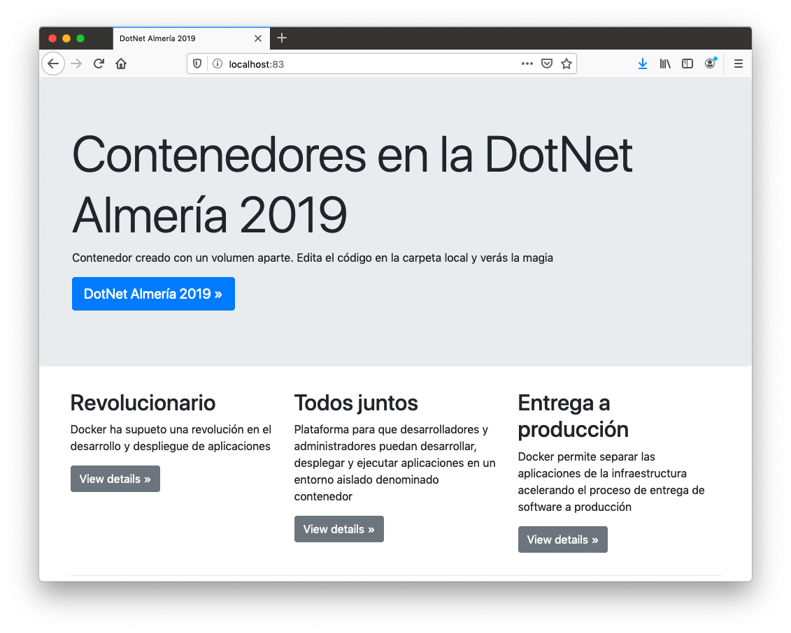
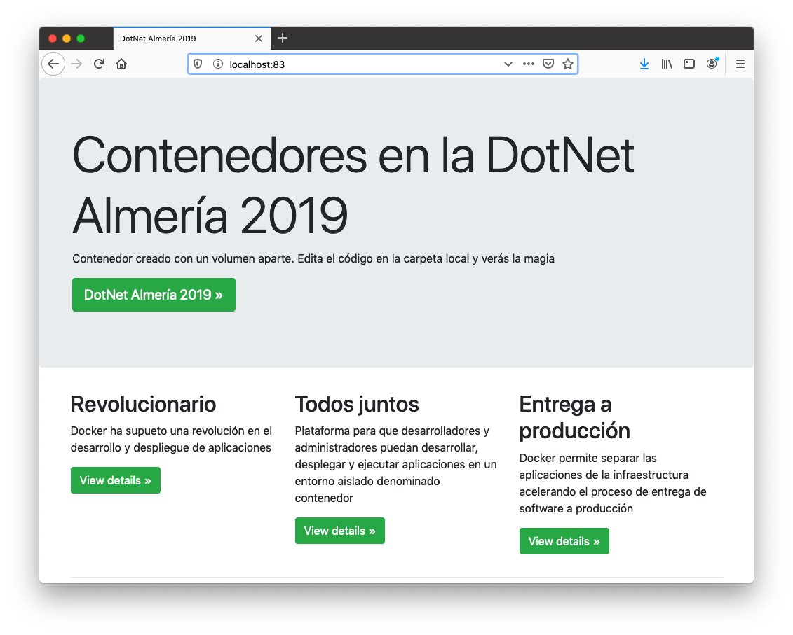
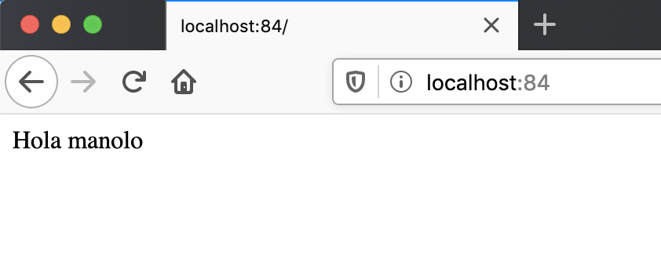
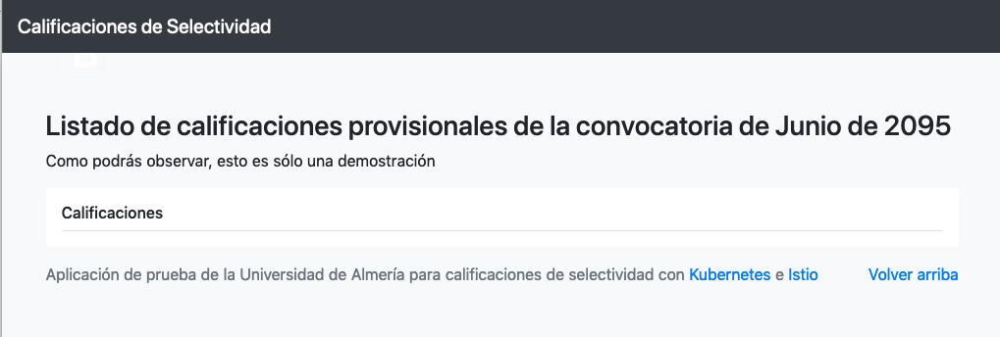
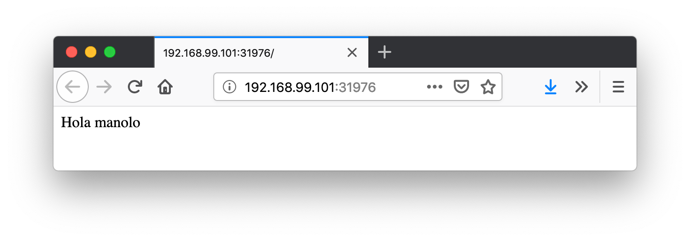
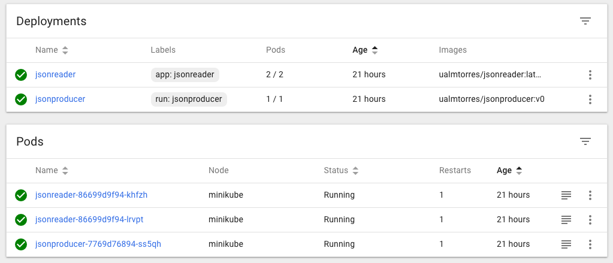
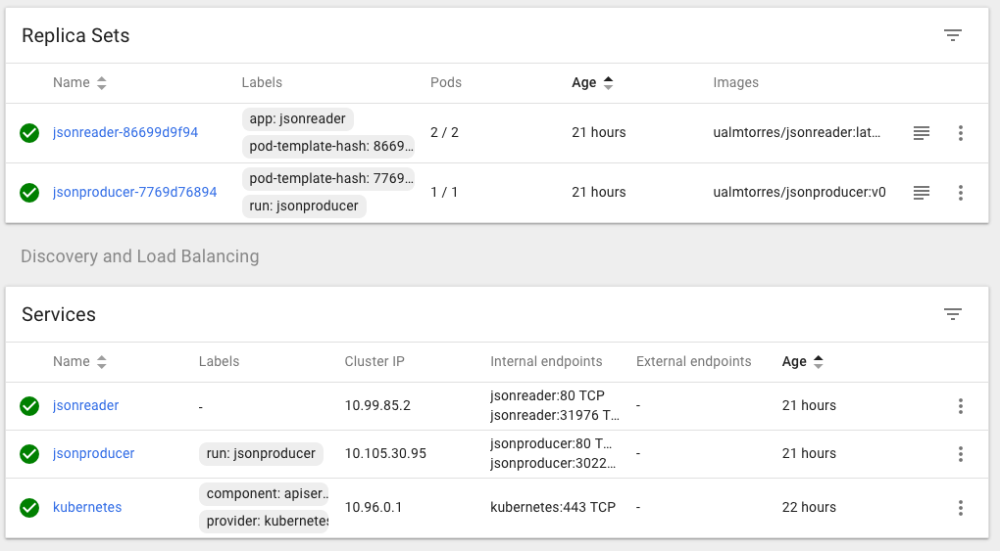
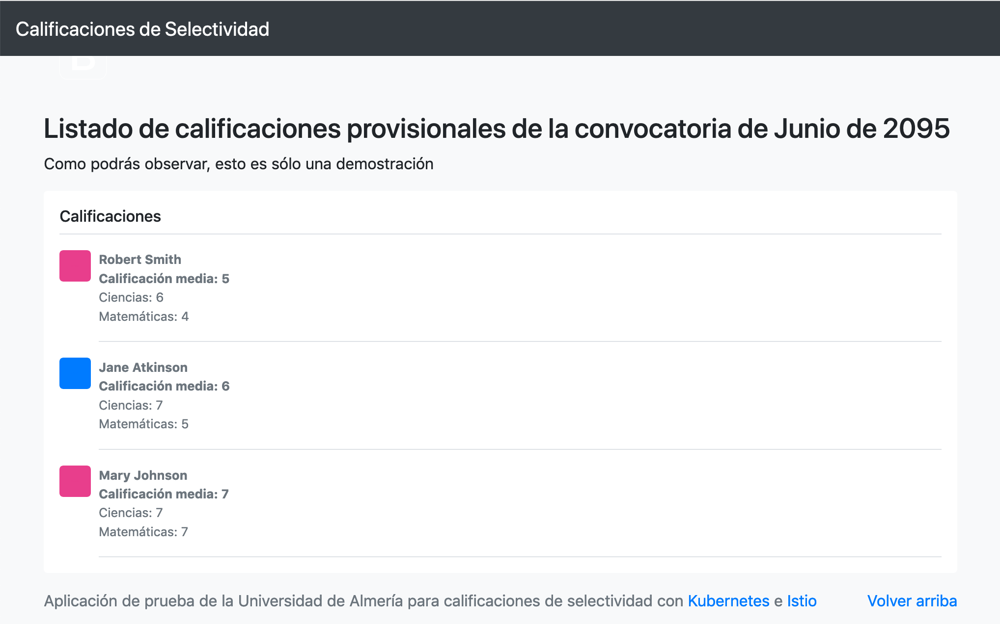

## 8. Despliegue de aplicaciones mediante archivos YAML

Hasta ahora, la interacción con Kubernetes la hemos hecho sobre la marcha, creando despliegues, servicios, escalado de aplicaciones y demás. Esto nos ha servido familiarizarnos tanto con los objetos básicos de Kubernetes (Pod, ReplicaSet, Deployment, Service, ConfigMap, Secret, Namespace, …), como con operaciones habituales (escalado, actualización de versiones, …). Sin embargo, esta no es la forma habitual. Esta forma de uso de Kubernetes está más orientada a la creación de tareas puntuales. En cambio, cuando se trata de operaciones que queremos que sean repetibles, la forma de operar consiste en crear archivos YAML especificando el objeto que se quiere crear en Kubernetes (espacio de nombres, despliegue, servicio, …). Una vez creados estos archivos, se usará `kubectl` para cargarlos/desplegarlos en Kubernetes.

|      | El uso de archivos para despliegues Kubernetes nos permitirá además beneficiarnos de las ventajas de los sistemas de control de versiones, sometiendo nuestros recursos de Kubernetes al control de versiones, facilidad de distribución y trabajo en equipo. |
| ---- | ------------------------------------------------------------ |
|      |                                                              |

### 8.1. Despliegue de un Pod

Veamos cómo crear un archivo de manifiesto para desplegar un pod mediante un archivo de manifiesto YAML. El ejemplo despliega una web de contenido estático.

Archivo `pod-dotnet2019.yaml`

```yaml
apiVersion: v1
kind: Pod
metadata:
  name: dotnet2019
spec:
  containers:
  - name: dotnet2019
    image: ualmtorres/dotnet2019web:v0
```

Desplegaremos el pod con `kubectl` con este comando:

```bash
$ kubectl apply -f pod-dotnet2019.yaml
```

Si contamos con una URL para el manifiesto también lo podemos desplegar haciendo referencia a la URL:

```bash
$ kubectl apply -f https://gist.githubusercontent.com/ualmtorres/c6d0052dacd386c3dd01e57ad06dedc5/raw/e3cb7b828c21f6ebe0daa459e37d1578af892ce6/DotNetAlmeria2019-pod-dotnet2019.yaml
```

Esto creará un pod denominado `dotnet2019` en el namespace `default` de nuestro cluster Kubernetes.

Para ver la aplicación de forma provisional haremos un *port forward* entre el pod y nuestro equipo local con

```bash
$ kubectl port-forward dotnet2019 83:80
```

Al abrir un navegador en nuestro equipo en `localhost:83` accederemos a la web desplegada.



Si ahora queremos actualizar el pod con una nueva versión de la aplicación, basta con modificar el manifiesto YAML con la nueva imagen y volver a aplicar los cambios. Para ilustrar esto, modifiquemos la versión del manifiesto anterior a la imagen `ualmtorres/dotnet2019web:v1` en lugar de la versión `v0`. La nueva versión tiene los botones en verde.

La nueva versión del manifiesto quedaría así:

```yaml
apiVersion: v1
kind: Pod
metadata:
  name: dotnet2019
spec:
  containers:
  - name: dotnet2019
    image: ualmtorres/dotnet2019web:v1 
```

|      | Nueva imagen a desplegar |
| ---- | ------------------------ |
|      |                          |

Una vez guardados los cambios en el archivo de manifiesto, aplicaríamos los cambios con

```bash
$ kubectl apply -f pod-dotnet2019.yaml
```

Esto hará que se descargue la nueva imagen, se cree un nuevo pod con la nueva imagen y se elimine el pod que estaba sirviendo. Una vez finalizado ese proceso ya estará disponible la nueva versión de la aplicación en la misma URL:



### 8.2. Despliegue de un Deployment

Normalmente no desplegaremos Pods. En su lugar desplegaremos Deployments. En ellos podremos incluir contenedores con imágenes diferentes para que puedan trabajar de forma coordinada. Un ejemplo habitual es el de frontend y backend. En la especificación de los contenedores indicaremos además de la imagen de partida, número de réplicas, recursos solicitados (p.e. cantidad de RAM, porcentaje de CPU, …). Esto, además de desacoplar frontend y backend, desde el punto de vista de la escalabilidad, permite escalar frontend y backend de forma independiente.

|      | Un archivo de Deployment proporciona una forma declarativa de creación de Pods y ReplicaSets. En el archivo de Deployment se especifica el estado deseado. |
| ---- | ------------------------------------------------------------ |
|      |                                                              |

Para ilustrar el despliegue de una aplicación mediante archivos YAML vamos a desplegar una aplicación de ejemplo que consuma del servicio `jsonproducer` creado anteriormente. Se trata de un ejemplo muy sencillo de un entorno frontend-backend con un funcionamiento independiente.

|      | Recordemos que en la sección [Ejemplo de escalado de una aplicación](https://ualmtorres.github.io/SeminarioKubernetes/#trueejemplo-de-escalado-de-una-aplicaci-n) habíamos creado previamente un Deployment para `jsonproducer` y también habíamos creado un servicio. Por tanto, ya contamos con un Deployment y un Service para la parte de la producción de JSON. Si no es así, vuelve al apartado [Ejemplo de escalado de una aplicación](https://ualmtorres.github.io/SeminarioKubernetes/#trueejemplo-de-escalado-de-una-aplicaci-n) y ejecuta los comandos para volver a tenerlos disponibles en tu entorno. |
| ---- | ------------------------------------------------------------ |
|      |                                                              |

Vamos a crear un archivo de Deployment denominado `json-reader-deployment.yaml`. Este archivo básicamente contiene entre otros, el nombre de despliegue, el selector que usa el despliegue para seleccionar los pods que forman parte del despliegue, la etiqueta que usan los pods para ser agrupados y formar parte del mismo Deployment, número de réplicas y la imagen usada para crear el contenedor de cada pod.

```yaml
apiVersion: apps/v1
kind: Deployment 
metadata:
  name: jsonreader 
  namespace: default 
  labels:
    app: jsonreader 
spec:
  revisionHistoryLimit: 2 
  strategy:
    type: RollingUpdate 
  replicas: 2 
  selector:
    matchLabels:
      app: jsonreader 
  template: 
    metadata:
      labels: 
        app: jsonreader
    spec:
      containers:
      - name: jsonreader 
        image: ualmtorres/jsonreader:v0 
        ports:
        - name: http
          containerPort: 80 
```

|      | Tipo de recurso a desplegar                                  |
| ---- | ------------------------------------------------------------ |
|      | Nombre del despliegue                                        |
|      | Namespace de despliegue                                      |
|      | Etiqueta que usar el Deployment para ser luego seleccionado por otro objeto Kubernetes (p.e. Service). |
|      | Número de versiones almacenadas para poder deshacer despliegues fallidos |
|      | Tipo de estrategia de actualización                          |
|      | Número de réplicas del despliegue                            |
|      | Selector que define cómo el Deployment encuentra los Pods a gestionar, **que coincide con el definido en la plantilla (template) del pod** |
|      | Zona (plantilla) de definición del pod                       |
|      | Etiquetas asignadas a los pods y que les permitirán ser seleccionados para formar parte de un Deployment |
|      | Prefijo usado para los pods                                  |
|      | Imagen base para los contenedores de la aplicación           |
|      | Puerto por el que la aplicación sirve originalmente sus datos |

|      | La estrategia de despliegue (`spec.strategy.type`) puede ser `Recreate` o `RollingUpdate`, que es el valor predeterminado. |
| ---- | ------------------------------------------------------------ |
|      |                                                              |

El despliegue se realiza con `kubectl` con el comando siguiente

```bash
$ kubectl apply -f json-reader-deployment.yaml
```

Al crear el despliegue, se procederá a descargar la imagen y se pasarán a crear los dos pods indicados para este despliegue. Podemos ver los pods creados con el comando siguiente comprobando que efectivamente se creado los dos pods `jsonreader` que exigía el despliegue.

Podemos ver el despliegue con el comando siguiente

```bash
$ kubectl get deployments
NAME           READY   UP-TO-DATE   AVAILABLE   AGE
jsonproducer   1/1     1            1           22h
jsonreader     2/2     2            2           21h
```

También podemos ver los ReplicaSets creados por los despliegues

```bash
$ kubectl get rs
NAME                      DESIRED   CURRENT   READY   AGE
jsonproducer-7769d76894   1         1         1       22h
jsonreader-86699d9f94     2         2         2       22h
```

Los pods los podemos ver junto con sus etiquetas con el parámetro `--show-labels`

```bash
$ kubectl get pods --show-labels
NAME                            READY   STATUS    RESTARTS   AGE   LABELS
jsonproducer-7769d76894-ss5qh   1/1     Running   1          22h   pod-template-hash=7769d76894,run=jsonproducer
jsonreader-86699d9f94-khfzh     1/1     Running   1          22h   app=jsonreader,pod-template-hash=86699d9f94
jsonreader-86699d9f94-lrvpt     1/1     Running   1          22h   app=jsonreader,pod-template-hash=86699d9f94
```

Ahora podríamos ver a cualquiera de los pods de `jsonreader` haciendo *port forward* a nuestro equipo.

```bash
$ kubectl port-forward jsonreader-86699d9f94-lrvpt 84:80
```

Este sería su resultado en un navegador



|      | Hacer hincapié en que se puede ver funcionando correctamente este ejemplo porque ya se creó previamente en la sección [Ejemplo de escalado de una aplicación](https://ualmtorres.github.io/SeminarioKubernetes/#trueejemplo-de-escalado-de-una-aplicaci-n) el servicio para `jsonproducer`. Si ese servicio no hubiese sido creado, `jsonreader` no tendría acceso a `jsonreader`. |
| ---- | ------------------------------------------------------------ |
|      |                                                              |

Puedes encontrar un [ejemplo más completo de Deployment](https://github.com/ualmtorres/CursoKubernetes/tree/master/Ejemplos/Ejemplo16-Deployment) con un front-end más elaborado que consume de una API que proporciona calificaciones de estudiantes.

Sin embargo, vemos que el frontend no puede recuperar los datos del backend. Esto se debe a que aún no hay definido un servicio. En la siguiente sección encontraremos la solución a ese problema.



|      | Los servicios gestionan el descubrimiento y enrutado entre pods dependientes (p.e. frontend y backend) |
| ---- | ------------------------------------------------------------ |
|      |                                                              |

### 8.3. Despliegue de un Service

Un Service es una abstracción que define una agrupación de Pods y una política de acceso a ellos. El conjunto de Pods al que se dirige un Servicio están determinados por un **selector**.

En la sección [Ejemplo de escalado de una aplicación](https://ualmtorres.github.io/SeminarioKubernetes/#trueejemplo-de-escalado-de-una-aplicaci-n) habíamos creado un servicio directamente al hacer `kubectl expose deployment jsonproducer --type=NodePort`. Vamos a ver cómo podemos crear ese servicio mediante un manifiesto YAML.

Vamos a crear un archivo de Servicio denominado `json-reader-service.yaml`. Este archivo básicamente contiene entre otros el nombre de servicio, el tipo del servicio (ClusterIP, NodePort, …), el puerto de acceso a los pods del despliegue y el selector que identifica al despliegue con el que se corresponde el servicio creado.

```yaml
apiVersion: v1
kind: Service 
metadata:
  name: jsonreader 
  namespace: default 
spec:
  type: NodePort 
  ports:
  - name: http
    port: 80 
    targetPort: http
  selector:
    app: jsonreader 
```

|      | Tipo de recurso a desplegar                                  |
| ---- | ------------------------------------------------------------ |
|      | Nombre del servicio                                          |
|      | Namespace de despliegue                                      |
|      | Tipo de servicio. NodePort hará que el servicio esté disponible en la IP de los nodos en los que estén los pods y un puerto aleatorio entre 30000 y 32767 |
|      | Puerto en el que los pods están sirviendo su contenido       |
|      | Etiqueta que usa el servicio para localizar al Deployment. Buscará un valor coincidente en la etiqueta `labels` del Deployment. |

El despliegue se realiza con `kubectl` con el comando siguiente

```bash
$ kubectl create -f json-reader-service.yaml
```

El despliegue nos permitirá acceder a la aplicación en un puerto en el rango 30000-32767. En este caso ha tocado el 31976

```bash
$ kubectl get services
NAME           TYPE        CLUSTER-IP     EXTERNAL-IP   PORT(S)        AGE
jsonproducer   NodePort    10.105.30.95   <none>        80:30228/TCP   22h
jsonreader     NodePort    10.99.85.2     <none>        80:31976/TCP   22h
kubernetes     ClusterIP   10.96.0.1      <none>        443/TCP        22h
```

Para poder acceder al servicio pediremos a Minikube que nos lo muestre.

```bash
$ minikube service jsonreader
```

Esto hará que se abra un navegador con la aplicación `jsonreader` que simplemente lee el JSON y presenta un saludo sencillo.



También podemos usar el Kubernetes Dashboard para mostrar información de interés sobre este despliegue, viendo como el Deployment de `jsonreader` se ha incorporado a la lista de despliegues disponibles en el cluster, así como los Pods, ReplicaSets y Services, como muestran las figuras siguientes.





Puedes encontrar un [ejemplo más completo de Service](https://github.com/ualmtorres/CursoKubernetes/tree/master/Ejemplos/Ejemplo17-Service) que completa el Deployment de la sección anterior. Recordemos que el frontend no podía obtener la lista de calificaciones que ofrecía la API. Esto se debía a que se había desplegado el Deployment de la API, pero no se había desplegado su Service, que es lo que le da visibilidad.

Al desplegar el servicio del backend ya podremos ver que el frontend ya sí puede acceder a los datos que genera la API.



### 8.4. Despliegue de ConfigMaps

Tal y como comentamos anteriormente en la sección [ConfigMaps](https://ualmtorres.github.io/SeminarioKubernetes/#trueconfigmaps), los objetos ConfigMap permiten almacenar datos no sensibles en forma de clave valor. Un uso habitual de los ConfigMap es para inicialización de variables de entorno.

Antes de comenzar a usar ConfigMaps con variables de entorno, veamos cómo establecer variables de entorno. El ejemplo siguiente muestra un manifiesto YAML que crea un pod e inicializa dos variables de entorno (`NOMBRE` y `APELLIDOS`)

```yaml
apiVersion: v1
kind: Pod
metadata:
  name: configmap-env
spec:
  containers:
  - name: php-apache
    image: php:7-apache
    env:
      - name: NOMBRE
        value: Manolo
      - name: APELLIDOS
        value: Torres
```

El código siguiente muestra cómo lanzamos el manifiesto YAML para configurar las variables de entorno:

```bash
$ kubectl apply -f configmap-env.yaml
```

Una vez que el pod esté en ejecución podremos abrir una sesión interactiva en él con

```bash
$ kubectl exec -it configmap-env /bin/bash
```

Una vez dentro del contenedor del pod podremos mostrar las variables de entorno

```bash
$ echo $NOMBRE
$ echo $APELLIDOS
```

Una vez hecho esto haremos el mismo ejemplo pero configurando los valores a través de un ConfigMap. Una vez creado el ConfigMap, habrá que acceder a sus pares clave-valor para asignarlo a las variables del entorno en el contenedor de destino.

El manifiesto YAML siguiente crea un objeto ConfigMap con dos pares clave-valor y un objeto Pod que accede al ConfigMap para inicializar dos variables de entorno.

```bash
apiVersion: v1
kind: ConfigMap
metadata:
  name: myconfigmap 
data:
  nombre: Manolo 
  apellidos: Torres
---
apiVersion: v1
kind: Pod
metadata:
  name: configmap-pod
spec:
  containers:
  - name: configmap-container
    image: php:7-apache
    env:
      - name: NOMBRE
        valueFrom: 
          configMapKeyRef: 
            name: myconfigmap 
            key: nombre 
      - name: APELLIDOS
        valueFrom:
          configMapKeyRef:
            name: myconfigmap
            key: apellidos
```

|      | Nombre del objeto ConfigMap para poder ser usado posteriormente |
| ---- | ------------------------------------------------------------ |
|      | Configuración de pares clave-valor en el ConfigMap           |
|      | Acceso de un valor almacenado                                |
|      | Acceso a un un ConfigMap                                     |
|      | Nombre del ConfigMap a usar                                  |
|      | Clave del ConfigMap a leer                                   |

El código siguiente muestra cómo lanzamos el manifiesto YAML para configurar las variables de entorno:

```bash
$ kubectl apply -f configmap-pod.yaml
```

Una vez que el pod esté en ejecución podremos abrir una sesión interactiva en él con

```bash
$ kubectl exec -it configmap-env /bin/bash
```

Una vez dentro del contenedor del pod podremos mostrar las variables de entorno

```bash
$ echo $NOMBRE
$ echo $APELLIDOS
```

### 8.5. Despliegue de Secrets

Como comentamos anteriormente en la sección [Secrets](https://ualmtorres.github.io/SeminarioKubernetes/#truesecrets), los objetos Secret se usan para almacenar información sensible, como contraseñas, tokens OAuth y claves ssh. No obstante, los datos de los objetos Secret no están cifrados. Están codificados en base64 y pueden hacerse visibles fácilmente.

Para ilustrar el uso de Secrets veamos el manifiesto de creación de un pod con MySQL sin y con secretos.

El manifiesto siguiente crea un pod MySQL al que se le pasa la variable de entorno `MYSQL_ROOT_PASSWORD` durante su inicialización para la contraseña del `root`. En este ejemplo, el valor de la variable de entorno de la contraseña del `root` es pasada en el propio manifiesto

```yaml
apiVersion: apps/v1
kind: Deployment
metadata:
  name: mysql-sin-secrets
spec:
  selector:
    matchLabels: mysql
  template:
    metadata:
      labels:
        app: mysql
    spec:
      containers:
      - name: mysql-sin-secrets
        image: mysql
        env:
        - name: MYSQL_ROOT_PASSWORD
          value: password
        ports:
        - containerPort: 3306
```

El manifiesto anterior lo lanzamos con

```bash
$ kubectl apply -f mysql-sin-secrets.yaml
```

Vamos a modificar el manifiesto anterior para hacer uso de objetos Secret.

Kubernetes guarda los secretos en base64. Por tanto, los valores que vayamos a almacenar en los pares clave-valor de un secreto tendrán que estar en base64.

Para codificar en base64 el valor `password` que utilizamos en el ejemplo anterior para contraseña del `root`, ejecutaremos el comando siguiente desde la línea de comandos:

```bash
$ echo -n 'password' | base64
```

Esto devolverá la cadena `cGFzc3dvcmQ=`, que corresponde a la cadena `password` en base64. Este valor codificado será el que usaremos para la creación del Secret.

A continuación crearemos el manifiesto YAML `secret-password.yaml` que inicializa un objeto Secret.

```yaml
apiVersion: v1
kind: Secret
metadata:
  name: mysqlpassword
type: Opaque
data:
  password: cGFzc3dvcmQ=
```

Lanzamos la creación del Secret con kubectl:

```yaml
kubectl apply -f secret-password.yaml
```

Por último, creamos el manifiesto YAML que inicializa un pod MySQL que lee del Secret creado la contraseña del usuario `root` para inicializar el pod correctamente.

```yaml
apiVersion: apps/v1
kind: Deployment
metadata:
  name: initdb
spec:
  selector:
    matchLabels:
     app: mysql
  template:
    metadata:
      labels:
        app: mysql
    spec:
      containers:
      - name: mysql
        image: mysql-con-secrets
        env:
        - name: MYSQL_ROOT_PASSWORD
          valueFrom:
            secretKeyRef:
              name: mysqlpassword
              key: password
        ports:
        - containerPort: 3306
```

Este manifiesto lo lanzaremos con `kubectl`:

```bash
$ kubectl apply -f mysql-con-secrets.yaml
```