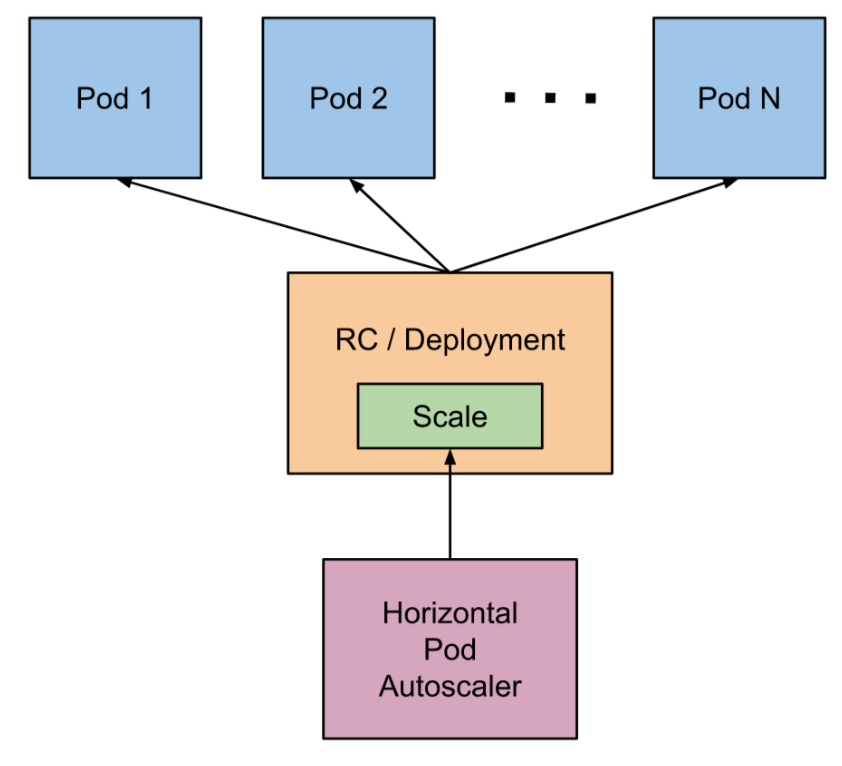
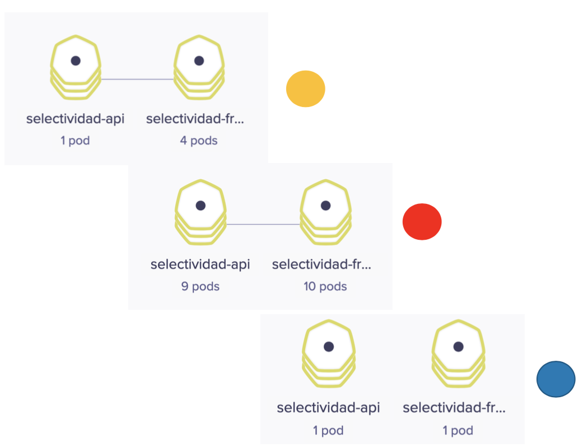
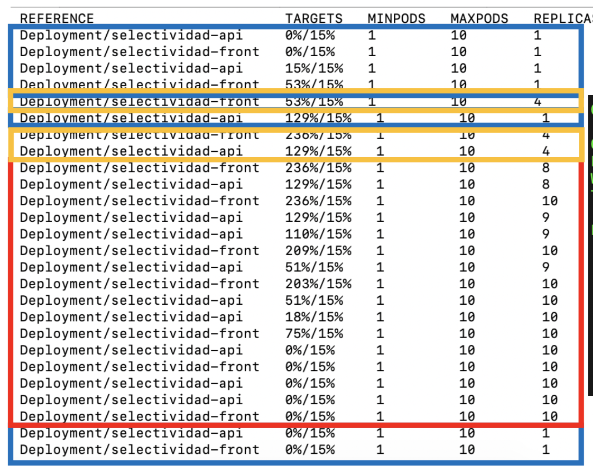

## 9. HPA. Horizontal Pod Autoscaler

El Horizontal Pod Autoscaler, o HPA pasa simplificar, escala de forma automática el número de réplicas de un pod en función de la observación de métricas de los pods (p.e. el uso de la CPU).

De forma escueta podemos resumir de esta forma su funcionamiento:

- En su definición se fija un mínimo y máximo de réplicas de un deployment
- En su definición se definen las condiciones de stress (p.e. porcentaje de uso de la CPU)
- HPA consulta cada 15s las métricas de uso (CPU, RAM, …) de cada pod
- Ante stress HPA escala hacia arriba
- HPA escala hacia abajo tras un periodo de 5 minutos sin stress



A continuación se muestran la redefinición de los Deployment de los ejemplos de la API y frontend del ejemplo de las calificaciones especificando una petición de CPU y memoria para cada pod.

Archivo `deployment-api.yaml` indicando límites de CPU y memoria:

```yaml
apiVersion: apps/v1
kind: Deployment
metadata:
  name: selectividad-api
  namespace: default
  labels:
    app: selectividad-api
spec:
  revisionHistoryLimit: 2
  strategy:
    type: RollingUpdate
  selector:
    matchLabels:
      app: selectividad-api
  template:
    metadata:
      labels:
        app: selectividad-api
    spec:
      containers:
      - name: selectividad-api
        image: ualmtorres/selectividad-api:v2
        ports:
        - name: http
          containerPort: 80
        resources:
          requests:
            cpu: 100m
            memory: 128Mi
          limits:
            cpu: 250m
            memory: 256Mi
```

Archivo `deployment-front.yaml` indicando límites de CPU y memoria:

```yaml
apiVersion: apps/v1
kind: Deployment
metadata:
  name: selectividad-front
  namespace: default
  labels:
    app: selectividad-front
spec:
  revisionHistoryLimit: 2
  strategy:
    type: RollingUpdate
  selector:
    matchLabels:
      app: selectividad-front
  template:
    metadata:
      labels:
        app: selectividad-front
    spec:
      containers:
      - name: selectividad-front
        image: ualmtorres/selectividad-front:v2
        ports:
        - name: http
          containerPort: 80
        resources:
          requests:
            cpu: 100m
            memory: 128Mi
          limits:
            cpu: 250m
            memory: 256Mi
```

|      | La petición de CPU es relativa a unidades teniendo en cuenta lo siguiente:1 CPU equivale a 1 vCPU en un entorno cloud1 Hyperthread en un servidor con procesador Intel con HyperthreadingLas peticiones se hacen en miliCPUs o en fracciones decimales de CPU. Así una petición de 100m y de 0.1 representan la misma cantidad de CPU solicitada.La unidad mínima solicitada es 1m (1 miliCPU). |
| ---- | ------------------------------------------------------------ |
|      |                                                              |

Qué ocurre si no se especifica un límite de uso de la CPU

Cuando no se especifica límite de CPU para un contenedor puede pasar una de estas dos situaciones:

- Si el contenedor está en un namespace que tiene definido un límite de uso de CPU, el contenedor podrá llegar como máximo hasta ese límite. Los administradores del cluster pueden usar `LimitRange` para configurar un tope de uso de la CPU.
- Si no hay límite definido, el contenedor podría llegar todos los recursos de CPU del nodo en el que se está ejecutando.

|      | También es posible limitar los recursos de RAM asignados a un contenedor. Consultar la [documentación oficial sobre la asignación de recursos de RAM a un contenedor](https://kubernetes.io/docs/tasks/configure-pod-container/assign-memory-resource/) para más información. |
| ---- | ------------------------------------------------------------ |
|      |                                                              |

A continuación se muestra el manifiesto que crea un servicio para cada deployment.

```bash
apiVersion: v1
kind: Service
metadata:
  name: selectividad-api
spec:
  type: ClusterIP
  ports:
  - port: 80
  selector:
    app: selectividad-api
---
apiVersion: v1
kind: Service
metadata:
  name: selectividad-front
spec:
  type: LoadBalancer
  ports:
  - port: 80
  selector:
    app: selectividad-front
```

Una vez definidos los objetos Deployment y sus Service correspondientes, pasamos a crear el HPA que monitorizará el uso de recursos de los contenedores y solicitará su autoescalado en función del uso de los recursos. En este caso, y para poder ver en acción fácilmente el autoescalado en acción, fijamos que a partir del 15% de uso de la CPU se soliten la creación de nuevos pods. También se indica que el intervalo de escalado esté entre 1 y 10 réplicas según demanda.

```bash
apiVersion: autoscaling/v1
kind: HorizontalPodAutoscaler
metadata:
 name: selectividad-api
spec:
 scaleTargetRef:
   apiVersion: apps/v1beta1
   kind: Deployment
   name: selectividad-api
 minReplicas: 1
 maxReplicas: 10
 targetCPUUtilizationPercentage: 15
---
apiVersion: autoscaling/v1
kind: HorizontalPodAutoscaler
metadata:
 name: selectividad-front
spec:
 scaleTargetRef:
   apiVersion: apps/v1beta1
   kind: Deployment
   name: selectividad-front
 minReplicas: 1
 maxReplicas: 10
 targetCPUUtilizationPercentage: 15
```

Podemos acceder al estado y condiciones del autoescalado con el comando siguiente.

```bash
$ kubectl get hpa

NAME                 REFERENCE                       TARGETS   MINPODS   MAXPODS   REPLICAS   AGE
selectividad-api     Deployment/selectividad-api     1%/15%    1         10        1          5m
selectividad-front   Deployment/selectividad-front   1%/15%    1         10        1          5m
```

Weavescope

[Weavescope](https://www.weave.works/oss/scope/) es una herramienta que nos puede ser muy útil a la hora de controlar cómo escala un despliegue. Con Weavescope podemos ver en vivo el número de réplicas de cada pod conforme se va adaptando a la demanda.

Weavescope está disponible para su despliegue en Kubernetes. Los comandos siguientes instalan Weavescope en nuestro cluster y redirigen su frontend al puerto 4040 a nuestro equipo local.

```bash
$ kubectl apply -f "https://cloud.weave.works/k8s/scope.yaml?k8s-version=$(kubectl version | base64 | tr -d '\n')"
$ kubectl port-forward -n weave "$(kubectl get -n weave pod --selector=weave-scope-component=app -o jsonpath='{.items..metadata.name}')" 4040
```

### 9.1. Prueba de stress de autoescalado

[Apache Benchmark](https://httpd.apache.org/docs/2.4/programs/ab.html) es una herramienta útil para realizar pruebas de carga. A continuación se muestra cómo hacer una prueba de carga con

- 100.000 peticiones totales
- 100 peticiones simultáneas

```bash
$ ab -n 100000 -c 100 http://selectividad-front.default.192.168.66.253.xip.io/
```

|      | Este ejemplo ha sido realizado en un cluster Kubernetes que gestionamos con [Rancher](https://rancher.com/). Al servicio de frontend le hemos creado un *ingress* de tipo *load balancer* para poder acceder al cluster desde fuera con un nombre DNS. |
| ---- | ------------------------------------------------------------ |
|      |                                                              |

La figura siguiente ilustra varias capturas de cómo ha ido adaptándose el número de pods a la demanda a lo largo de la prueba de carga. Hemos usado colores naranja, rojo y azul para ilustrar el estado de stress y la respuesta elástica con el número de pods en distintos estados que hemos ido capturando durante la prueba de carga.



La figura siguiente ilustra el estado del objeto HPA con el comando

```bash
$ kubectl get horizontalpodautoscalers.autoscaling --watch
```

