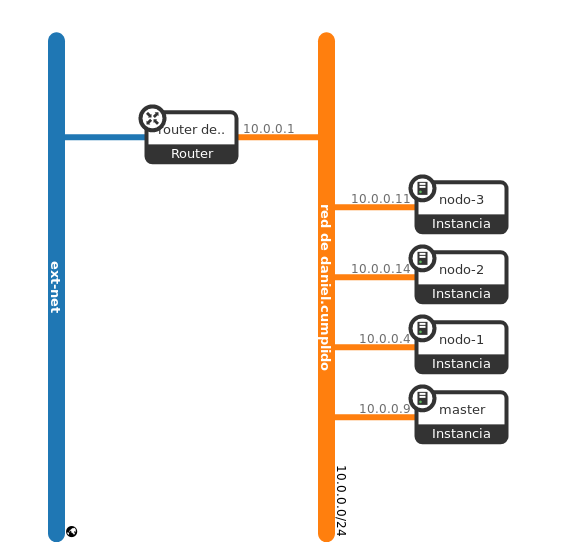

# Índice

1. [Introducción](#1-introducción)
    1. [Descripción del proyecto](#11-descripción-del-proyecto)
    2. [Escenario](#12-escenario)
2. [Qué es un Operator](#2-qué-es-un-operator)
    1. [Componentes](#21-componentes)
        * [Kubernetes](#kubernetes)
        * [Kubeadm](#kubeadm)
        * [Operator SDK](#operator-sdk)
        * [Operator Lifecycle Manager](#OLM)
        * [Operator Metering](#operator-metering)
3. [Instalación](#3-instalación)
    1. [Creación del cluster de kubernetes](#31-creación-del-cluster-de-kubernetes)
        1. [Chequeo de puertos](#311-chequeo-de-puertos)
        2. [Instalación del CRI](#312-instalación-del-CRI)
        3. [Instalación de kubeadm, kebelet y kubectl](#313-instalación-de-kubeadm,-kebelet-y-kubectl)
        4. [Inicio del cluster](#314-inicio-del-cluster)
    2. [Instalación de OLM](#32-instalación-de-olm)
    3. [Instalación de Operator SDK](#33-instalación-de-operator-sdk)
        1. [Prerrequisitos](#331-prerrequisitos)
        2. [Instalación](#332-instalación)
4. [Mongodb Operator](#4-mongodb-operator)
    1. [Instalación y comprobación](#41-instalación-y-comprobación)
5. [Proceso de creación de un Operator](#5-proceso-de-creación-de-un-operator)
6. [Conclusión](#6-conclusión)
7. [Siguientes pasos](#7-siguientes-pasos)
8. [Webgrafía](#8-webgrafía)

# 1. Introducción

## 1.1. Descripción del proyecto

El objetivo del proyecto es la creación de un cluster de **Kubernetes** con **Kubeadm** en máquinas virtuales levantadas en **OpenStack** para mostrar el uso y funcionamiento de un **Operator** ya existente como **Mongodb** y la posterior creación, despliegue y gestión de un **Operator** no existente, por ejemplo **Mariadb**, mediante el uso de **Helm**, **Operator SDK** y **OLM**. También se realizará la publicación del **operator** en el repositorio oficial de la comunidad.

## 1.2 Escenario



- Master (172.22.200.123): Ubuntu Bionic-18.04 m1.large, funciona como master del cluster de K8s.

- Nodo-1 (172.22.200.171): Ubuntu Bionic-18.04 m1.medium, actúa como nodo del cluster de K8s.

- Nodo-2 (172.22.201.40): Ubuntu Bionic-18.04 m1.medium, actúa como nodo del cluster de K8s.

- Nodo-3 (172.22.200.124): Ubuntu Bionic-18.04 m1.medium, actúa como nodo del cluster de K8s.

# 2. ¿Qué es un Operator?

Un **Operator** u operador es un método para empaquetar, implementar y administrar una aplicación de **Kubernetes**. Siendo esta administrada mediante las API de **Kubernetes** y las herramientas de **kubectl**. Los **operadores** nos permiten automatizar el proceso de despliegue de una aplicación en nuestros clústeres de **Kubernetes**, así como sus actualizaciones, copias de seguridad y escalado a lo largo del tiempo. También podremos recolectar métricas de nuestros **Operadores** para su análisis, aunque esta es una función que todavía se esa testeando y que llegará dentro de poco.

## 2.1. Componentes

Se detallarán lo componentes principales de **Operator**.

### Kubernetes

**Kubernetes** es un orquestador de contenedores, en principio de **Docker**, escrito en **Go** anunciado por Google en 2014, siendo su versión 1.0 liberada el 21 de julio de 2015. Al mismo tiempo Google se asoció con la Linux Fundation para formar la Cloud Native Computing Foundation (CNCF) y dejaron el proyecto en sus manos.

### Kubeadm

**Kubeadm** fue una idea que nació con la salida de **Kubernetes** con el objetivo de ofrecer una herramienta que pudiera levantar clústeres de **Kubernetes** y que fuera sencillo como **Docker Swarm**. **Kubeadm** fue diseñado para la actualización, modificación o destrucción de estos clústeres siendo su primera versión lanzada como parte de **Kubernetes 1.5**. Además, también posee integración con herramientas como **Terraform** o **Ansible** para realizar grandes despliegues.

### Operator SDK

**Operator SDK** es una herramienta que permite la creación de **Operators** sin necesidad de tener conocimientos avanzados de la API de **Kubernetes**.

### OLM

El **Operator Lifecycle Manager** o **OLM** para abreviar, es el componente encargado de supervisar la instalación, actualización y mantenimiento de cualquier **Operator** funcional en el cluster de **Kubernetes**.

### Operator Metering

**Operator Metering** es un componente en desarrollo que permitirá la creación de reportes de los distintos servicios que ofrezca un **Operator**. 

# 3. Instalación

## 3.1. Creación del cluster de kubernetes

### 3.1.1 Chequeo de puertos

Se crearon tres grupos de seguridad en **Openstack**: uno común, uno para el master y otro para los nodos. En ellos se abrirán los puertos necesarios para el funcionamiento y acceso de las aplicaciones:

- Proyecto:

    Puerto 22: SSH

- Master:

    Puerto 6443: Kubernetes API server
    
	Puertos 2379-2380: etcd server client API
	
	Puerto 10250: Kubelet API
	
	Puerto 10251: kube-scheduler
	
	Puerto 10252: kube-controller-manager
	
- Nodes:

	Puerto 10250: Kubelet API

	Puertos 30000-32767: NodePort Services
	
### 3.1.2 Instalación del CRI

El Container Runtime Interface, es el servicio de contenedores que Kubernetes usará para desplegar contenedores en Pods, por defecto se usará docker pero tambien podrán usarse alguno de los siguientes:

- containerd

- cri-o

- frakti


Se instalará el CRI por defecto tanto en el master como en los nodos:

	apt install docker.io

### 3.1.3 Instalación de kubeadm, kebelet y kubectl

Se deberán instalar los siguientes paquetes en el master y los nodos:

- kubeadm: sirve para crear el cluster.

- kubelet: sirve por ejemplo para levantar los pods y contenedores en las máquinas del cluster.

- kubectl: sirve para la gestión del cluster.

Para ello necesitaremos el repositorio de kubernetes y su correspondiente clave:

- Instalamos curl si no estaba previamente.

- Añadimos la clave y el repositorio:

		curl -s https://packages.cloud.google.com/apt/doc/apt-key.gpg | apt-key add -
		cat <<EOF >/etc/apt/sources.list.d/kubernetes.list deb https://apt.kubernetes.io/ kubernetes-xenial main EOF

- Actualizamos e instalamos los paquetes.
- Se recomienda marcar los paquetes para evitar problemas de versionado:

		apt-mark hold kubelet kubeadm kubectl

	Habilitamos el servicio de docker:

		systemctl enable docker.service

### 3.1.4 Inicio del cluster

Iniciamos el master del cluster:

	kubeadm init

Si queremos usar kubectl con un usuario distinto de root, ejecutaremos los siguientes comandos con un usuario distinto de root:

	mkdir -p $HOME/.kube
	sudo cp -i /etc/kubernetes/admin.conf $HOME/.kube/config
	sudo chown $(id -u):$(id -g) $HOME/.kube/config

Con el usuario root ejecutaremos el siguiente comando para exportar la configuración:

	export KUBECONFIG=/etc/kubernetes/admin.conf

Se instalará Weave como pods de red del cluster:

	kubectl apply -f "https://cloud.weave.works/k8s/net?k8s-version=$(kubectl version | base64 | tr -d '\n')"

Por último, añadiremos cada nodo al cluster con el siguiente comando que nos proporcionó kubeadm init:

	kubeadm join 10.0.0.9:6443 --token mabvhm.ow9h3cg9186ph8bt --discovery-token-ca-cert-hash sha256:dae090f2b21ccce79035803d801f641d5922b2b8da60581193d2cc7a0d2fc610

## 3.2. Instalación de OLM

    kubectl apply -f https://github.com/operator-framework/operator-lifecycle-manager/releases/download/0.10.0/crds.yaml
    kubectl apply -f https://github.com/operator-framework/operator-lifecycle-manager/releases/download/0.10.0/olm.yaml

## 3.3. Instalación de Operator SDK

### 3.3.1. Prerrequisitos

- Dep version v0.5.0+.

- Git

- Go versión v1.12+.

- Docker versión 17.03+.

- Alternativamente podman v1.2.0+ o buildah v1.7+

- Kubectl versión v1.11.3+.

- Acceso a Kubernetes v1.11.3+ cluster.

### 3.3.2. Instalación

    go get -d github.com/operator-framework/operator-sdk # This will download the git repository and not install it
    cd $GOPATH/src/github.com/operator-framework/operator-sdk
    git checkout master
    make dep
    make install

# 4. Mongodb Operator

## 4.1. Instalación y comprobación

Creamos el namespace donde se levantarán los pods:

    kubectl create namespace mongodb

Antes de instalar el **Operator** es necesario instalar las crds (CustomResourceDefinition):

    kubectl apply -f https://raw.githubusercontent.com/mongodb/mongodb-enterprise-kubernetes/master/crds.yaml

Se instalará el **Operator** usando un fichero [.yaml](https://raw.githubusercontent.com/mongodb/mongodb-enterprise-kubernetes/master/mongodb-enterprise.yaml), aunque también puede realizarse con **Helm**:

    kubectl apply -f mongodb-enterprise.yaml

Comprobamos la creación del pod:

    kubectl get pods --namespace mongodb
    NAME                                           READY   STATUS              RESTARTS   AGE
    mongodb-enterprise-operator-5944bb6c6c-9dzp5   0/1     ContainerCreating   0          5d18h

# 5. Proceso de creación de un Operator

 Creamos un fichero .ymal con las características de nuestro operador
 ```
 apiVersion: apache.org/v1alpha1
kind: Tomcat
metadata:
  name: tomcat-app
spec:
  replicaCount: 1
 ```
 Usamos Helm para lanzar el operador:
 ```
 helm install -f tomcat.yaml
 ```

# 6. Conclusión

Operator ofrece la rápida implantación de aplicaciones con tolerancia a fallos y recursivas mediante su uso en clusteres de kubernetes. Al poseer estas características, se esta volviendo una herramienta más popular y aumentará su uso en los próximos años. Aun así, está sigue teniendo algunas mejoras como la centralización de la documentación.

# 7. Siguientes pasos

Despliegue de la herramienta Operator Metering para la monitorización de los operadores.
Despliegue de un operador usando Operator sdk.

# 8. Webgrafía

[Instalación Kubernetes con Kubeadm](https://kubernetes.io/docs/setup/independent/install-kubeadm/)

[Configuración CRI Kubernetes](https://kubernetes.io/docs/setup/cri/)

[Creación de un cluster Kubernetes con Kubeadm](https://kubernetes.io/docs/setup/independent/create-cluster-kubeadm/)

[Instalación Operator SDK CLI](https://github.com/operator-framework/operator-sdk/blob/master/doc/user/install-operator-sdk.md)

[Operators](https://coreos.com/operators/)

[Operators Hub](https://operatorhub.io/)

[Instalación OLM](https://github.com/operator-framework/operator-lifecycle-manager/releases)

[Introducción Kubeadm](https://blogs.vmware.com/opensource/2018/10/04/open-source-kubeadm-introduction/)