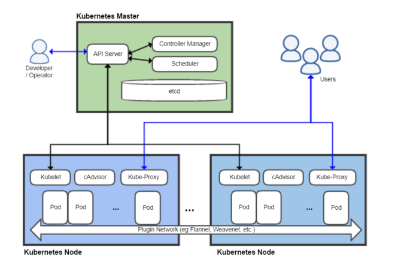

#  2. Conceptos básicos

Kubernetes es una plataforma de código abierto para despliegue, escalado y gestión de aplicaciones contenedorizadas.

> Kubernetes is a portable, extensible, open-source platform for  managing containerized workloads and services, that facilitates both  declarative configuration and automation. It has a large, rapidly  growing ecosystem. Kubernetes services, support, and tools are widely  available.
>
> The name Kubernetes originates from Greek, meaning helmsman or pilot. Google open-sourced the Kubernetes project in 2014. Kubernetes builds  upon a decade and a half of experience that Google has with running  production workloads at scale, combined with best-of-breed ideas and  practices from the community.

— Documentación oficial de Kubernetes (https://kubernetes.io/docs/concepts/overview/what-is-kubernetes/)

Kubernetes ofrece una abstracción en la que permite el despliegue de  aplicaciones en un cluster sin pensar en las máquinas que lo soportan.

## 2.1. Cluster de Kubernetes

Un cluster de Kubernetes está formado por dos tipos de recursos (referidos a máquinas, ya sean físicas o virtuales):

- El **Master** coordina el cluster. Coordina todas las  actividades del cluster como organizar (schedule) las aplicaciones,  mantener el estado deseado de las aplicaciones, escalado, despliegue de  actualizaciones, y demás. También recoge información de los nodos worker y Pods (unidades mínimas de despliegue en Kubernetes. Contienen al  menos un contenedor) .
- Los **Nodos** son *workers* que ejecutan las aplicaciones. Cada nodo contiene un agente denominado *Kubelet* que gestiona el nodo y mantiene la comunicación con el Máster. El nodo  también tiene herramientas para trabajar con contenedores, como por  ejemplo Docker.

|      | Un cluster Kubernetes en producción debería tener al menos 3 nodos.  En entornos de producción se usan varios nodos máster para que los  clusters sean tolerantes a fallos y ofrezcan alta disponibilidad. |
| ---- | ------------------------------------------------------------ |
|      |                                                              |


Al desplegar una aplicación en Kubernetes el Master inicia los  contenedores de la aplicación. El máster organiza los contenedores para  que se ejecuten en los nodos (*worker*) del cluster. Los nodos se comunican con el master usando la [API de Kubernetes](https://kubernetes.io/docs/reference/generated/kubernetes-api/v1.15/#-strong-api-overview-strong-). La API es expuesta a través del nodo Master y es posible usarla directamente para intectuar con el cluster.

|      | Una aplicación de tratamiento de imágenes y que esté basada en  contenedores podría interactuar con la API de Kubernetes solicitando a  demanda la creación de pods dedicados a operaciones específicas (p.e.  filtrado, aclarado, …) en respuesta a las acciones de los usuarios. Una vez finalizada la operación, la aplicación volvería a interactuar con  la API de Kubernetes para la liberación de los pods creados para la  resolución de la tarea. |
| ---- | ------------------------------------------------------------ |
|      |                                                              |

Example 1. Lista de pods usando la API de Kubernetes

```bash
$ curl http://<kubernetes_home>/api/v1/namespaces/default/pods
{
  "kind": "PodList",
  "apiVersion": "v1",
  "metadata": {
    "selfLink": "/api/v1/namespaces/default/pods",
    "resourceVersion": "10803"
  },
  "items": [
    {
      "metadata": {
        "name": "hello-minikube-64c7df9db-ffwtn",
        "generateName": "hello-minikube-64c7df9db-",
        "namespace": "default",
        "selfLink": "/api/v1/namespaces/default/pods/hello-minikube-64c7df9db-ffwtn",
        "uid": "652c298a-6dc2-4aec-a72f-390669fed6d2",
        "resourceVersion": "10608",
        "creationTimestamp": "2019-07-08T18:02:23Z",
        "labels": {
          "pod-template-hash": "64c7df9db",
          "run": "hello-minikube"
        },
....
```

Los clusters de Kubernetes se pueden desplegar sobre máquinas físicas o virtuales. Para comenzar a practicar con Kubernetes o para tareas de  desarrollo, [Minikube](https://github.com/kubernetes/minikube) es una buena opción. En la sección [Minikube](https://ualmtorres.github.io/SeminarioKubernetes/#Minikube) se presenta más información sobre esta plataforma. Minikube está disponible para Windows, Linux y MacOS.

### 2.2. Arquitectura de Kubernetes

Tal y como hemos introducido en el apartado anterior, un cluster de Kubernetes está formado por dos tipos de unidades, el nodo *Master* y los nodos *Worker* (o siemplemente *Nodos*).

La figura siguiente ilustra estas dos unidades, así como algunos de los componentes más importantes en su interior.



- **Plugins** de red: Permiten la conexión entre pods de nodos diferentes y la integración de soluciones de red diferentes (overlay, L3, …)
- `**etcd`:** una base de datos clave-valor donde Kubernetes guarda todos los datos del cluster.
- **API server:** Componente del Master que expone la API de Kubernetes. Es el front-end del plano de control de Kubernetes.
- **Control Manager:** Se encarga de comprobar si el estado deseado coincide con la realidad (p.e. número de réplicas)
- **Scheduler:** Componente del master que observa qué pods se han creado  nuevos y no tienen nodo asignado, y les selecciona un nodo donde se  puedan ejecutar.
- **`kubelet`:** Agente que se se ejecuta en cada nodo worker del cluster y que asegura que los nodos están en ejecución y sanos. **`kubelet` no gestiona los pods que no han sido creados por Kubernetes.**
- **`kube-proxy`:** Mantiene las reglas de networking en los  nodos para los pods que se ejecutan en él de acuerdo con las  especificaciones de los manifiestos.
- **`cAdvisor`:** Recoge datos de uso de los contenedores.
- **Plano de control o *Control plane*:** Nivel de orquestación de  contenedores que expone la API para definir, desplegar y gestionar el  ciclo de vida de los contenedores.
- **Plano de datos o *Data Plane*:** Nivel que proporciona los  recursos, como CPU, memoria, red y almacenamiento, para que los pods se  puedan ejecutar y conectar a la red.

|      | [etcd](https://etcd.io/), es una base de  datos clave-valor fiable y distribuida para los datos más críticos de un un sistema distribuido. Dado que Kubernetes guarda todos los datos del  cluster en ella, se deberían mantener copias de seguridad de esta base  de datos y disponer de un plan de recuperación ante posibles desastres. |
| ---- | ------------------------------------------------------------ |
|      |                                                              |

|      | Los componentes `kube-proxy`, `kube-scheduler`, `kube-controller-manager`, `etcd`, `kubelet`, así como los componentes de red se ejecutan como contenedores en cada  uno de los nodos del cluster de Kubernetes. Basta con abrir un terminal  en uno de los nodos del cluster y comprobarlo. Si lo hacemos, veremos  como en los nodos worker están los contenedores de los componentes de  Kubernetes junto con los contenedores de las aplicaciones que se están  ejecutando en el nodo.  Un ejercicio interesante es detener el contenedor `kubelet` y ver cómo el nodo pasa a estar inactivo. En caso de ser el único nodo  de trabajo, los contenedores de los nuevos despliegues quedarán en el  estado `Pending` mientras `kubelet` no vuelva a estar disponible. |
| ---- | ------------------------------------------------------------ |
|      |                                                              |

### 2.3. Objetos de Kubernetes

Kubernetes ofrece una serie de objetos básicos y una serie de abstracciones de nivel superior llamadas Controladores.

Los objetos básicos de Kubernetes son:

- Pod
- Service
- Volume
- Namespace

Los objetos de nivel superior o Controladores se basan en los objetos básicos y ofrecen funcionalidades adicionales sobre los objetos  básicos:

- ReplicaSet
- Deployment
- StatefulSet
- DaemonSet
- Job

 