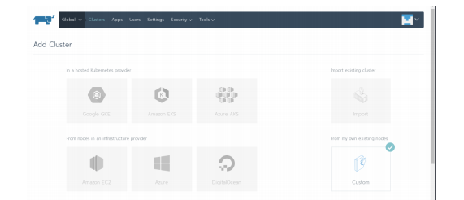
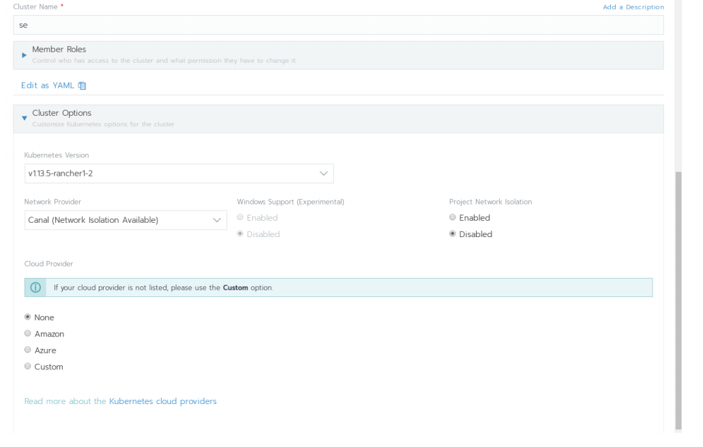
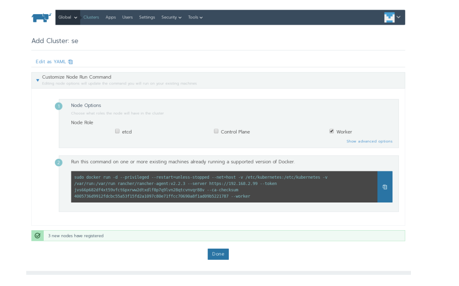
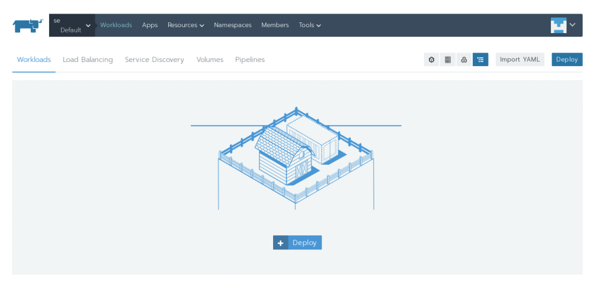
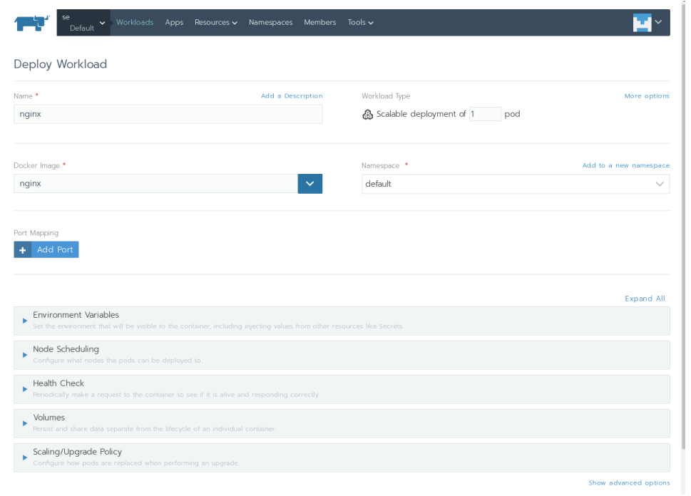
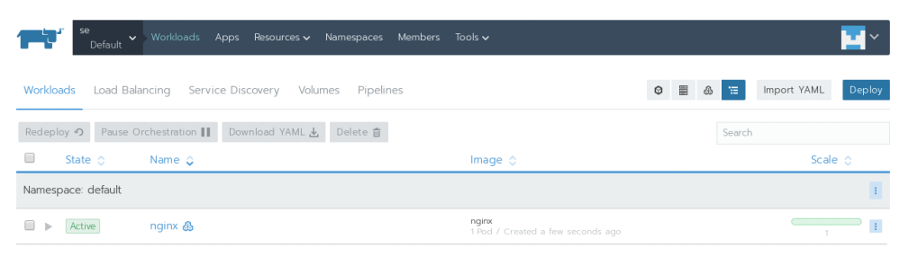
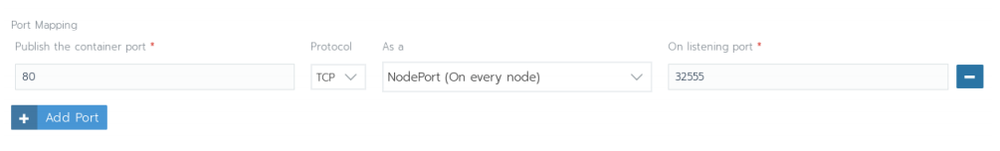
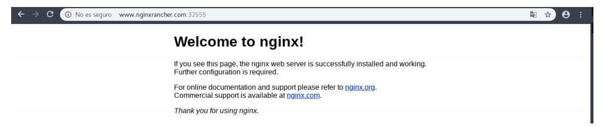
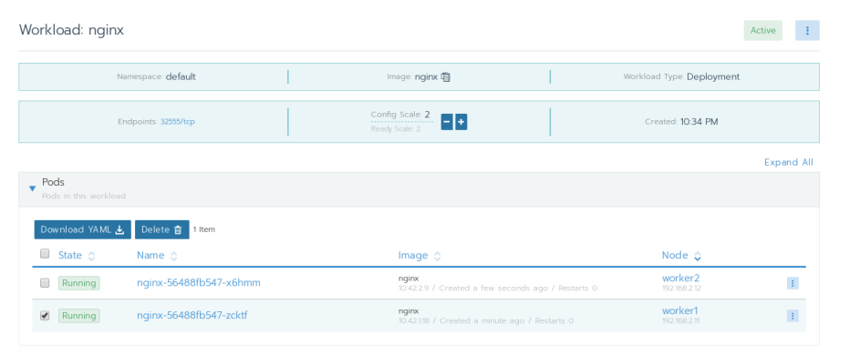

# Introducción

Para desplegar y administrar cluster de kubernetes con la herramienta rancher, hay que realizar despliegues sobre maquinas virtuales locales, OpenStack y Amazon EC2. 

Rancher es una plataforma para la administración de cluster de kubernetes, nos permite desplegar y administrar clusters de kubernetes en varios proveedores, Amazon, Azure, Google, OpenStack, etc. 

Tenemos que tener en cuenta que rancher y rancheros no es lo mismo pero pueden ir juntos, rancheros es el sistema operativo orientado a trabajar con Docker, y rancher es la plataforma con la que trabajaremos para lo dicho anteriormente. 

OpenStack: Es un proyecto de computación en la nube para proporcionar una infraestructura como servicio (IaaS).

 Amazon EC2: Amazon Elastic Compute Cloud (Amazon EC2) proporciona capacidad de computación escalable en la nube de Amazon Web Services (AWS). El uso de Amazon EC2 elimina la necesidad de invertir inicialmente en hardware, de manera que puede desarrollar e implementar aplicaciones en menos tiempo. 

Puede usar Amazon EC2 para lanzar tantos servidores virtuales como necesite, configurar la seguridad y las redes y administrar el almacenamiento. 

Kubernetes: Es un sistema de código libre para la automatización del despliegue, ajuste de escala y manejo de aplicaciones en contenedores que fue originalmente diseñado por Google y donado a la Cloud Native Computing Foundation (parte de la Linux Foundation). 3/16 Rancher Kubernetes 

Instalación de Rancher La instalación de Rancher es sencilla, lo primero que nos dice que tengamos una maquina Linux con al menos 4GB de memoria y con Docker instalado. Para instalarlo ejecutamos en la maquina el siguiente comando:

```
$ sudo docker run -d –restart=unless-stopped \ -p 80:80 -p 443:443 rancher/rancher 
```

Una vez que tenemos el contenedor corriendo, ya podemos acceder a rancher vía web.


# Cluster con maquinas virtuales 

Crear cluster 

En este escenario  creamos 3 maquinas virtuales con el sistema operativo Ubuntu 16.04, donde tendremos un master y dos nodos worker. Necesitaremos tener docker instalado en las 3 maquinas, procedimiento de instalación:

```bash
$ sudo apt-get update
$ sudo apt-key adv --keyserver \
hkp://p80.pool.sks-keyservers.net:80 \
--recv-keys 58118E89F3A912897C070ADBF76221572C52609D
$ sudo apt-add-repository \
'deb https://apt.dockerproject.org/repo ubuntu-xenial main'
$ sudo apt-get update
$ sudo apt-cache policy docker-engine
$ sudo apt-get install -y docker-engine
```

Lo siguiente que hacemos iniciamos rancher y accedemos al panel web, una vez ahí le damos a añadir cluster, y por ultimo elegimos la opción custom.



Los siguientes parámetros son las opciones del cluster



Kubernetes tiene varios proveedores de red CNI (Container Network Interfaces), los principales son: 

Flannel , un proyecto desarrollado por CoreOS , es quizás el complemento CNI más sencillo y popular disponible. Es uno de los ejemplos más maduros de tejido de redes para sistemas de orquestación de contenedores, destinado a permitir una mejor interconexión entre contenedores e inter-host. 

Calico, es conocido por su rendimiento, flexibilidad y potencia. Calico tiene una visión más holística de las redes, preocupándose no solo por proporcionar conectividad de red entre hosts y pods, sino también por la administración y seguridad de la red. 

Canal, es una combinación de Flannel y Calico 

Weave crea una red de superposición de malla entre cada uno de los nodos del clúster, lo que permite un enrutamiento flexible entre los participantes. 


El siguiente paso es añadir los nodos, elegimos el rol que va a tener el nodo y copiamos y pegamos el comando en las maquinas.



Comando para nodo master:

```
$ sudo docker run -d --privileged --restart=unless-stopped --net=host -v /etc/kubernetes:/etc/kubernetes -v /var/run:/var/run rancher/rancher-agent:v2.2.3 --server https://192.168.2.99 --token jvs66p682df4xt59vfct6pxrww2dtxdlf8p7q9lvn28qtcvnvqr88v --cachecksum 4005736d9912fdcbc55a53f15fd2a1097c80e71ffcc70690a8f1ad09b5221787 --etcd --controlplane
```

Comando para nodos worker:

```
$ sudo docker run -d --privileged --restart=unless-stopped --net=host -v /etc/kubernetes:/etc/kubernetes -v /var/run:/var/run rancher/rancher-agent:v2.2.3 --server https://192.168.2.99 --token jvs66p682df4xt59vfct6pxrww2dtxdlf8p7q9lvn28qtcvnvqr88v --cachecksum 4005736d9912fdcbc55a53f15fd2a1097c80e71ffcc70690a8f1ad09b5221787 --worker
```

Por ultimo, empezara a crear el cluster y al cabo de unos minutos estará disponible.


# Despliegue app

Vamos a desplegar un nginx en nuestro cluster, nos dirigimos nuestro proyecto por defecto que es default

En la siguiente imagen se puede ver que en la parte derecha se puede importar un fichero yaml, en este caso se va a desplegar dándole a Deploy



Se elige la imagen de nginx.



Se desplega, y ya estaría funcionando.



Para tener acceso se abre el puerto 80, o se redirecciona con otro.



Se accede desde el navegador correctamente



Se puede aumentar el escalado




# Referencias 

https://rancher.com/docs/rancher/v2.x/en/quick-start-guide/